# 타임박싱 timeboxing

Tags: productivity
Date: July 2, 2024 → July 3, 2024
Score: ★★☆☆☆

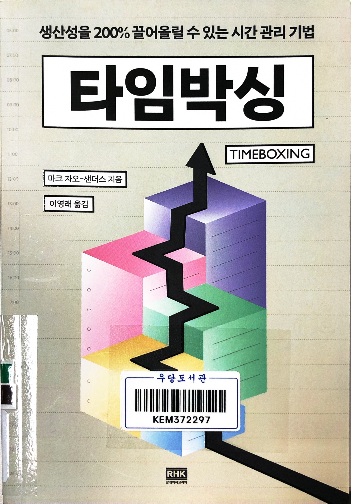

- ★★☆☆☆ July 2, 2024 → July 3, 2024 나쁜 책은 아니고 읽기 어려운 것도 아닌데 묘하게 뭔가 부족한 느낌이 든다. 타임박싱이라는 기법을 이미 알고 있기 때문일까? 아니면 타임박싱이란 저자 스스로도 복잡할 게 없다고 말하는 기법을 책 한권으로 쓰면서 유용한 부분이 과장되었다고 느끼는 걸까? 추천하라고 하면 나쁘진 않은데 또 굳이 읽어보라고 하기도 좀 어렵게 느껴지는 게 좀 애매하다
    - 우당 문325.2112-자65ㅌ
    - https://marczaosanders.com/tech/
- pp25~26

    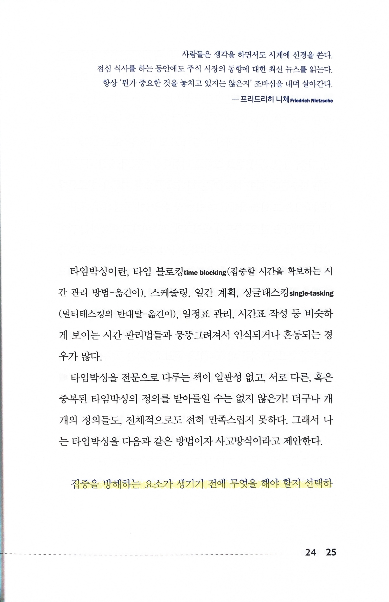

    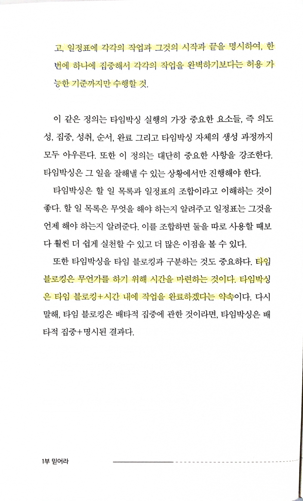

    - 집중을 방해하는 요소가 생기기 전에 무엇을 해야 할지 선택하고, 일정표에 각각의 작업과 그것의 시작과 끝을 명시하여, 한번에 하나에 집중해서 각각의 직업을 완벽하기보다는 허용 가능한 기준까지만 수행할 것
    - 타임블로킹은 무언가를 하기 위해 시간을 마련하는 것
    - 타임박싱은 타임블로킹 + 시간 내에 작업을 완료하겠다는 약속
- p110

    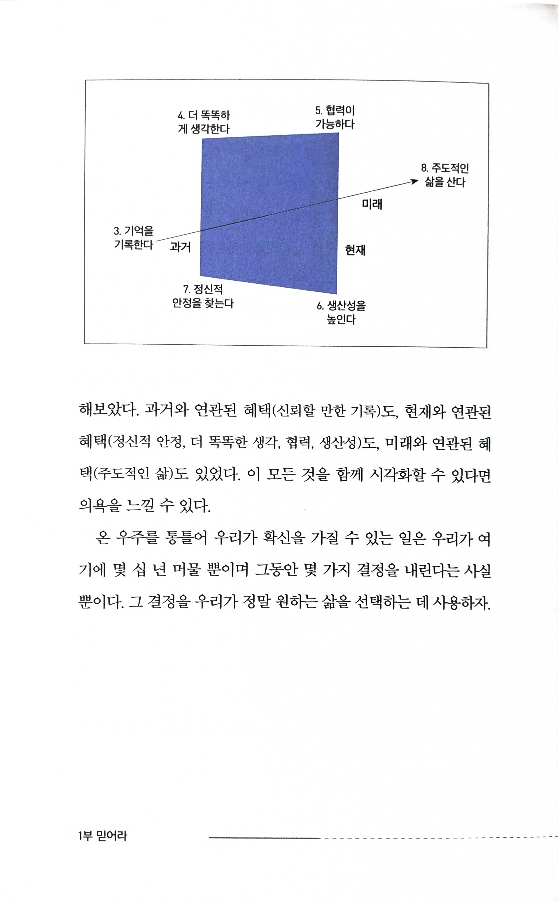

- p155

    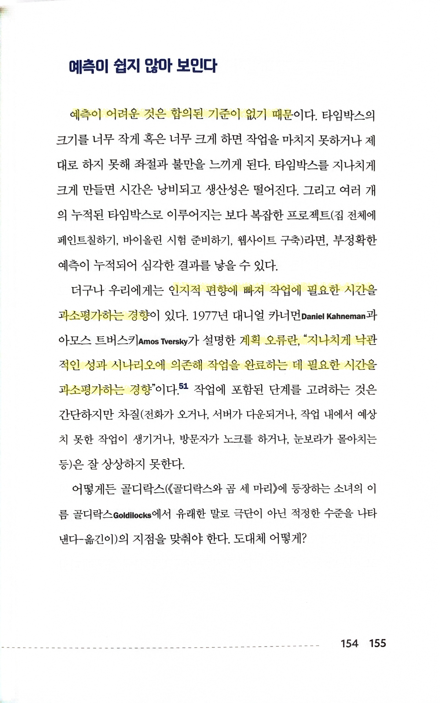

    - 예측이 어려운 것은 합의된 기준이 없기 때문
    - 인지적 편향에 빠져 작업에 필요한 시간을 과소평가하는 경향… 계획 오류란, “지나치게 낙관적인 성과 시나리오에 의존해 작업을 완료하는 데 필요한 시간을 과소평가하는 경향”
- pp200~203

    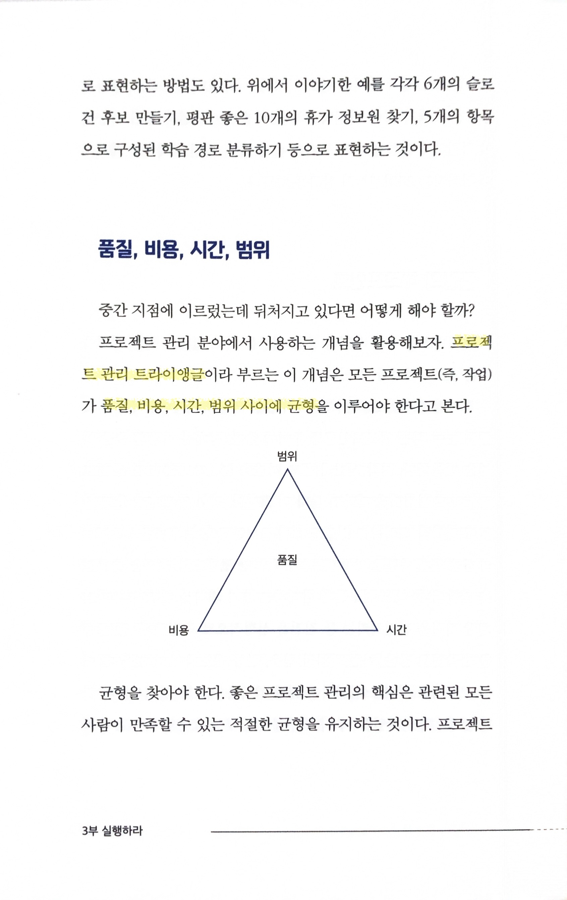

    - 프로젝트 관리 트라이앵글… 품질, 비용, 시간, 범위 사이에 균형을 이루어야

    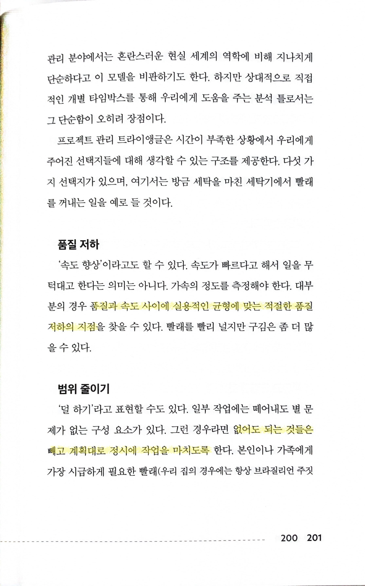

    - 품질과 속도 사이에 실용적인 균형에 맞는 적절한 품질 저하의 지점을 찾을 수
    - 없어도 되는 것들은 빼고 계획대로 정시에 작업을 마치도록

    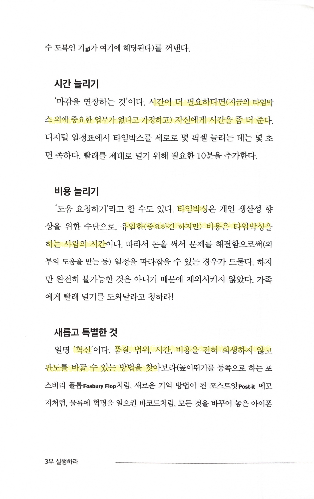

    - 시간이 더 필요하다면(지금의 타임박스 외에 중요한 업무가 없다고 가정하고) 자신에게 시간을 좀 더 준다
    - 타임박싱은… 유일한(중요하긴 하지만) 비용은 타임박싱을 하는 사람의 시간
    - ‘혁신’… 품질, 범위, 시간, 비용을 전혀 희생하지 않고 판도를 바꿀 수 있는 방법을 찾아

    

    - 범위의 축소… “스케줄이 아니라 범위를 바꾸라”
    - 품질을 낮추거나(속도 향상) 시간을 늘리는 것이 더 합리적인 상황도 있다(일정 변경)
- pp211~214

    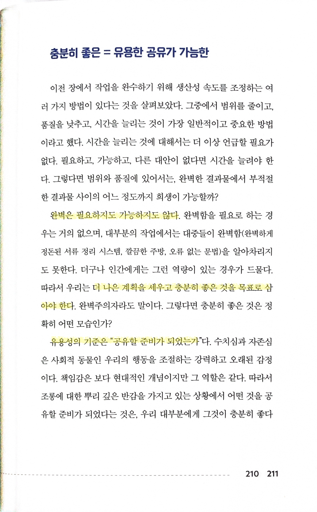

    - 완벽은 필요하지도 가능하지도 않다… 더 나은 계획을 세우고 충분히 좋은 것을 목표로 삼아야 한다
    - 유용성의 기준은 “공유할 준비가 되었는가”

    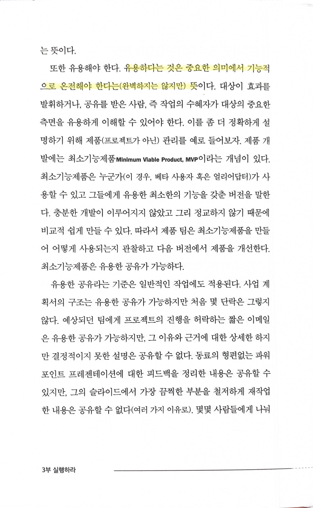

    - 유용하다는 것은 중요한 의미에서 기능적으로 온전해야 한다는(완벽하지는 않지만) 뜻

    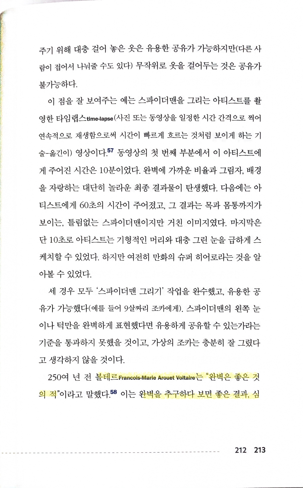

    - 볼테르 Francois-Marie Arouet Voltaire는 “완벽은 좋은 것의 적”… 완벽을 추구하다 보면 좋은 결과, 심지어 훌륭한 결과를 놓칠 수도 있다는 의미
        - https://jollycontrarian.com/index.php?title=Perfection_is_the_enemy_of_good_enough
        - The perfect is the enemy of the good https://www.goodreads.com/author/quotes/5754446.Voltaire?page=9

    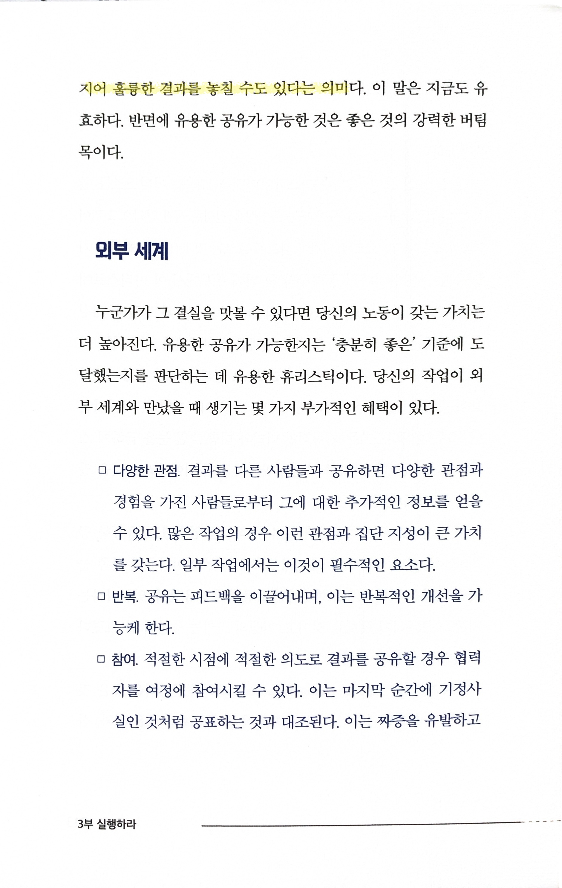

- p230

    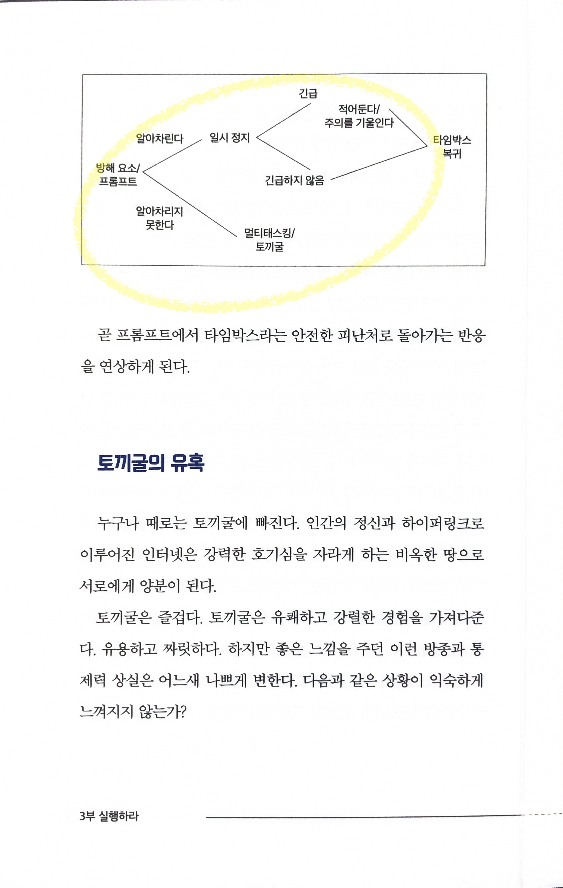

- p233

    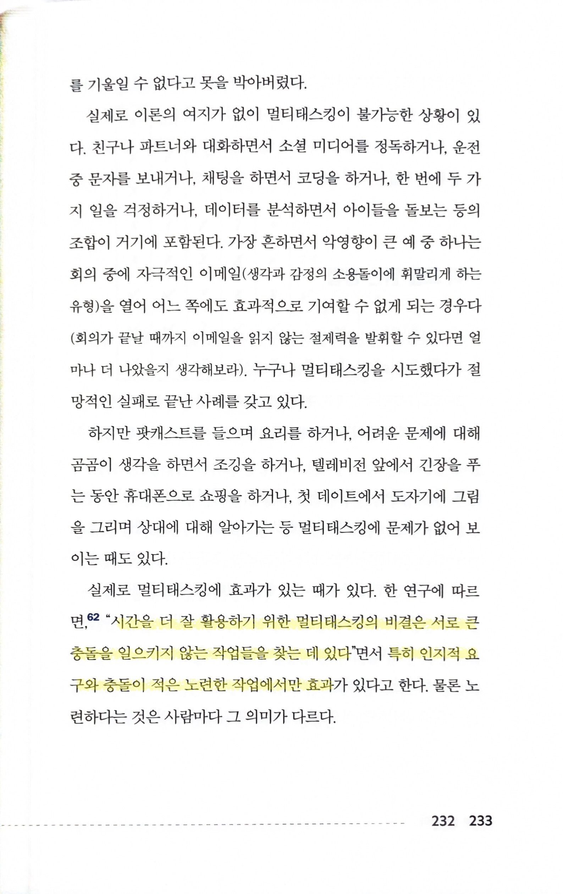

    - 시간을 더 잘 활용하기 위한 멀티태스킹의 비결은 서로 큰 충돌을 일으키지 않는 작업들을 찾는 데 있다… 특히 인지적 요구와 충돌이 적은 노련한 작업에서만 효과
- p248

    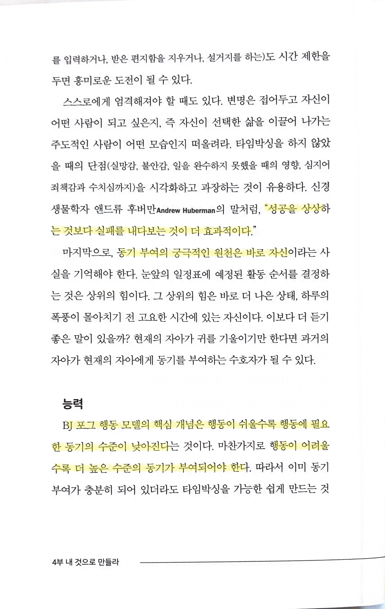

    - 성공을 상상하는 것보다 실패를 내다보는 것이 더 효과적이다
    - 동기 부여의 궁극적인 원천은 바로 자신
    - BJ 포그 행동 모델의 핵심 개념은 행동이 쉬울수록 행동에 필요한 동기의 수준이 낮아진다는 것… 행동이 어려울수록 더 높은 수준의 동기가 부여되어야 한다
