A/B 테스트 신뢰도 높은 온라인 통제 실험 TRUSTWORTHY ONLINE CONTROLLED EXPERIMENTS
==================================================================================
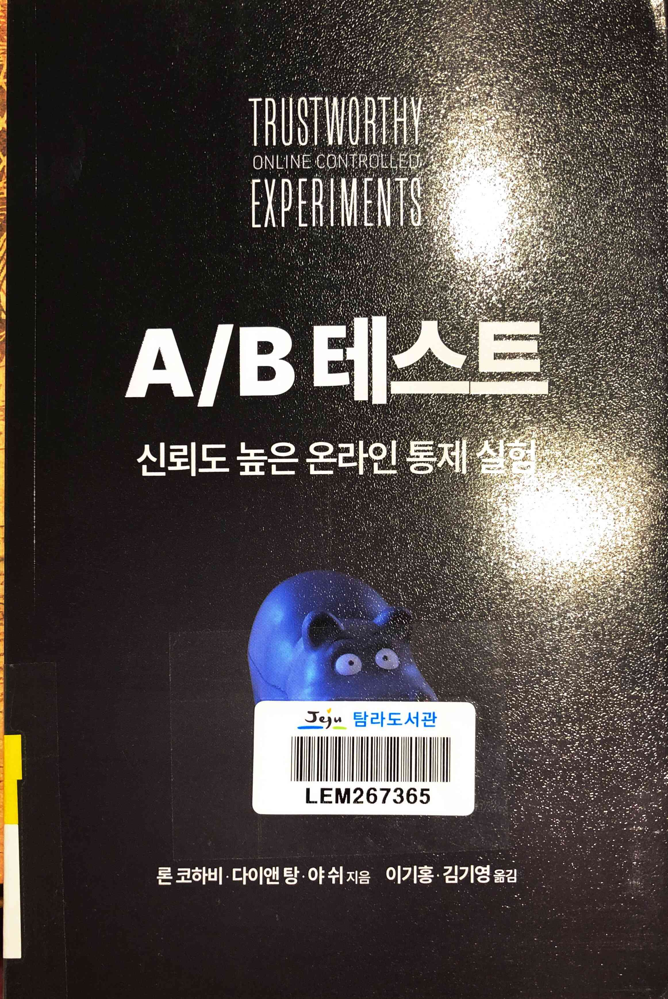

* [Experiment Guide – Accelerate innovation using trustworthy online controlled experiments](https://experimentguide.com/)

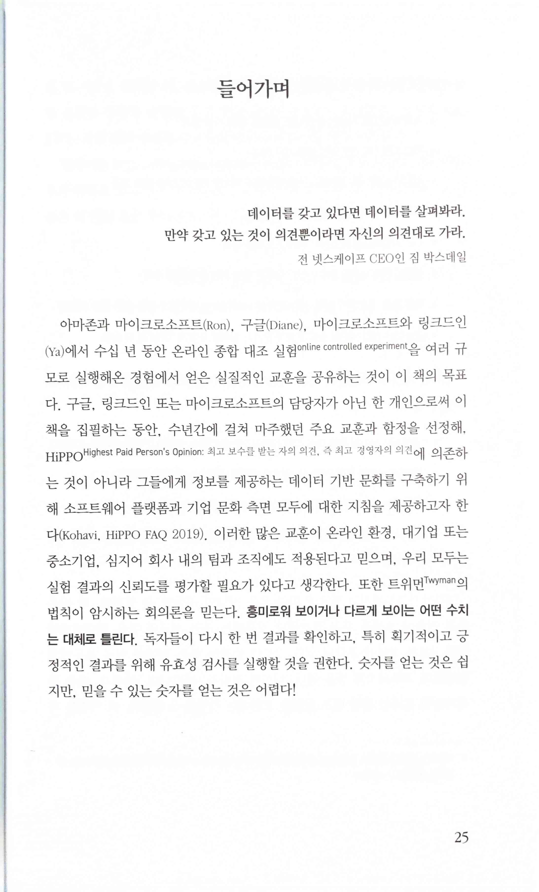

> `트위먼Twyman의 법칙`이 암시하는 회의론을 믿는다. 흥미로워 보이거나 다르게 보이는 어떤 수치는 대체로 틀린다. 독자들이 다시 한 번 결과를 확인하고, 특히 획기적이고 긍정적인 결과를 위해 유효성 검사를 실행할 것을 권한다. 숫자를 얻는 것은 쉽지만, 믿을 수 있는 숫자를 얻는 것은 어렵다!

# 1부 모두를 위한 소개

## 01 소개와 동기

> `하나의 정확한 측정이 수천 개의 전문가 의견보다 가치 있다. 그레이스 호퍼 제독Admiral Grace Hopper`
>
> A와 B 또는 대조군control과 실험군treatment 의 2개 종류를 비교하는 가장 간단한 형태의 종합 대조 실험controlled experiment인 A/B 테스트

## 02 실험의 실행과 분석 - 엔드-투-엔드 예제

> `사실이 적을수록 의견이 강해진다. 아놀드 글래소Arnold Glasow`

## 03 트위먼의 법칙과 실험의 신뢰도

> 트위먼의 법칙: `"흥미롭게 보이거나 다르게 보이는 모든 것들은 대체로 틀렸다." A.S.C 에렌버그 Ehrenberg(1975)`
>
> 트위먼의 법칙: `"흥미롭게 보이는 통계는 거의 다 확실히 실수다." 폴 딕슨 Paul Dickson(1999)`

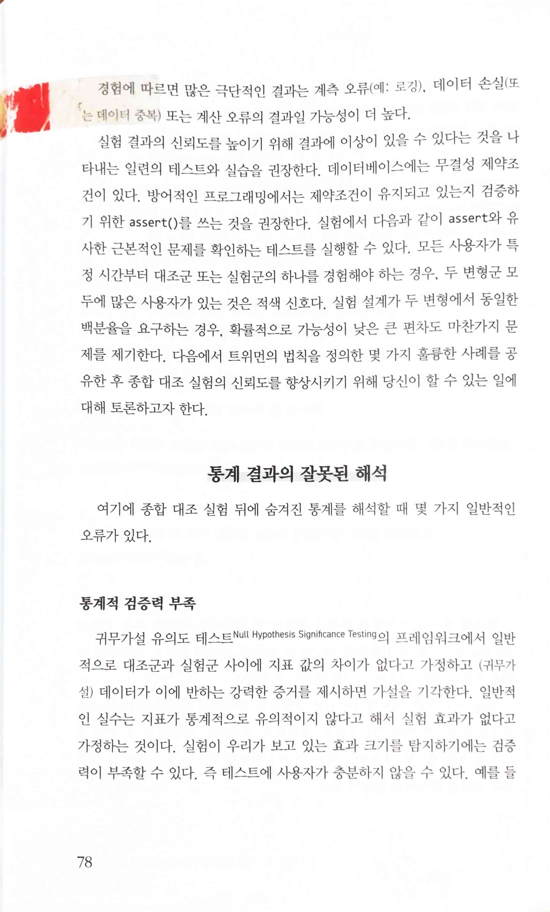

> 경험에 따르면 많은 극단적인 결과는 계측 오류(예: 로깅), 데이터 손실(또 데이터 중복) 또는 계산 오류의 결과일 가능성이 더 높다.

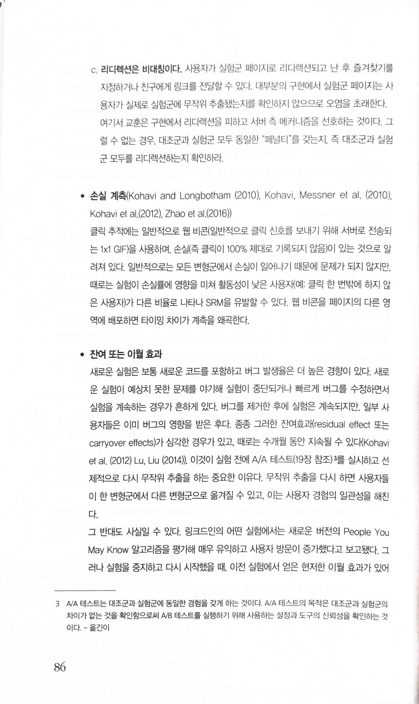

> 리디렉션은 비대칭이다. 사용자가 실험군 페이지로 리디렉션되고 난 후 즐겨찾기를 지정하거나 친구에게 링크를 전달할 수 있다. 대부분의 구현에서 실험군 페이지는 사용자가 실제로 실험군에 무작위 추출됐는지를 확인하지 않으므로 오염을 초래한다. 여기서 교훈은 구현에서 리디렉션을 피하고 서버 측 메커니즘을 선호하는 것이다. 그럴 수 없는 경우, 대조군과 실험군 모두 동일한 페널티를 갖는지, 즉 대조군과 실험군 모두를 리디렉션하는지 확인하라.
>
> 새로운 실험은 보통 새로운 코드를 포함하고 버그 발생율은 더 높은 경향이 있다. 새로운 실험이 예상치 못한 문제를 야기해 실험이 중단되거나 빠르게 버그를 수정하면서 실험을 계속하는 경우가 흔하게 있다. 버그를 제거한 후에 실험은 계속되지만, 일부 사용자들은 이미 버그의 영향을 받은 후다. 종종 그러한 `잔여효과`(`residual effect` 또는 `carryover effects`)가 심각한 경우가 있고, 때로는 수개월 동안 지속될 수 있다(Kohaviet al. (2012) Lu, Liu (2014)). 이것이 실험 전에 `A/A 테스트`(19장 참조)를 실시하고 선제적으로 다시 무작위 추출을 하는 중요한 이유다. 무작위 추출을 다시 하면 사용자들이 한 변형군에서 다른 변형군으로 옮겨질 수 있고, 이는 사용자 경험의 일관성을 해친다.

> 조직은 "신뢰할 수 있는 실험'에 선뜻 투자하기 어려울 수 있다. 이는 미지의 것, 즉 테스트가 실패하면 결과를 무효화할 수 있는 테스트를 구축하는 데 투자를 하는 셈이기 때문이다. 좋은 데이터 과학자들은 회의론자들이다. 그들은 이상 징후를 탐지하고 결과에 의문을 제기하며, 결과가 너무 좋아 보일때 트위먼의 법칙을 발동한다.

## 04 실험 플랫폼과 문화

> `왕자를 잡기 위해 많은 개구리에게 키스해야 한다면, 더 많은 개구리를 찾아내서 더욱 빨리 키스를 해라. 마이크 모란Mike Moran, Do It Wrong Quickly(2007)`
>
> 새로운 아이디어를 시도하는 비용을 줄이고, 선순환적인 피드백 루프의 가운데에서 이들로부터 배움을 얻고, 혁신을 가속화시킨다.

> 리더십
>
> 실험을 중심으로 하는 강력한 문화를 확립하고 A/B 테스트를 제품 개발 과정의 필수 요소로 포함시키기 위해서는 적극적인 리더십이 매우 중요하다.
>
> 주요 지표를 측정하고, 원인을 설명할 수 없는 차이를 고려하기 시작... 지속적인 측정 실험, 지식 수집을 통해서만 조직은 원인에 대한 기초적 이해와 모델의 작동에 대한 근본적 이해에 도달할 수 있다.
>
> 리더는 단지 실험 플랫폼과 도구를 조직에 제공만해서는 안 된다. 리더는 조직이 데이터 중심 결정을 내릴 수 있도록 적절한 인센티브, 프로세스 및 권한을 제공해야 한다. 이들 활동에 참여하는 리더십은 특히 기어가기와 걷기 성숙도 단계에서 조직을 목표에 맞추기 위해 매우 중요하다.

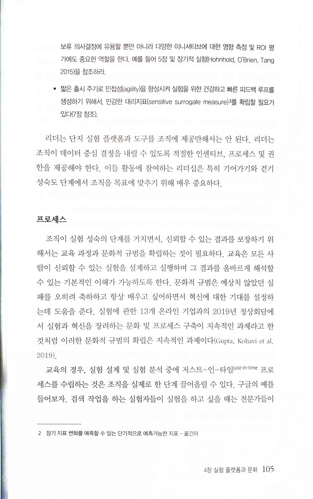 

> 프로세스
>
> 조직이 실험 성숙의 단계를 거치면서, 신뢰할 수 있는 결과를 보장하기 위해서는 교육 과정과 문화적 규범을 확립하는 것이 필요하다. 교육은 모든 사람이 신뢰할 수 있는 실험을 설계하고 실행하며 그 결과를 올바르게 해석할 수 있는 기본적인 이해가 가능하도록 한다. 문화적 규범은 예상치 않았던 실패를 오히려 축하하고 항상 배우고 싶어하면서 혁신에 대한 기대를 설정하는데 도움을 준다.

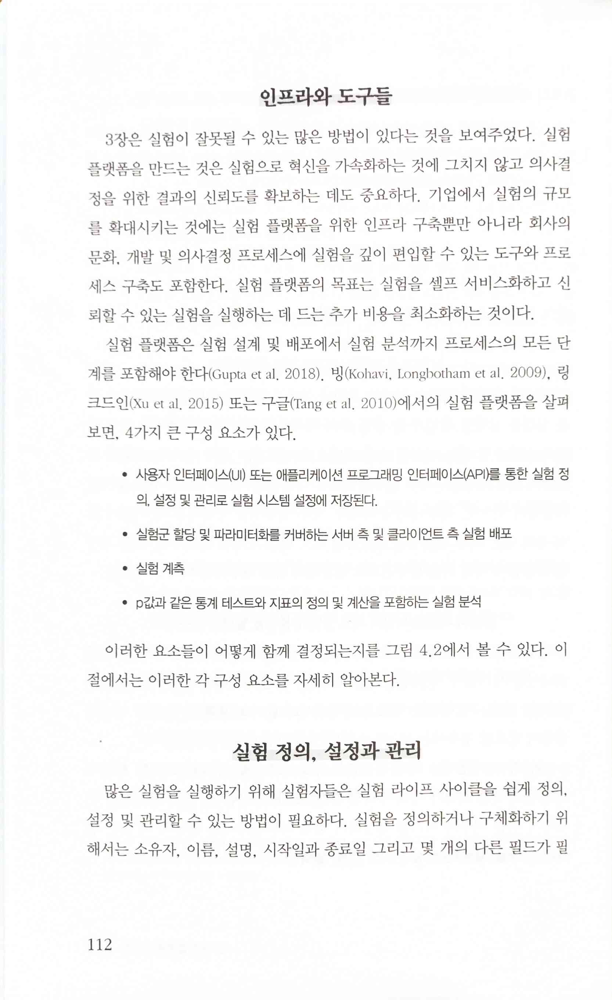

> 인프라와 도구들
>
> 실험 플랫폼을 만드는 것은 실험으로 혁신을 가속화하는 것에 그치지 않고 의사결정을 위한 결과의 신뢰도를 확보하는 데도 중요하다. 기업에서 실험의 규모를 확대시키는 것에는 실험 플랫폼을 위한 인프라 구축뿐만 아니라 회사의 문화, 개발 및 의사결정 프로세스에 실험을 깊이 편입할 수 있는 도구와 프로세스 구축도 포함한다. 실험 플랫폼의 목표는 실험을 셀프 서비스화하고 신뢰할 수 있는 실험을 실행하는 데 드는 추가 비용을 최소화하는 것이다.

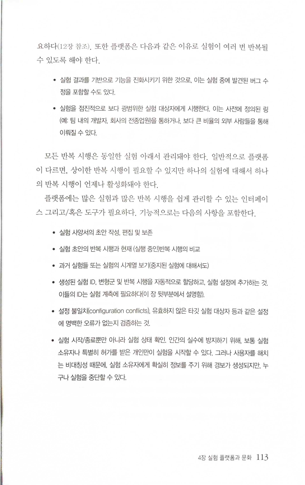

> 실험 정의, 설정과 관리
>
> 많은 실험을 실행하기 위해 실험자들은 실험 라이프 사이클을 쉽게 정의, 설정 및 관리할 수 있는 방법이 필요하다. 실험을 정의하거나 구체화하기 위해서는 소유자, 이름, 설명, 시작일과 종료일 그리고 몇 개의 다른 필드가 필요하다(12장 참조). 또한 플랫폼은 다음과 같은 이유로 실험이 여러 번 반복될 수 있도록 해야 한다.
>
> 모든 반복 시행은 동일한 실험 아래서 관리돼야 한다. 일반적으로 플랫폼이 다르면, 상이한 반복 시행이 필요할 수 있지만 하나의 실험에 대해서 하나의 반복 시행이 언제나 활성화돼야 한다.
>
> 플랫폼에는 많은 실험과 많은 반복 시행을 쉽게 관리할 수 있는 인터페이스 그리고/혹은 도구가 필요하다.
 
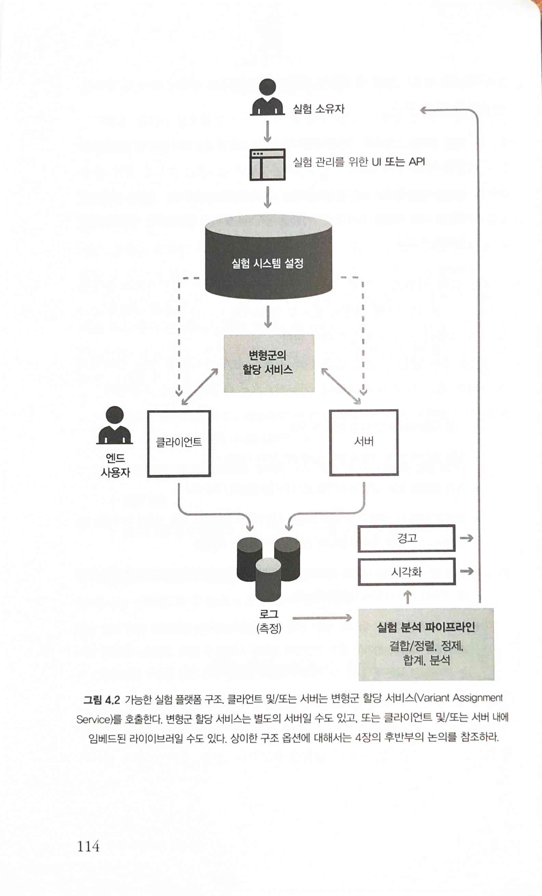

> 그림 4.2 가능한 실험 플랫폼 구조

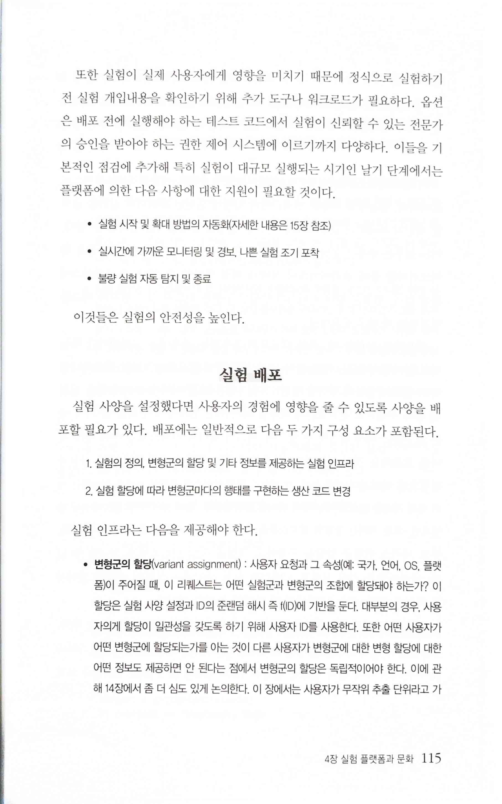

> 실험 배포
>
> 실험 사양을 설정했다면 사용자의 경험에 영향을 줄 수 있도록 사양을 배포할 필요가 있다.

# 2부 모두를 위해 선택된 주제

> 사용자 참여와 수익에 민감하게 영향을 주는 대리 지표로서 대기 시간과 사이트 속도
>
> 리더들이 조직을 위해 이해하고, 토론하고, 확립해야 하는 조직 지표Organization Metrics
>
> 실험 지표와 전체 평가기준OEC, Overall Evaluation Criterion
>
> 제도적 기억과 메타 분석
>
> 온라인 종합 대조 실험

## 05 속도의 중요성: 엔드-투-엔드 사례 연구

> 느린 웹사이트의 위험: 사용자 좌절, 부정적인 브랜드 인식, 운영 비용 증가, 수익 손실 스티브 수더스 Steve Souders(2009)
>
> 서버 성능을 10밀리초(우리의 눈이 깜박이는 속도의 30분의 1에 해당하는 속도)까지 향상시키는 엔지니어는 본인의 연간 총 비용보다 더 많은 이익을 가져온다. 매 밀리초가 중요하다. 코하비, 덩Deng, 프라스카Frasca, 워커 Walker, 쉬Xu, 폴만Pohlmann (2013)
>
> 빠르다fast라는 것은 내가 가장 좋아하는 기능이다. 구글 셔츠 Google shirt 2009년경

> 실험 결과를 검토할 때 어떤 신뢰수준을 적용해야 하는지 스스로에게 물어보고, 특정 사이트에 대해 아이디어가 작용했더라도 다른 사이트에서는 잘 작동하지 않을 수 있다는 점을 기억하라. 한 가지 할 수 있는 일은 과거 실험의 재현(성공 여부)을 보고하는 것이다. 이것이 과학을 가장 효과적으로 작동시키는 방법이다.

## 06 조직 운영을 위한 지표

> 측정할 수 없으면 개선할 수 없다. 피터 드러커 Peter Drucker (켈빈 경 Lord Kelvin의 더 긴 버전)
>
> [워터멜론 지표:]...팀들은 자신들이 녹색에 대한 목표를 달성하는 일을 훌륭하게 하고 있다고 생각하지만, 고객들이 보는 것은 빨간 부분이다. 바클레이 래Barclay Rae(2014)
>
> 변환을 최적화하기 위해, 펑크난 타이어를 무시하고 엔진의 성능을 향상시키려고 하는 고객들을 자주 보게 된다. 브라이언 아이젠버그 Bryan Eisenberg와 존 쿼토-본티바다르John Quarto-vonTivadar(2008)

> `성공 지표 success metrics` 또는 `진정한 북극 지표` `진북 지표, true north metrics` 라고도 불리는 `목표 지표 goal metrics`는 조직이 궁극적으로 무엇을 신경쓰는지를 보여준다. 목표 지표를 도출하기 위해 노력할 때, 먼저 당신이 원하는 것을 단어로 표현해 보는 것을 추천한다. 당신의 제품이 존재하는 이유는? 귀사의 성공은 어떤 모습인가? 조직의 지도자들은 이러한 질문에 대답하는데 관여해야 하며, 그 답은 종종 회사의 미션mission statement에 결부된다.
>
> 목표를 지표로 완벽하게 변환하는 것이 매우 어렵기 때문에 말로써 목표를 명확하게 표현하는 것이 중요하다.
>
> 목표 지표는 일반적으로 여러분이 추구하는 궁극적인 성공을 가장 잘 포착하는 단일 또는 매우 작은 지표 집합이다. 각 이니셔티브가 지표에 미치는 영향이 매우 작을 수도 있고 영향을 실현하는 데 오랜 시간이 소요되기 때문에 이러한 지표는 단기적으로 움직이기가 쉽지 않을 수 있다.

> `동인 지표 driver metrics`는 `사인 포스트 지표sign post metrics`, `대리 지표surrogate metrics`, `간접 지표indirect metrics` 또는 `예측 지표redictive metrics` 라고도 불리며, 목표지표보다 단기적이고 더 빠르게 움직이며, 더 민감한 지표인 경향이 있다. 동인 지표는 성공 그 자체보다는 오히려 조직을 성공으로 이끌기 위한 `사고의 인과관계 모델mental causal model`, 즉 성공 요인이 어떤 가설을 반영하는가를 반영한다.
>
> 좋은 동인 지표는 조직이 목표 지표를 향해 올바른 방향으로 움직이고 있다는 것을 표시한다.
>
> `가드레일 지표guardrail metric`는 가정을 위반하는 것을 방지하기 위한 것으로 다음의 두 가지 유형이 있다. 즉 비즈니스를 보호하는 지표와 실험 결과의 신뢰성과 내부 타당성을 평가하는 지표가 있다.

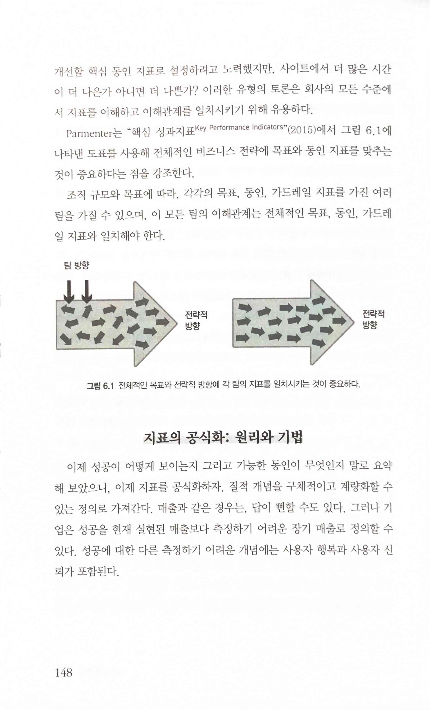

> 그림 6.1 전체적인 목표와 전략적 방향에 각 팀의 지표를 일치시키는 것이 중요하다.

> 어떤 지표들은 다른 지표들보다 더 빨리 진화할 수 있다. 예를 들어, 동인, 가드레일 및 데이터 품질 지표는 종종 근본적인 비즈니스 또는 환경 진화가 아닌 방법론 개선에 의해 주도되기 때문에 목표 지표보다 더 빨리 진화할 수 있다.
>
> 지표는 시간이 지남에 따라 진화할 것이기 때문에 조직이 성장함에 따라 지표의 변화도 보다 구조적으로 처리해야 한다. 특히, 새로운 지표의 평가. 이에 수반되는 스키마 변경, 필요한 데이터의 백업 등을 지원하기 위한 인프라가 필요할 것이다.

## 07 실험을 위한 지표와 종합 평가 기준

> 네가 나를 어떻게 측정하는지 말해달라. 그러면 내가 어떻게 행동할지 말해주겠다. 엘리야후 M. 골드라트 Eliyahu M. Goldratt(1990)
>
> 첫 번째 규칙은 측정(모든 측정)이 없는 것보다 낫다는 것이다. 그러나 진정으로 효과적인 지표는 작업 단위의 성과를 측정하는 것이고, 단순히 관련 활동을 측정하는 것이 아니다. 분명히 영업 사원은 전화(활동)가 아니라 그가 받는 주문(성과)으로 측정된다. 앤디 그로브 Andrew S. Grove of High Output Management (1995)

> 경험적 자료만 보면 안 된다. 인센티브에 대해서도 생각해 볼 필요가 있다. 분명히 정책 변화는 강도들이 그들의 성공 가능성을 재평가하게 할 것이다.
>
> 과거 데이터에서 상관관계를 찾는다고 해서 변수 중 하나를 수정하면, 다른 변수가 변화할 것으로 예상하는 상관 곡선 상의 점을 선택할 수 있다는 의미는 아니다. 그렇게 되기 위해서는 관계가 인과관계여야 하며, 이는 OEC 대한 지표를 선택하는 것을 어려운 문제로 만든다.

## 08 제도적 기억과 메타 분석

> 개인은 때때로 용서하지만, 조직과 사회는 결코 용서하지 않는다.체스터필드 경Lord Chesterfield(1694-1773)
>
> 종합 대조 실험을 혁신 프로세스의 기본 단계로 완전히 수용한 후, 회사는 효과적으로 설명, 스크린샷, 주요 결과를 포함한 실험에 의한 모든 변경에 대해 효과적으로 디지털 저널을 가지는 것이 가능하다. 과거에 실행된 수백, 심지어 수천 개의 실험은 각각 저널의 한 페이지로, 각각의 변화에 대한 소중하고 풍부한 데이터를 갖고 있다(출시하는 안 하든). 이 디지털 저널은 우리가 `제도적 기억institutional memory`이라고 부르는 것이다.

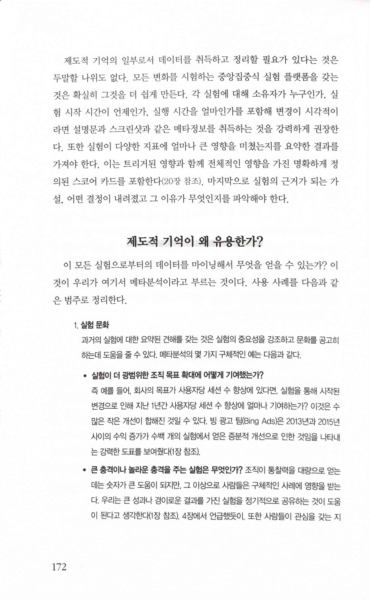

> 모든 변화를 시험하는 중앙집중식 실험 플랫폼을 갖는 것은 확실히 그것을 더 쉽게 만든다... 또한 실험이 다양한 지표에 얼마나 큰 영향을 미쳤는지를 요약한 결과를 가져야 한다... 실험의 근거가 되는 가설, 어떤 결정이 내려졌고 그 이유가 무엇인지를 파악해야 한다.

## 09 종합 대조 실험의 윤리

> `과학의 진보는 인간의 윤리적 행동보다 훨씬 앞서 있다. 찰리 채플린Charlie Chaplin(1964)`
>
> … 코드의 변경으로 사용자를 속이는 테스트 …[우리는] 이 새로운 접근법을 A/B 시험과 구별하기 위해 C/D 실험이라고 부른다. 라켈 벤부난-피치 Raquel Benbunan-Fich (2017)

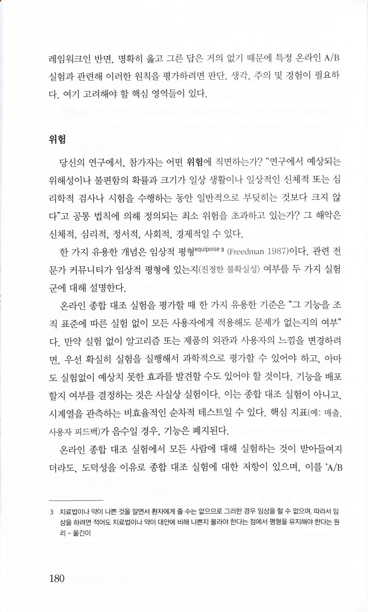

> 온라인 종합 대조 실험을 평가할 때 한 가지 유용한 기준은 "그 기능을 조직 표준에 따른 실험 없이 모든 사용자에게 적용해도 문제가 없는지의 여부"

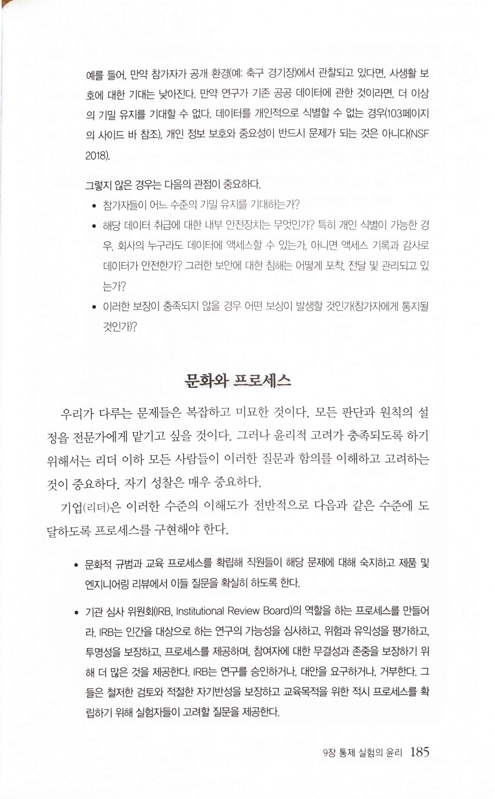

> 우리가 다루는 문제들은 복잡하고 미묘한 것이다. 모든 판단과 원칙의 설정을 전문가에게 맡기고 싶을 것이다. 그러나 윤리적 고려가 충족되도록 하기 위해서는 리더 이하 모든 사람들이 이러한 질문과 함의를 이해하고 고려하는 것이 중요하다. 자기 성찰은 매우 중요하다.

# 3부 종합 대조 실험에 대한 보완 및 대체 기법들

## 10 보완 기법들

> `네가 망치를 갖고 있다면 모든 것이 못처럼 보일 것이다. 아브라함 매슬로우 Abraham Maslow`

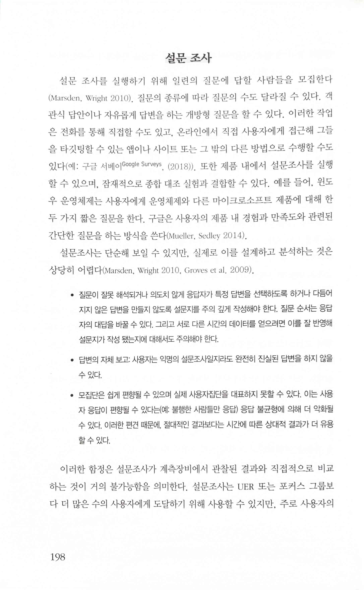

> 설문조사는 단순해 보일 수 있지만, 실제로 이를 설계하고 분석하는 것은 상당히 어렵다(Marsden, Wright 2010, Groves et al, 2009).

> 설문조사는 신뢰나 평판과 같이 직접 측정할 수 없는 문제에 대한 추세를 관찰하는 데 유용하며, 때로는 전체적인 사용량이나 성장과 같은 고도로 집적된 비즈니스 지표의 추이와 상관관계를 보는데 사용된다. 이 상관관계는 사용자 신뢰도를 향상시키는 방법과 같은 일반적인 영역에 대한 투자를 촉진할 수 있지만 반드시 특정 아이디어를 창출하는 것은 아니다. 만약 특정 영역을 지정한다면 아이디어를 얻기 위해 타깃팅이 된 UER을 사용해 볼 수 있다.
>
> 외부 데이터는 당신 또는 당신이 보고자 하는 것과 관련된 것으로 회사의 외부에서 수집되고 분석된 데이터다.

> 사용자가 개인화된 추천에 만족하는지 여부를 확인하려면, '만족'을 먼저 정의해야 한다.

## 11 관측 인과 연구

> `얄팍한 사람은 운을 믿는다. 심지가 굳은 사람은 원인과 결과를 믿는다. 랄프 왈도 에머슨 Ralph Waldo Emerson`

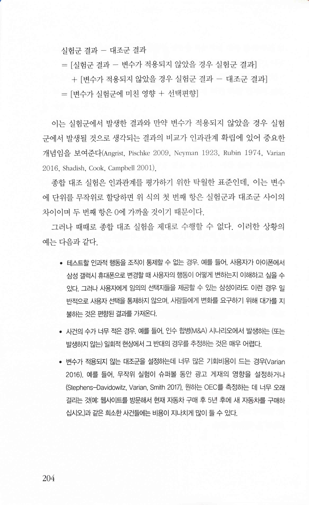

> 질문에 대한 답변을 하기위해 특정 변화에 의한 인과 효과를 측정해야 하며, 이는 변화의 영향을 받는 집단과 그렇지 않은 집단을 비교해야 한다. “인과 추론의 기본 공식(Varian2016)"은 다음과 같다.
>
> 실험군 결과 - 대조군 결과
>
> = [실험군 결과 - 변수가 적용되지 않았을 경우 실험군 결과] + [변수가 적용되지 않았을 경우 실험군 결과 - 대조군 결과]
>
> = [변수가 실험군에 미친 영향 + 선택편향]

> `관측(인과) 연구`라는 용어를 사용해서 실험 대상 조작이 없는 연구를 지칭하고, `준실험quasi-experiment 설계`라는 용어는 실험 대상들이 변수들에 할당됐지만 무작위가 아닌 연구를 지칭하는 데에 사용

# 4부 실험 플랫폼 구축을 위한 고급 주제

## 12 클라이언트 측 실험

> 현실 속 이론과 현실의 차이는 이론 속 이론과 현실의 차이보다 크다. 얀 L. A. 반드 스엡스회트Jan LA. van de Snepscheut

> 모바일 앱에서 개발자는 배포와 출시 주기를 완전히 통제할 수 없다. 출시 절차에는 앱 소유자(예: 페이스북), 앱 스토어(예: 구글 플레이 또는 애플 앱스토어) 및 최종 사용자라는 세 당사자가 관련돼 있다.

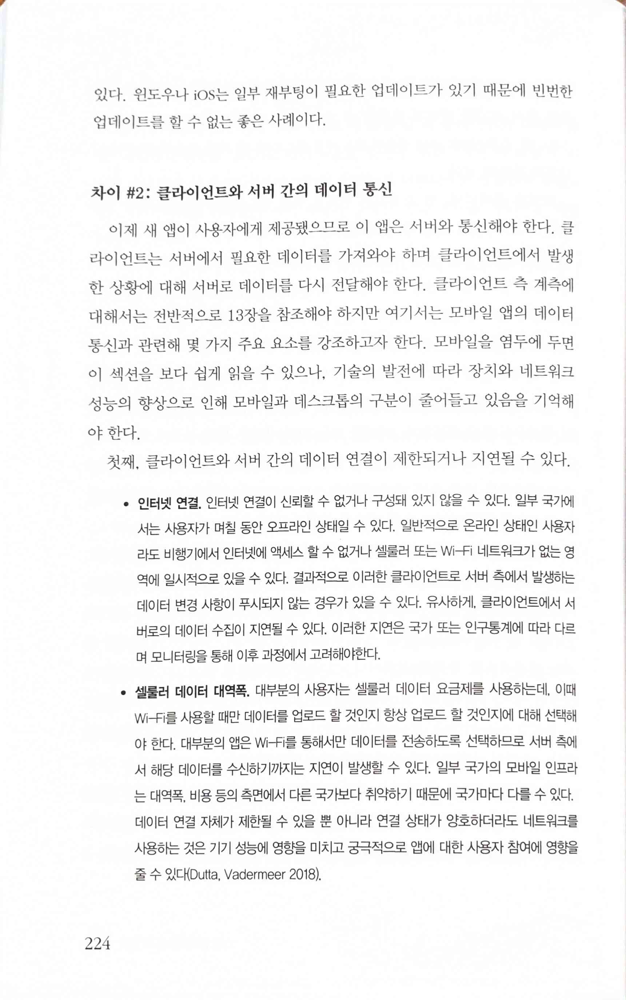

> 기술의 발전에 따라 장치와 네트워크 성능의 향상으로 인해 모바일과 데스크톱의 구분이 줄어들고 있음

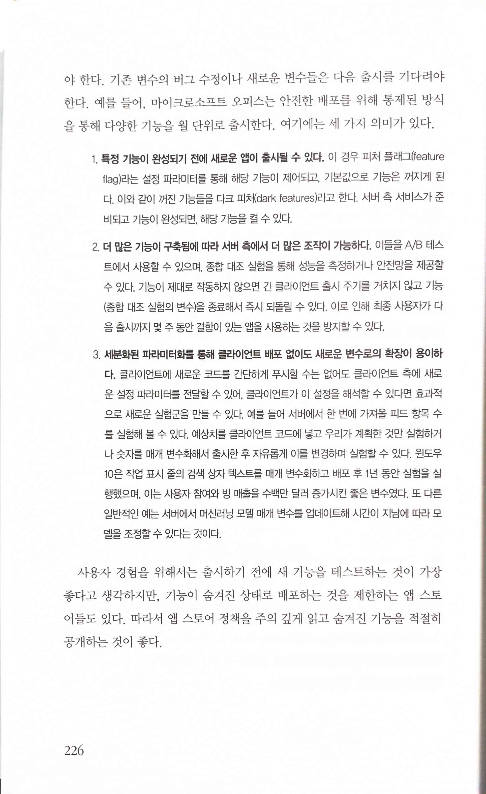

> 예를 들어, 마이크로소프트 오피스는 안전한 배포를 위해 통제된 방식을 통해 다양한 기능을 월 단위로 출시한다. 여기에는 세 가지 의미가 있다.

> 실험군과 대조군을 비교할 기간을 신중하게 선택해야 한다.

## 13 계측

> `발생하는 모든 일은 마땅히 그래야 하는 대로 발생하며, 주의 깊게 관찰하면 실제로 그렇게 된다는 걸 알 수 있다. 마르쿠스 아우렐리우스 Marcus Aurelius`
>
> 실험을 실행하기 전에 사용자와 시스템(예: 웹사이트 응용 프로그램)에 발생한 상황을 기록할 수 있는 도구가 있어야 한다. 또한 모든 비즈니스는 시스템의 작동 방법과 어떻게 사용자들이 이와 상호작용하는지에 대해 기본적으로 이해해야 하며, 이를 위해 계측이 필요하다. 실험을 실행할 때에는 사용자가 본 내용, 상호작용(예: 클릭, 머물기 및 클릭 하기까지의 시간) 및 시스템 성능(예: 지연 시간)에 대한 풍부한 데이터가 있어야 한다.

> 실제로 계측의 가장 어려운 부분은 엔지니어가 처음부터 계측하도록 하는 것이다. 이 어려움은 시간 지연(코드 작성 시점부터 결과를 검토할 때까지)과 직무적 차이(종종 기능을 만드는 엔지니어와 작동을 검토하기 위해 기록을 분석하는 이가 다르다)에서 비롯된다. 이 직무적 분리를 개선하는 방법에 대한 몇 가지 팁이 있다.
>
> • 문화적 규범 확립
>
> • 개발 중 계측 장치의 테스트에 투자
>
> • 가공 전 수집 그대로의 기록 품질을 모니터링

## 14 무작위 단위 선택

> 식별자는 실험의 기본이 되는 무작위 단위이기 때문에 중요

> 쿠키, 장치 ID, 등록된 사용자 ID, IP 주소, ...

## 15 실험 노출 증가시키기: 속도, 품질 및 위험의 트레이드오프

> 성공의 진정한 지표는 24시간 내내 행했던 실험의 수이다. 토머스 에디슨Thomas A. Edison
>
> 실험은 제품 혁신의 가속화를 위해 보편적으로 쓰이고 있지만 그 방법에 따라 혁신의 속도가 제한될 수 있다. 새로운 기능 출시와 관련해서 불확실한 위험을 통제하기 위해서는 실험에서 새로운 변수들에 대한 트래픽을 점차 증가시키는 `램핑 과정ramp process`을 거치는 것을 권장한다. 원칙을 세워 작업을 수행하지 않으면 이 프로세스는 비효율 및 위험을 유발해서 실험 규모가 확장됨에 따라 제품 안정성을 저하시킬 수 있다. 램핑 과정에서는 속도, 품질 및 위험이라는 세 가지 주요 고려 사항의 균형을 효과적으로 유지해야 한다.

> 램핑 과정을 거치지 않았을 시 일어날 수 있는 부정적인 사례는 healthcare.gov의 초기 출시
>
> 주로 `램핑업ramp-up` (실험 대상의 확대) 과정에 중점을 둔다. `램핑다운ramp-down` (실험 대상의 축소) 과정은 일반적으로 나쁜 변수가 있을 때 사용되며, 보통 이 경우에는 사용자 효과를 제한하기 위해 매우 빠르게 0으로 종료한다.

## 16 실험 분석 확장

> `성공률을 높이려면 실패율을 두 배로 높여라. 토머스 왓슨Thomas J. Watson`
>
> 데이터 분석 파이프라인을 실험 플랫폼의 일부로 통합하는 것은 해당 방법론을 견고하고, 일관적이며, 과학적이고, 신뢰가 높아지게 만든다. 이는 임시방편적인 분석으로 많은 시간을 보내는 것을 방지한다. 이 방향으로 나아 간다면, 데이터 처리, 계산 및 시각화를 위한 일반적인 인프라 단계를 이해하는 것이 유용할 것이다.

# 5부 실험 분석을 위한 고급 주제

> `t-검정`, `p값` 및 `신뢰구간` 계산, `정규성` 가정, `통계 검정력` 및 `유형 I/II 오류` - 온라인 종합 대조 실험의 통계
>
> 메타 분석을 위한 `다중 테스트` 및 `피셔 Fisher의 방법`
>
> 매우 일반적인 함정을 해결하기 위해 필수적인 `델타 방법`, 분산을 줄여 실험의 민감도를 향상시키는 방안
>
> `A/A 테스트` `트리거링`
>
> `샘플 비율 불일치 SRM`, 기타 `신뢰와 관련된 가드레일 지표Trust-Related Guardrail metrics`
>
> 변수의 장기적 효과 측정

## 17 온라인 종합 대조 실험에 사용되는 통계 이론

> 흡연은 통계의 필요성을 알려주는 주요 요인 중 하나다. 플레처 네벨Fletcher Knebel

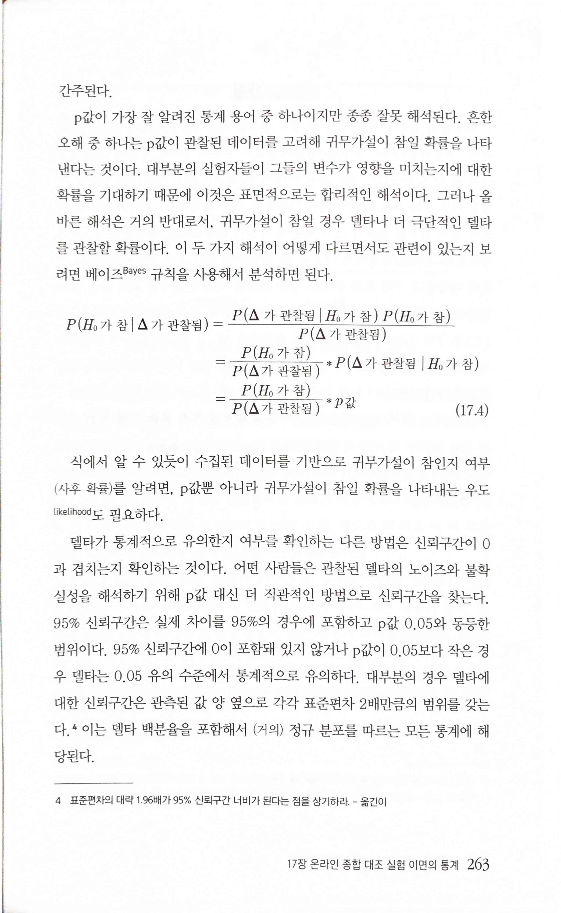

> `베이즈 Bayes 규칙`

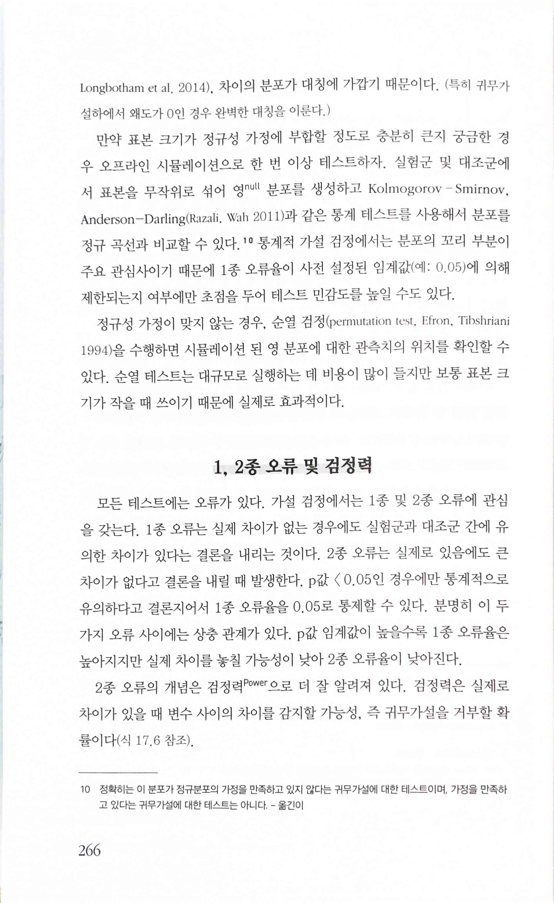 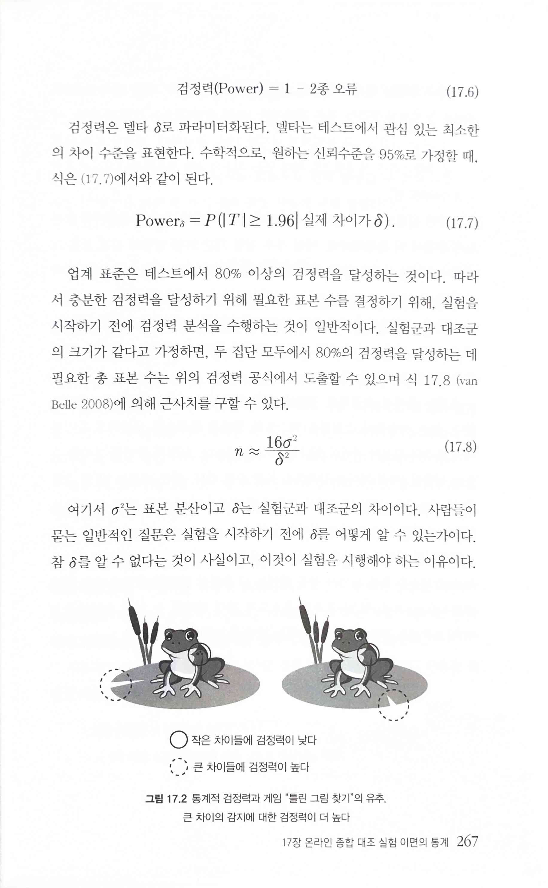 

> `1종 오류`는 실제 차이가 없는 경우에도 실험군과 대조군 간에 유의한 차이가 있다는 결론을 내리는 것
>
> `2종 오류`는 실제로 있음에도 큰 차이가 없다고 결론을 내릴 때 발생
>
> 2종 오류의 개념은 `검정력 Power` 으로 더 잘 알려져 있다. 검정력은 실제로 차이가 있을 때 변수 사이의 차이를 감지할 가능성, 즉 귀무가설을 거부할 확률

> 실험 결과에서 추정치와 평균의 실제 값이 시스템적으로 다를 때 `편향`이 발생
>
> 여러 가지를 병렬로 테스트할 때 허위 발견 수가 증가한다. 이것을 `"다중 테스트"` 문제

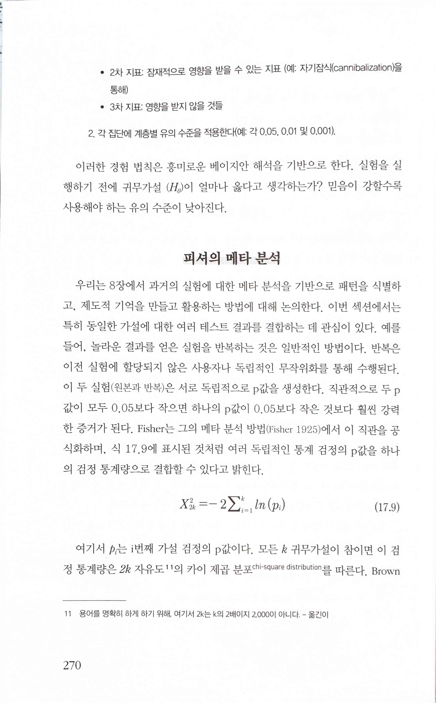

> 반복은 이전 실험에 할당되지 않은 사용자나 독립적인 무작위화를 통해 수행된다. 이 두 실험(원본과 반복)은 서로 독립적으로 p값을 생성한다. 직관적으로 두 p값이 모두 0.05보다 작으면 하나의 p값이 0.05보다 작은 것보다 훨씬 강력한 증거가 된다. Fisher는 그의 `메타 분석 방법`(Fisher 1925)에서 이 직관을 공식화하며, 식 17.9에 표시된 것처럼 여러 독립적인 통계 검정의 p값을 하나의 검정 통계량으로 결합할 수 있다고 밝힌다.

## 18 분산 추정 및 민감도 개선: 함정 및 해결책

> 검정력이 높으면, 효과의 크기가 작을 수 있다. Unknown
>
> 신뢰할 수 있는 방식으로 실험을 분석할 수 없는 경우에 실험을 수행하는 게 의미가 있을까? 분산은 실험 분석의 핵심이다. 이제까지 소개한 대부분의 주요 통계적 개념 (통계적 유의성, p값, 검정력 및 신뢰구간)은 분산과 관련이 있다. 따라서 분산을 정확하게 추정하는 것뿐만 아니라 통계적 가설 검정의 민감도를 얻기 위해 분산을 줄이는 방법을 이해하는 것은 매우 중요하다.

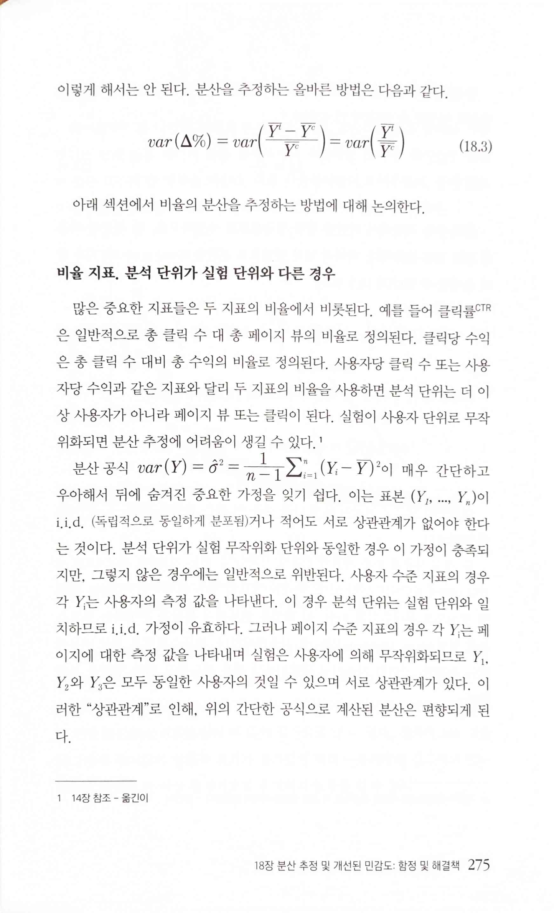

> 분산 공식이 매우 간단하고 우아해서 뒤에 숨겨진 중요한 가정을 잊기 쉽다. 이는 표본 (Y1, ...… Yn)이 i.i.d. (독립적으로 동일하게 분포됨)거나 적어도 서로 상관관계가 없어야 한다는 것이다. 분석 단위가 실험 무작위화 단위와 동일한 경우 이 가정이 충족되지만 그렇지 않은 경우에는 일반적으로 위반된다.

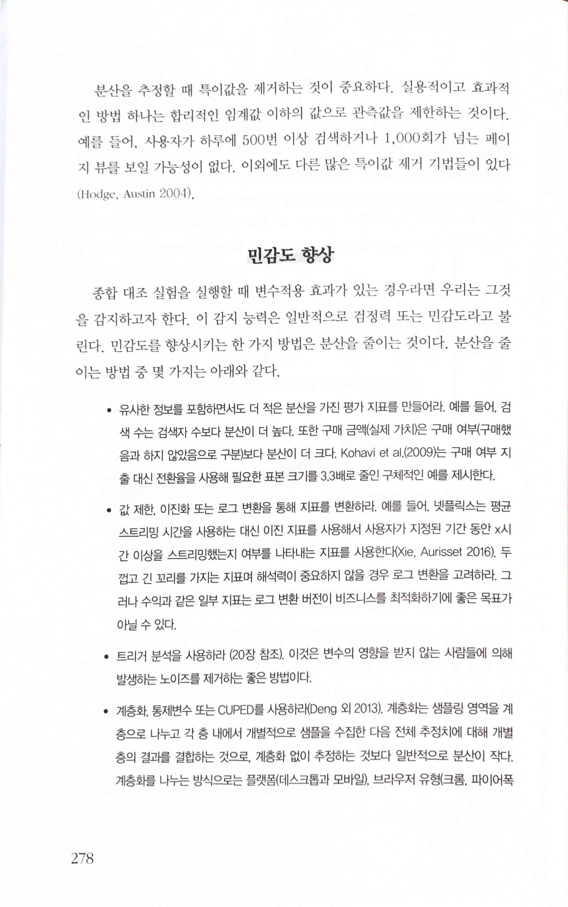

> 분산을 추정할 때 특이값을 제거하는 것이 중요하다. 실용적이고 효과적인 방법 하나는 합리적인 임계값 이하의 값으로 관측값을 제한하는 것이다. 
>
> 민감도를 향상시키는 한 가지 방법은 분산을 줄이는 것이다.

> 이 책의 대부분의 논의에서 우리는 관심 통계량이 평균이라고 가정한다. `분위수quantile`와 같은 다른 통계량에 관심이 있다면 어떻게 해야 할까?`PLT Page-load-time`와 같은 시간 기반 지표의 경우 사이트 속도 성능을 측정하기 위해 평균이 아닌 분위수를 사용하는 것이 일반적이다.

## 19 A/A 테스트

> 모든 것이 컨트롤되고 있는 상황이라면, 그건 충분히 빠르게 못 나아가고 있다는 뜻이다. 마리오 안드레티 Mario Andretti
>
> `A/A 테스트`의 개념은 간단하다. 일반 A/B 테스트에서와 같이 사용자를 두 그룹으로 나누지만 B를 A와 동일하게 만든다(따라서 A/A 테스트라고 함), 시스템이 올바르게 작동하는 경우, 반복 시행에서 약 5%의 경우에 주어진 지표는 0.05 미만의 값을 지니며 통계적으로 유의해야 한다.

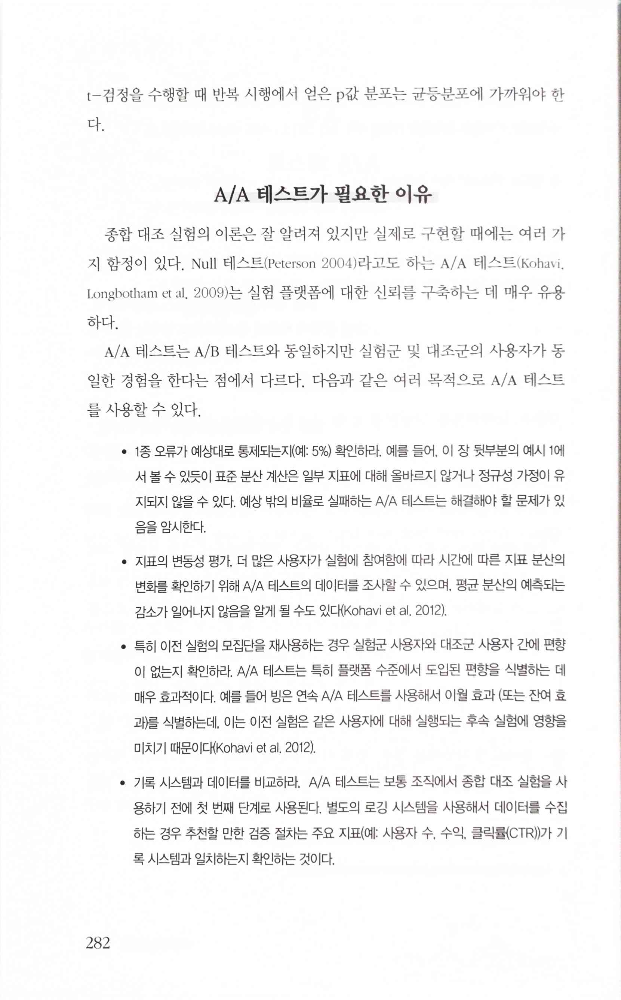

> 종합 대조 실험의 이론은 잘 알려져 있지만 실제로 구현할 때에는 여러 가지 함정이 있다. `Null 테스트`(Peterson 2004)라고도 하는 `A/A 테스트`(Kohavi. Longbotham et al, 2009)는 실험 플랫폼에 대한 신뢰를 구축하는 데 매우 유용하다.

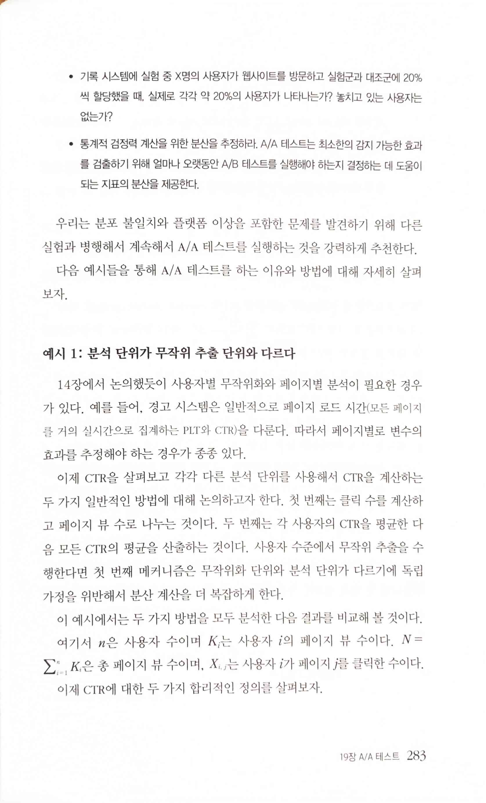  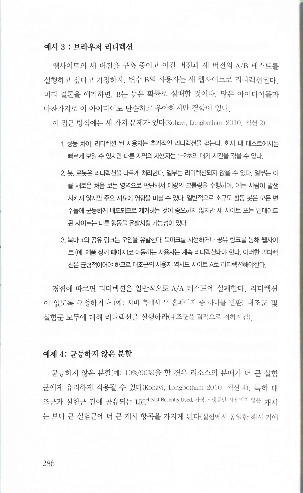 

> 분포 불일치와 플랫폼 이상을 포함한 문제를 발견하기 위해 다른 실험과 병행해서 계속해서 A/A 테스트를 실행하는 것을 강력하게 추천
>
> 브라우저 리디렉션
>
> 1. 성능 차이
>
> 2. 봇 로봇은 리디렉션을 다르게 처리
>
> 3. 북마크와 공유 링크는 오염 유발
>
> 경험에 따르면 리디렉션은 일반적으로 A/A 테스트에 실패한다. 리디렉션이 없도록 구성하거나 (예: 서버 측에서 두 홈페이지 중 하나를 반환) 대조군 및실험군 모두에 대해 리디렉션을 실행하라(대조군을 질적으로 저하시킴).

> A/B 테스트 시스템을 사용하기 전에 항상 일련의 A/A 테스트를 실행하라. 이상적으로는 1,000개의 A/A 테스트를 시뮬레이션하고 p값의 분포를 시각화하라, 분포가 균등하지 않으면 문제가 있는 것이다. 이 문제를 해결하기 전에는 A/B 테스트 시스템을 신뢰할 수 없다.
>
> 관심 지표가 연속적이고 A/A 테스트 예시에서 동일한 평균과 같은 간단한 귀무가설이 있는 경우 p값 분포는 균등해야 한다(Dickhaus 2014. Blocker etal, 2006)

> A/A 테스트를 통과한 후에도 A/B 테스트와 동시에 정기적으로 A/A 테스트를 실행해서 시스템에 문제가 발생하는 것을 알아내거나 특이값의 등장으로 분포가 변경돼 실패한 새 지표가 있는지 확인하는 것을 권장한다.

## 20 민감도 향상을 위한 트리거링

> 방아쇠를 당기기 전에 목표물을 확실하게 식별하라. 톰 플린Tom Flynn
>
> 사용자는 자신이 속한 집단과 다른 집단 간에 시스템 또는 사용자 행동에 약간의 차이가 있을 경우(잠재적으로) 실험 분석으로 트리거된다. 트리거링은 실제 사용시에 유용한 도구이지만 잘못된 결과로 이어질 수 있는 몇가지 함정을 지니고 있다. 적어도 모든 트리거된 사용자에 대해 분석 단계를 수행하는 것이 중요하다. 트리거링 이벤트가 런타임에 기록되도록 하면 트리거된 사용자 모집단을 더 쉽게 식별할 수 있다.

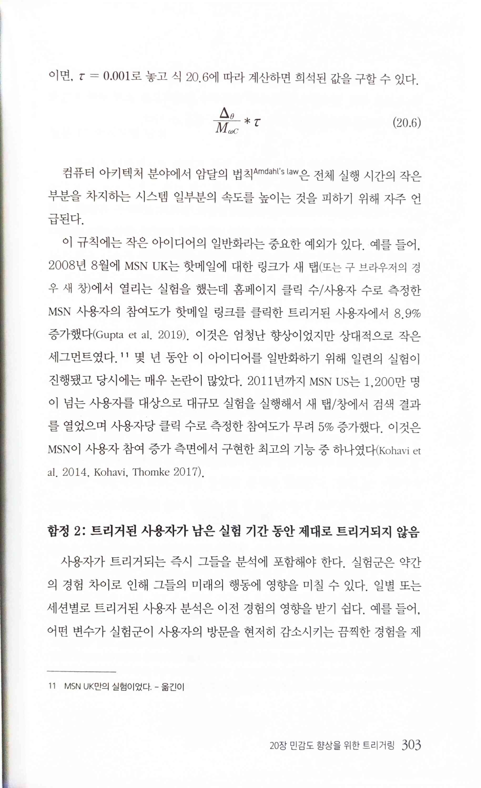

> 컴퓨터 아키텍처 분야에서 `암달의 법칙Amdahl's law`은 전체 실행 시간의 작은 부분을 차지하는 시스템 일부분의 속도를 높이는 것을 피하기 위해 자주 언급된다.

## 21 샘플 비율 불일치 및기타 신뢰 관련 가드레일 지표

> 잘못될 수 있는 것과 잘못될 수 없는 것의 가장 큰 차이점은 잘못될 수 없는 것이 잘못되면 대개는 발견하거나 고치기가 불가능하다는 것이다.더글라스 아담스Douglas Adams
>
> 가드레일 지표는 가정이 위반될 경우에 실험자에게 경고하기 위해 설계된 중요한 지표다. 가드레일 지표의 유형으로는 조직관련 지표와 신뢰 관련 지표(e.g. `샘플 비율 불일치 SRM, Sample Ratio Mismatch`)가 있다.

## 22 실험 간의 누출 및 간섭

> `당신의 이론이 얼마나 아름다운지는 중요하지 않다. 당신이 얼마나 똑똑한지는 중요하지 않다. 실험과 일치하지 않으면 잘못된 것이다. 리처드 파인만Richard Feynman`

> A/B 실험에서 이것은 실험군이 사용자에게 상당한 영향을 미치는 경우 이웃이 실험군 또는 대조군에 있는지 여부에 관계없이 그 효과가 점진적으로 퍼질 수 있음을 의미한다.

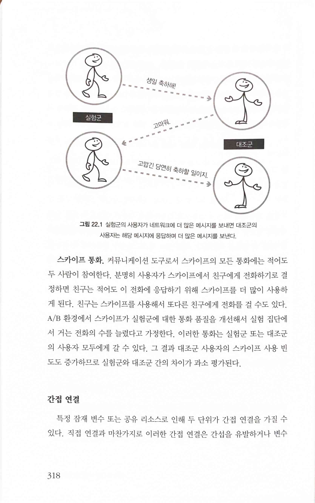

> 그림 22.1 실험군의 사용자가 네트워크에 더 많은 메시지를 보내면 대조군의 사용자는 해당 메시지에 응답하며 더 많은 메시지를 보낸다.
>
> 실험군와 대조군 간의 차이가 과소 평가된다.

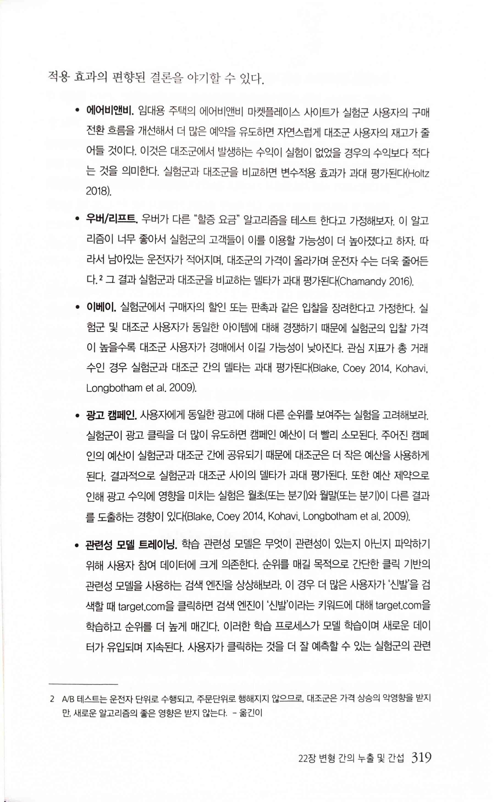 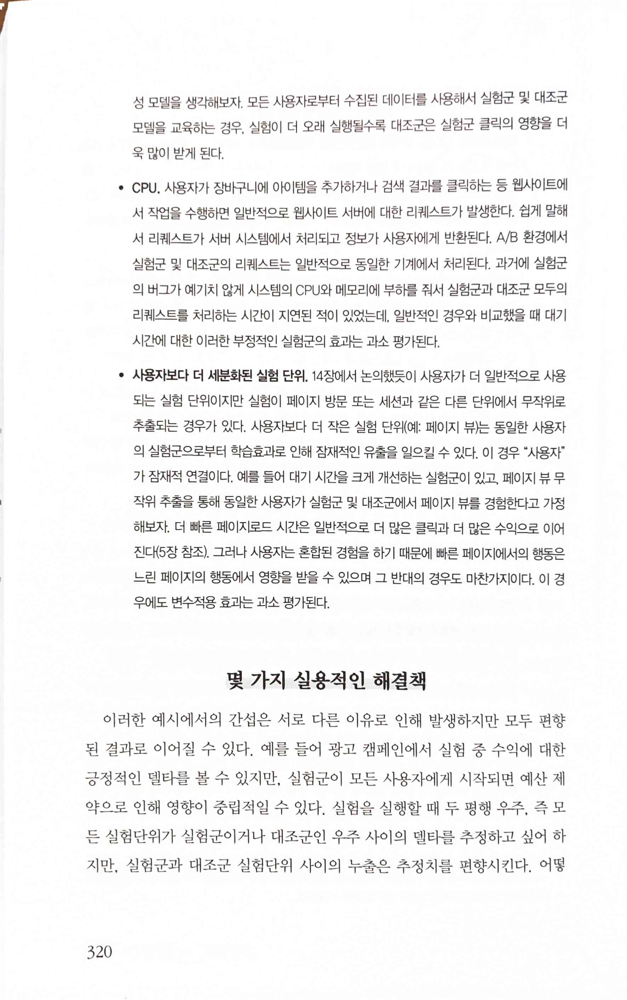

> 간접 연결
>
> 특정 잠재 변수 또는 공유 리소스로 인해 두 단위가 간접 연결을 가질 수 있다. 직접 연결과 마찬가지로 이러한 간접 연결은 간섭을 유발하거나 변수 적용 효과의 편향된 결론을 야기할 수 있다.

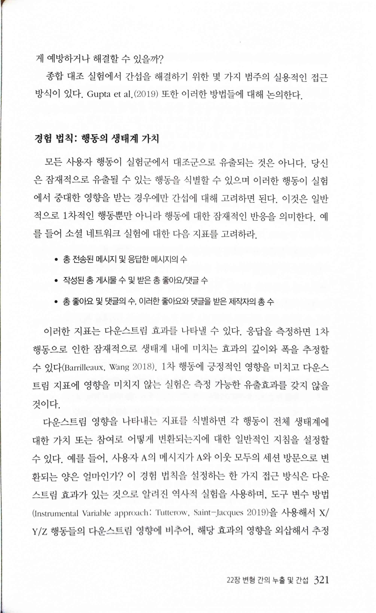 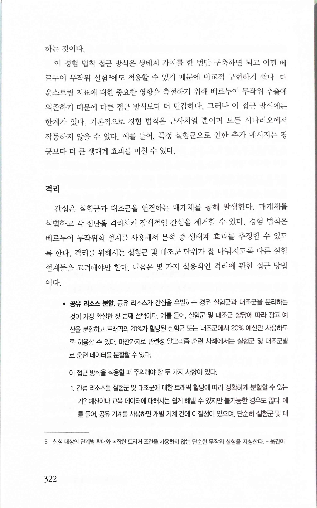 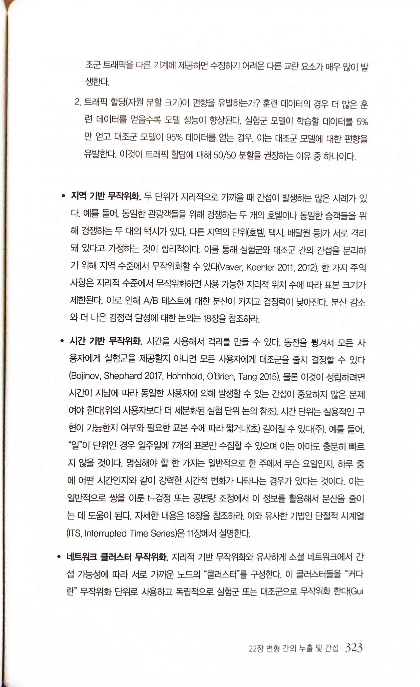 

> 종합 대조 실험에서 간섭을 해결하기 위한 몇 가지 범주의 실용적인 접근방식
>
> 경험 법칙: 행동의 생태계 가치
>
> 모든 사용자 행동이 실험군에서 대조군으로 유출되는 것은 아니다. 당신은 잠재적으로 유출될 수 있는 행동을 식별할 수 있으며 이러한 행동이 실험에서 중대한 영향을 받는 경우에만 간섭에 대해 고려하면 된다. 이것은 일반적으로 1차적인 행동뿐만 아니라 행동에 대한 잠재적인 반응을 의미한다.
>
> 격리
>
> 간섭은 실험군과 대조군을 연결하는 매개체를 통해 발생한다. 매개체를 식별하고 각 집단을 격리시켜 잠재적인 간섭을 제거할 수 있다. 경험 법칙은 베르누이 무작위화 설계를 사용해서 분석 중 생태계 효과를 추정할 수 있도록 한다. 격리를 위해서는 실험군 및 대조군 단위가 잘 나눠지도록 다른 실험설계들을 고려해야만 한다.

> 에지 수준 분석
>
> 일부 유출은 두 사용자 간의 명확하게 정의된 상호작용에서 발생한다. 이러한 상호작용(에지)은 식별하기 쉽다. 사용자에 대해 베르누이 무작위 추출을 사용한 다음, 사용자(노드)의 실험 할당에 따라 에지를 다음 네 가지 유형중 하나로 구분할 수 있다. 실험군-실험군, 실험군-대조군, 대조군-대조군 및 대조군-실험군, 서로 다른 에지에서 발생하는 대조적인 상호작용(예: 메시지 좋아요)을 통해 중요한 네트워크 효과를 이해할 수 있다. 
>
> 간섭의 메커니즘을 이해하는 것이 좋은 해결책을 알아내는 열쇠이다. 정확한 측정을 하는 것이 모든 실험에서 실용적으로 구현이 가능하지 않을 수도 있지만 간섭을 감지하기 위해서는 강력한 모니터링 및 경고 시스템을 갖추는 것이 중요하다.

## 23 장기 실험효과 측정

> 우리는 기술의 효과를 단기적으로는 과대 평가하고, 장기적으로는 과소 평가하는 경향이 있다. 로이 아마라 Roy Amara

> 장기적 효과와 단기적 효과가 다른 시나리오가 존재한다. 예를 들어 가격을 올리면 단기 수익은 증가하지만 사용자가 제품이나 서비스를 포기함에 따라 장기 수익이 감소한다. 검색 엔진에서 열악한 검색 결과를 표시하면 사용자는 다시 검색하게 된다(Kohavi et al. 2012). 검색어 점유율이 단기적으로는 증가하지만 사용자가 더 나은 검색 엔진으로 전환함에 따라 장기적으로는 감소한다. 마찬가지로 더 낮은 품질의 광고를 포함해서 더 많은 광고를 표시하면 단기적으로는 광고 클릭과 수익이 증가할 수 있지만 장기적으로는 광고 클릭 및 검색이 줄어들며 수익이 감소할 수 있다. (Hohnhold, O'Brien, Tang 2015, Dmitriev, Frasca, et al, 2016).

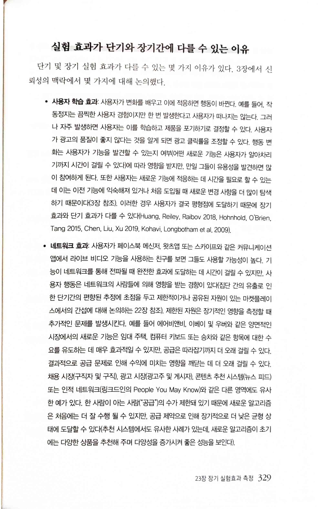 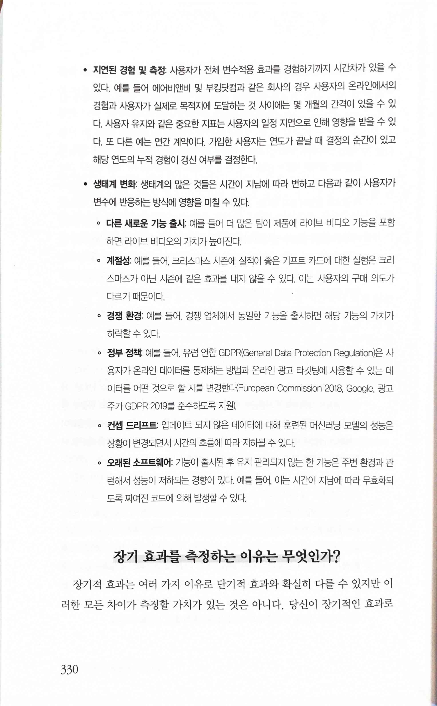

> 실험 효과가 단기와 장기간에 다를 수 있는 이유
>
> • 사용자 학습 효과
>
> • 네트워크 효과
>
> • 지연된 경험 및 측정
>
> • 생태계 변화

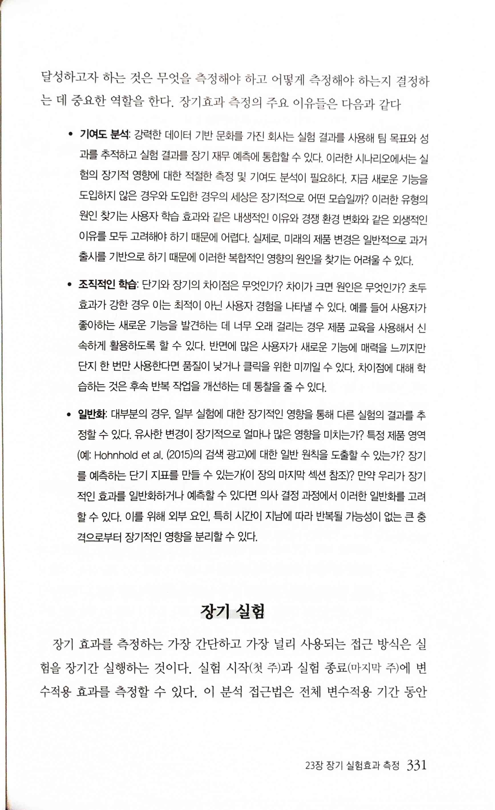

> 장기 효과를 측정하는 이유
>
> • 기여도 분석
>
> • 조직적인 학습
>
> • 일반화