# 1일 1로그 100일 완성 IT 지식

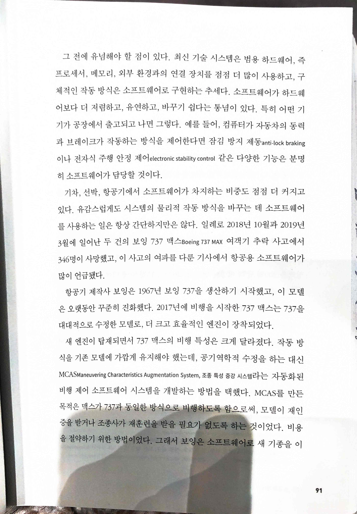 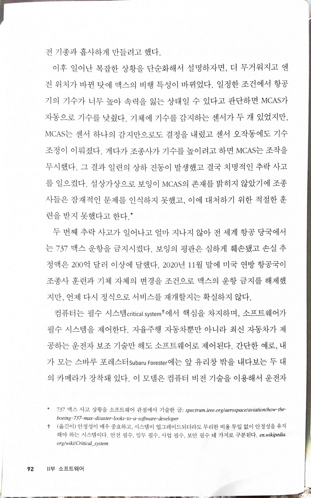 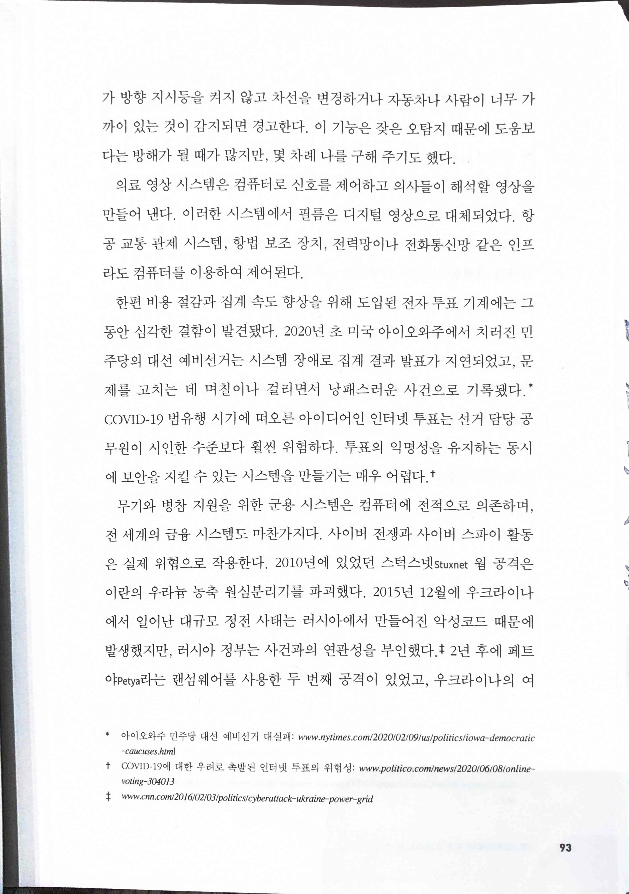 

* `소프트웨어가 하드웨어보다 더 저렴하고, 유연하고, 바꾸기 쉽다는 통념이 있다.`
* `유감스럽게도 시스템의 물리적 작동 방식을 바꾸는 데 소프트웨어를 사용하는 일은 항상 간단하지만은 않다.`
* 보잉 737 맥스 Boeing 737 MAX 여객기 추락 사고에서 346명이 사망
  * [How the Boeing 737 Max Disaster Looks to a Software Developer - IEEE Spectrum](https://spectrum.ieee.org/how-the-boeing-737-max-disaster-looks-to-a-software-developer)
* 2020년 초 미국 아이오와주에서 치러진 민주당의 대선 예비선거는 시스템 장애로 집계 결과 발표가 지연
* 2010년에 있었던 스턱스넷stuxnet 웜 공격은 이란의 우라늄 농축 원심분리기를 파괴
* 2015년 12월에 우크라이나에서 일어난 대규모 정전 사태는 러시아에서 만들어진 악성코드 때문에 발생했지만, 러시아 정부는 사건과의 연관성을 부인
* 2017년에 워너크라이 WannaCry로 알려진 랜섬웨어 공격은 전 세계에 수십억 달러의 피해
  * [WannaCry ransomware attack - Wikipedia](https://en.wikipedia.org/wiki/WannaCry_ransomware_attack)
* 2020년 7월에는 러시아 사이버 스파이 그룹이 여러 국가에서 COVID-19 백신 개발 정보를 빼내려고 했다는 혐의
  * [Russian hackers return to spotlight with vaccine research attack | The Hill](https://thehill.com/policy/national-security/507744-russian-hackers-return-to-spotlight-with-vaccine-research-attack/)

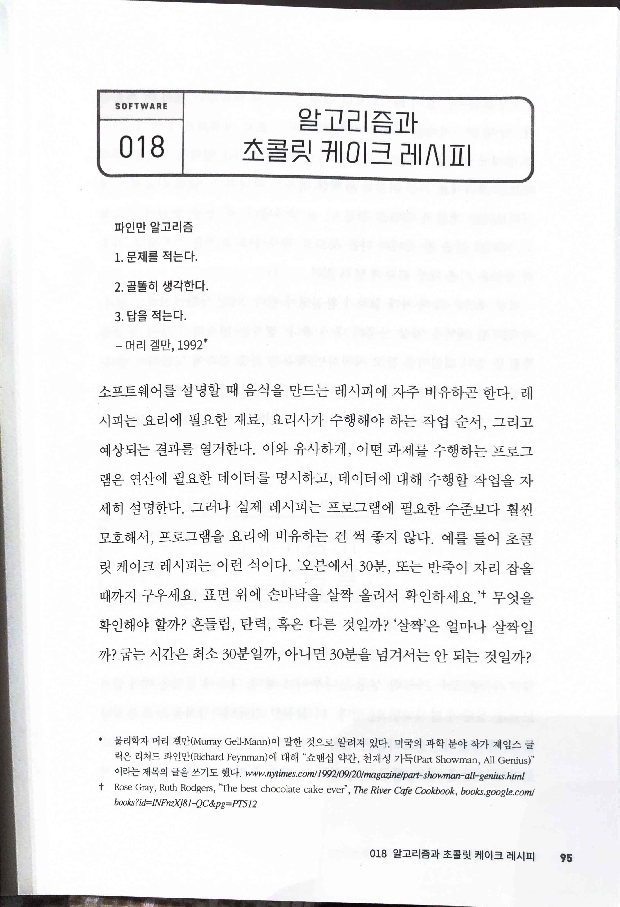 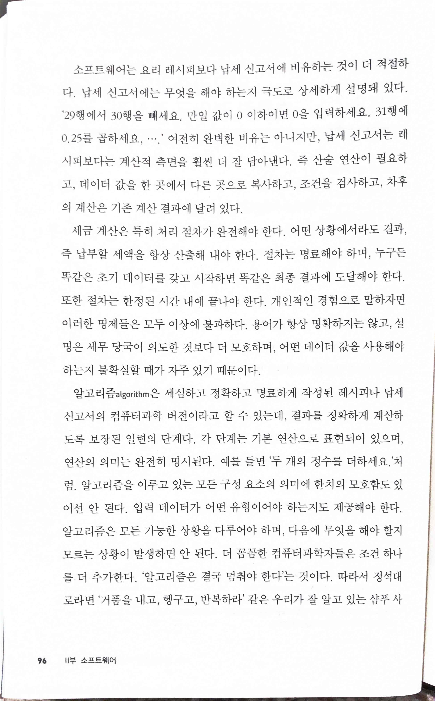 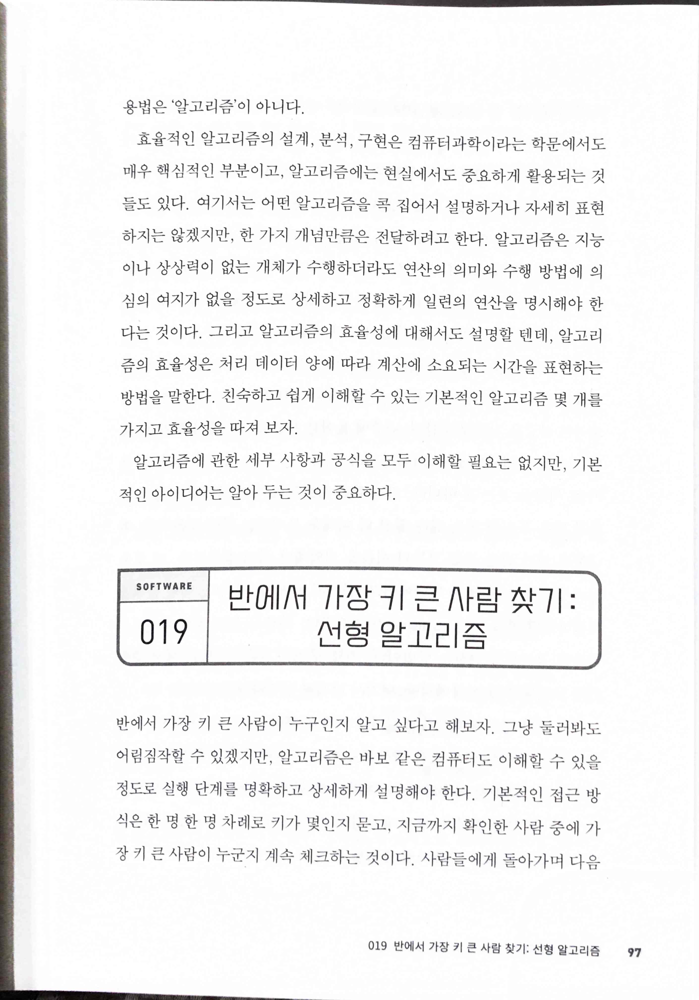

* `소프트웨어를 설명할 때 음식을 만드는 레시피에 자주 비유하곤 한다. 레시피는 요리에 필요한 재료, 요리사가 수행해야 하는 작업 순서, 그리고 예상되는 결과를 열거한다. 이와 유사하게, 어떤 과제를 수행하는 프로그램은 연산에 필요한 데이터를 명시하고, 데이터에 대해 수행할 작업을 자세히 설명한다. 그러나 실제 레시피는 프로그램에 필요한 수준보다 훨씬 모호해서, 프로그램을 요리에 비유하는 건 썩 좋지 않다. 예를 들어 초콜릿 케이크 레시피는 이런 식이다. 오븐에서 30분, 또는 반죽이 자리 잡을때까지 구우세요. 표면 위에 손바닥을 살짝 올려서 확인하세요. '무엇을 확인해야 할까? 흔들림, 탄력, 혹은 다른 것일까? '살짝'은 얼마나 살짝일까? 굽는 시간은 최소 30분일까, 아니면 30분을 넘겨서는 안 되는 것일까?`
* `소프트웨어는 요리 레시피보다 납세 신고서에 비유하는 것이 더 적절하다. 납세 신고서에는 무엇을 해야 하는지 극도로 상세하게 설명돼 있다... 여전히 완벽한 비유는 아니지만, 납세 신고서는 레시피보다는 계산적 측면을 훨씬 더 잘 담아낸다. 즉 산술 연산이 필요하고, 데이터 값을 한 곳에서 다른 곳으로 복사하고, 조건을 검사하고, 차후의 계산은 기존 계산 결과에 달려 있다.`
* `세금 계산은 특히 처리 절차가 완전해야 한다. 어떤 상황에서라도 결과, 즉 납부할 세액을 항상 산출해 내야 한다. 절차는 명료해야 하며, 누구든 똑같은 초기 데이터를 갖고 시작하면 똑같은 최종 결과에 도달해야 한다. 또한 절차는 한정된 시간 내에 끝나야 한다.`
* `개인적인 경험으로 말하자면 이러한 명제들은 모두 이상에 불과하다. 용어가 항상 명확하지는 않고, 설명은 세무 당국이 의도한 것보다 더 모호하며, 어떤 데이터 값을 사용해야 하는지 불확실할 때가 자주 있기 때문이다.`
  * (비즈니스와 개발간에 발생하는 현상에 대해 명확한 설명)
* `알고리즘algorithm은 세심하고 정확하고 명료하게 작성된 레시피나 납세 신고서의 컴퓨터과학 버전이라고 할 수 있는데, 결과를 정확하게 계산하도록 보장된 일련의 단계다. 각 단계는 기본 연산으로 표현되어 있으며, 연산의 의미는 완전히 명시된다. 예를 들면 '두 개의 정수를 더하세요. 처럼, 알고리즘을 이루고 있는 모든 구성 요소의 의미에 한치의 모호함도 있어선 안 된다. 입력 데이터가 어떤 유형이어야 하는지도 제공해야 한다. 알고리즘은 모든 가능한 상황을 다루어야 하며, 다음에 무엇을 해야 할지 모르는 상황이 발생하면 안 된다. 더 꼼꼼한 컴퓨터과학자들은 조건 하나를 더 추가한다. '알고리즘은 결국 멈춰야 한다'는 것이다.`
* `효율적인 알고리즘의 설계, 분석, 구현은 컴퓨터과학이라는 학문에서도 매우 핵심적인 부분이고, 알고리즘에는 현실에서도 중요하게 활용되는 것들도 있다... 알고리즘은 지능이나 상상력이 없는 개체가 수행하더라도 연산의 의미와 수행 방법에 의심의 여지가 없을 정도로 상세하고 정확하게 일련의 연산을 명시해야 한다는 것이다. 그리고 알고리즘의 효율성에 대해서도 설명할 텐데, 알고리즘의 효율성은 처리 데이터 양에 따라 계산에 소요되는 시간을 표현하는 방법을 말한다. 친숙하고 쉽게 이해할 수 있는 기본적인 알고리즘 몇 개를 가지고 효율성을 따져 보자.`

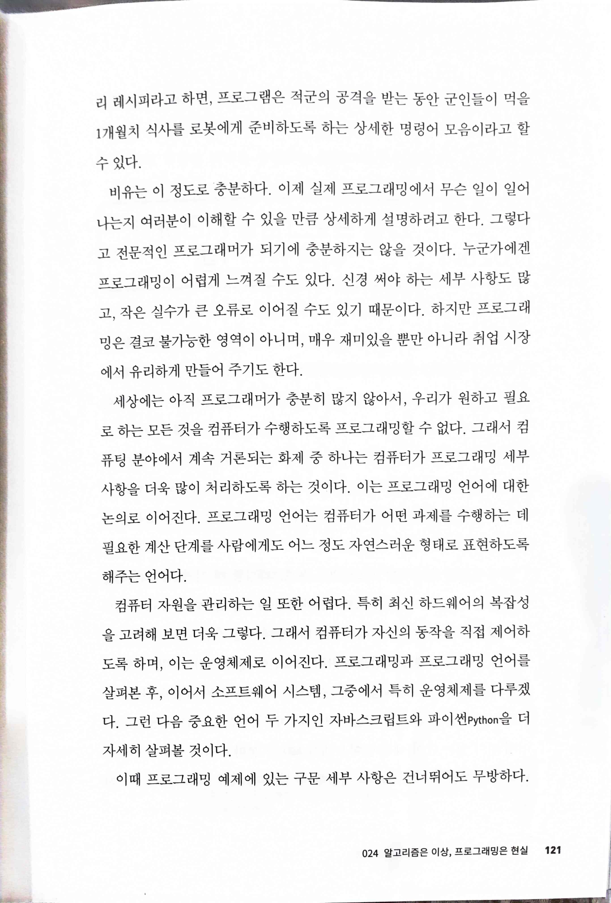

* `세상에는 아직 프로그래머가 충분히 많지 않아서, 우리가 원하고 필요로 하는 모든 것을 컴퓨터가 수행하도록 프로그래밍할 수 없다. 그래서 컴퓨팅 분야에서 계속 거론되는 화제 중 하나는 컴퓨터가 프로그래밍 세부사항을 더욱 많이 처리하도록 하는 것이다. 이는 프로그래밍 언어에 대한 논의로 이어진다. 프로그래밍 언어는 컴퓨터가 어떤 과제를 수행하는 데 필요한 계산 단계를 사람에게도 어느 정도 자연스러운 형태로 표현하도록 해주는 언어다.`
* `중요한 언어 두 가지인 자바스크립트와 파이썬 Python을 더 자세히 살펴볼 것이다.`

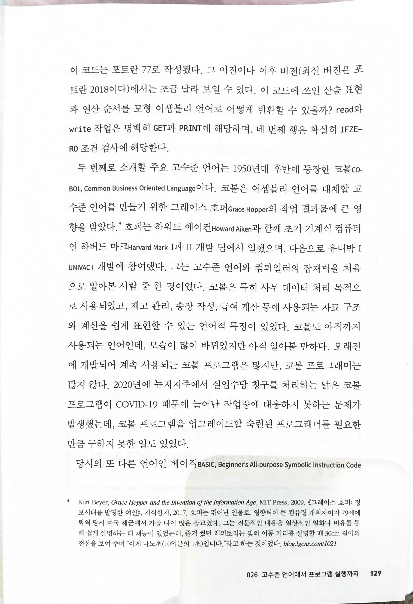

* `코볼COBOL, Common Business Oriented Language, 그레이스 호퍼Grace Hopper`

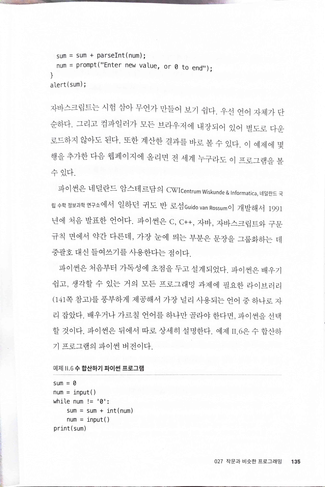

* `배우거나 가르칠 언어를 하나만 골라야 한다면, 파이썬을 선택할 것이다.`

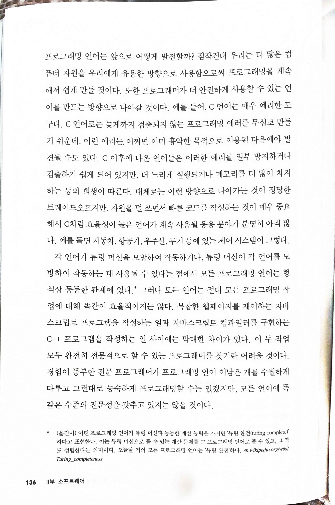

* `각 언어가 튜링 머신을 모방하여 작동하거나, 튜링 머신이 각 언어를 모방하여 작동하는 데 사용될 수 있다는 점에서 모든 프로그래밍 언어는 형식상 동등한 관계에 있다. 그러나 모든 언어는 절대 모든 프로그래밍 작업에 대해 똑같이 효율적이지는 않다.`
* `경험이 풍부한 전문 프로그래머가 프로그래밍 언어 여남은 개를 수월하게 다루고 그런대로 능숙하게 프로그래밍할 수는 있겠지만, 모든 언어에 똑같은 수준의 전문성을 갖추고 있지는 않을 것이다.`
* (항상 언어는 도구이고 하나를 잘 하면 다른 걸 잘 할수 있다고 주장하는 사람들에게 내가 반박할 때 하는 말)

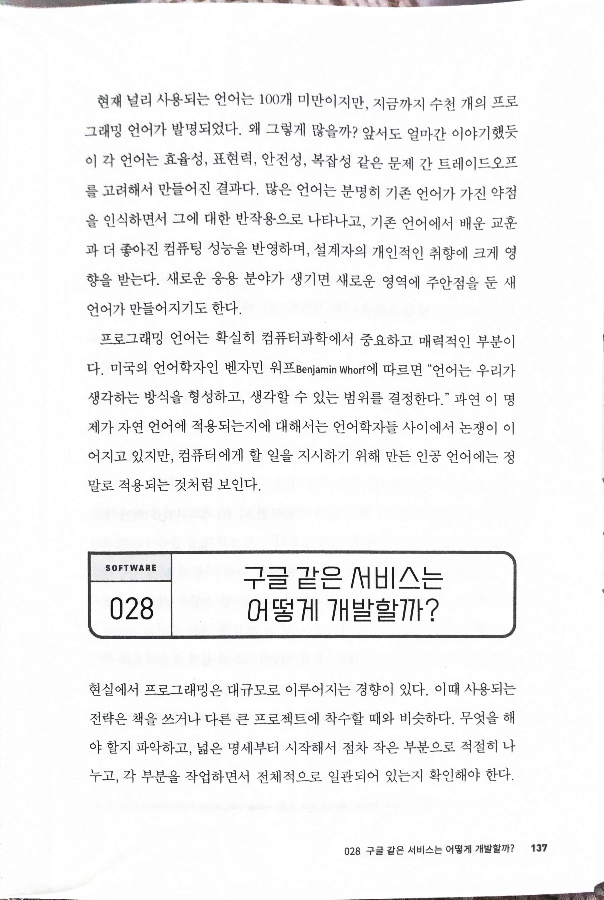

* `미국의 언어학자인 벤자민 워프 Benjamin Whorf에 따르면 "언어는 우리가 생각하는 방식을 형성하고, 생각할 수 있는 범위를 결정한다." 과연 이 명제가 자연 언어에 적용되는지에 대해서는 언어학자들 사이에서 논쟁이 이어지고 있지만, 컴퓨터에게 할 일을 지시하기 위해 만든 인공 언어에는 정말로 적용되는 것처럼 보인다.`
* `무엇을 해야 할지 파악하고, 넓은 명세부터 시작해서 점차 작은 부분으로 적절히 나누고, 각 부분을 작업하면서 전체적으로 일관되어 있는지 확인해야 한다.`

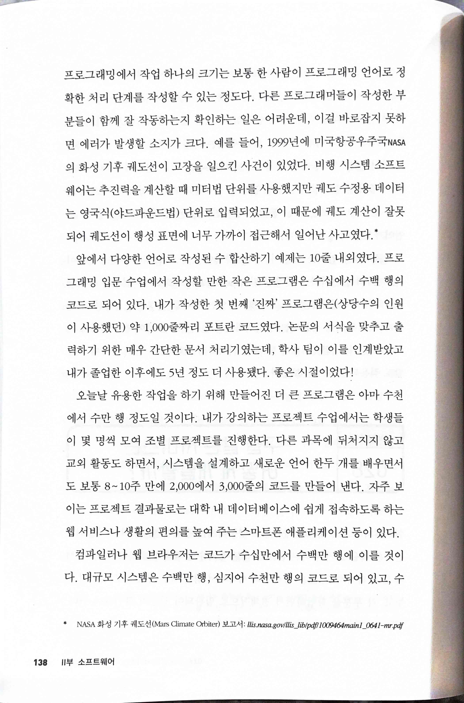

* `다른 프로그래머들이 작성한 부분들이 함께 잘 작동하는지 확인하는 일은 어려운데, 이걸 바로잡지 못하면 에러가 발생할 소지가 크다. 예를 들어, 1999년에 미국항공우주국NASA의 화성 기후 궤도선이 고장을 일으킨 사건이 있었다. 비행 시스템 소프트웨어는 추진력을 계산할 때 미터법 단위를 사용했지만 궤도 수정용 데이터는 영국식(야드파운드법) 단위로 입력되었고, 이 때문에 궤도 계산이 잘못되어 궤도선이 행성 표면에 너무 가까이 접근해서 일어난 사고였다.`

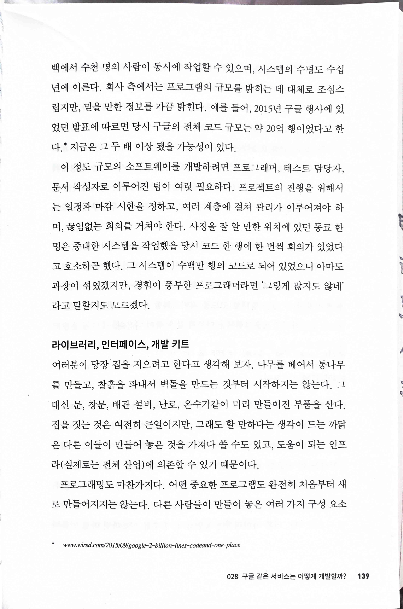

* `이 정도 규모의 소프트웨어를 개발하려면 프로그래머, 테스트 담당자, 문서 작성자로 이루어진 팀이 여럿 필요하다. 프로젝트의 진행을 위해서는 일정과 마감 시한을 정하고, 여러 계층에 걸쳐 관리가 이루어져야 하며, 끊임없는 회의를 거쳐야 한다. 사정을 잘 알 만한 위치에 있던 동료 한 명은 중대한 시스템을 작업했을 당시 코드 한 행에 한 번씩 회의가 있었다고 호소하곤 했다. 그 시스템이 수백만 행의 코드로 되어 있었으니 아마도 과장이 섞였겠지만, 경험이 풍부한 프로그래머라면 '그렇게 많지도 않네'라고 말할지도 모르겠다.`
* `여러분이 당장 집을 지으려고 한다고 생각해 보자. 나무를 베어서 통나무를 만들고, 찰흙을 파내서 벽돌을 만드는 것부터 시작하지는 않는다. 그'대신 문, 창문, 배관 설비, 난로, 온수기같이 미리 만들어진 부품을 산다. 집을 짓는 것은 여전히 큰일이지만, 그래도 할 만하다는 생각이 드는 까닭은 다른 이들이 만들어 놓은 것을 가져다 쓸 수도 있고, 도움이 되는 인프라(실제로는 전체 산업)에 의존할 수 있기 때문이다.`
* `프로그래밍도 마찬가지다. 어떤 중요한 프로그램도 완전히 처음부터 새로 만들어지지는 않는다.`

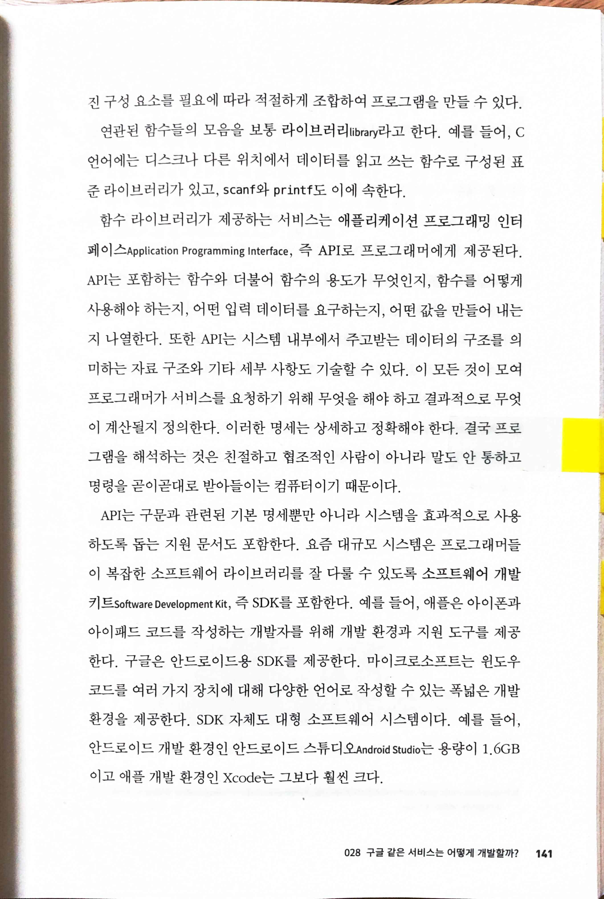

* `API는 포함하는 함수와 더불어 함수의 용도가 무엇인지, 함수를 어떻게 사용해야 하는지, 어떤 입력 데이터를 요구하는지, 어떤 값을 만들어 내는지 나열한다. 또한 API는 시스템 내부에서 주고받는 데이터의 구조를 의미하는 자료 구조와 기타 세부 사항도 기술할 수 있다. 이 모든 것이 모여 프로그래머가 서비스를 요청하기 위해 무엇을 해야 하고 결과적으로 무엇이 계산될지 정의한다. 이러한 명세는 상세하고 정확해야 한다. 결국 프로그램을 해석하는 것은 친절하고 협조적인 사람이 아니라 말도 안 통하고 명령을 곧이곧대로 받아들이는 컴퓨터이기 때문이다.`

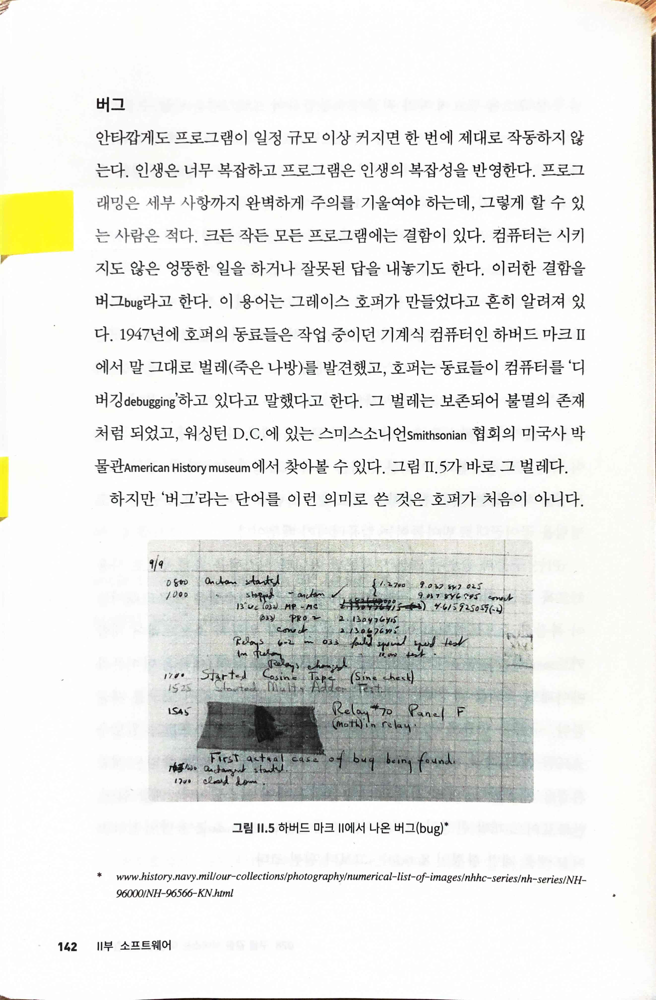

* `안타깝게도 프로그램이 일정 규모 이상 커지면 한 번에 제대로 작동하지 않는다. 인생은 너무 복잡하고 프로그램은 인생의 복잡성을 반영한다. 프로그래밍은 세부 사항까지 완벽하게 주의를 기울여야 하는데, 그렇게 할 수 있는 사람은 적다. 크든 작든 모든 프로그램에는 결함이 있다. 컴퓨터는 시키지도 않은 엉뚱한 일을 하거나 잘못된 답을 내놓기도 한다.`

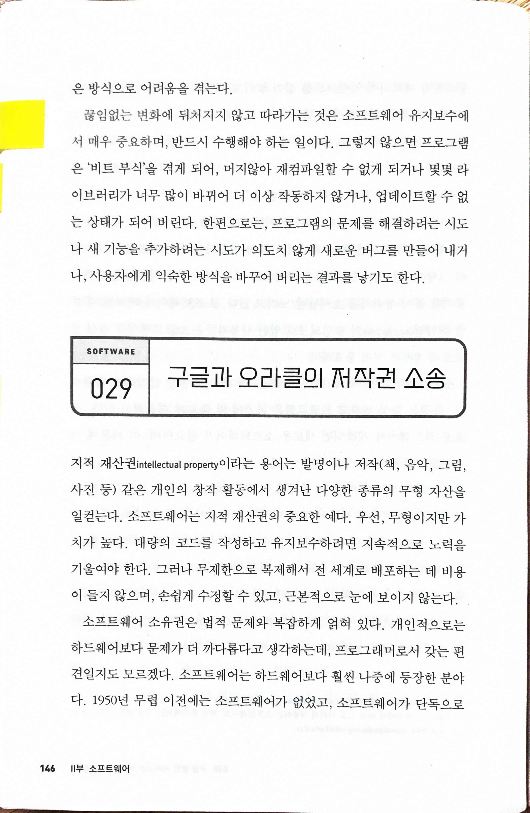

* `끊임없는 변화에 뒤처지지 않고 따라가는 것은 소프트웨어 유지보수에서 매우 중요하며, 반드시 수행해야 하는 일이다. 그렇지 않으면 프로그램은 '비트 부식'을 겪게 되어, 머지않아 재컴파일할 수 없게 되거나 몇몇 라이브러리가 너무 많이 바뀌어 더 이상 작동하지 않거나, 업데이트할 수 없는 상태가 되어 버린다. 한편으로는, 프로그램의 문제를 해결하려는 시도나 새 기능을 추가하려는 시도가 의도치 않게 새로운 버그를 만들어 내거나, 사용자에게 익숙한 방식을 바꾸어 버리는 결과를 낳기도 한다.`

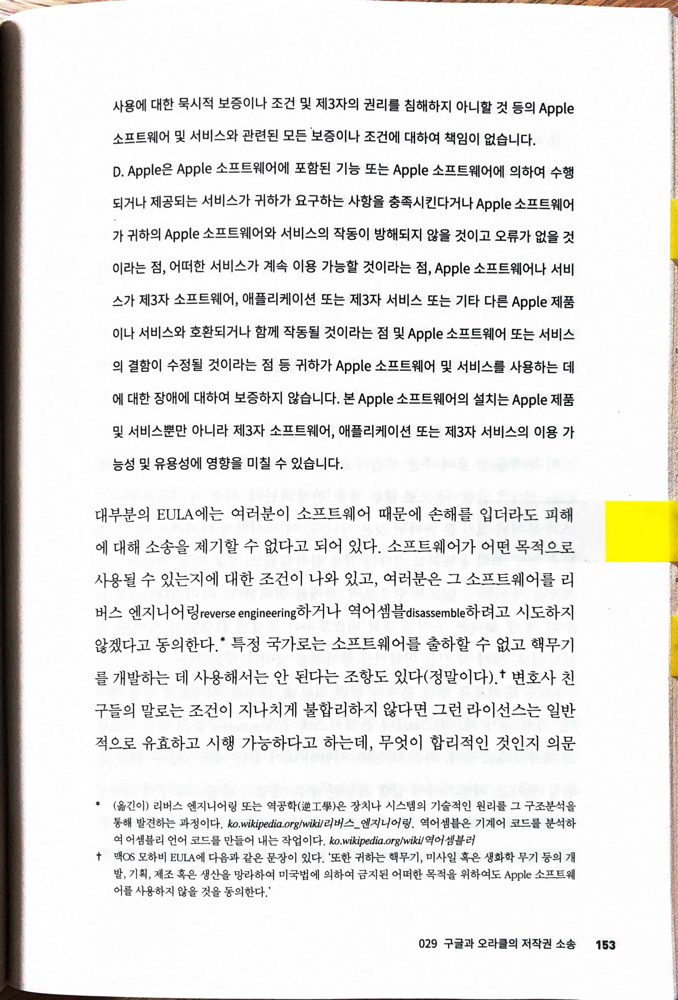

* `대부분의 EULA에는 여러분이 소프트웨어 때문에 손해를 입더라도 피해에 대해 소송을 제기할 수 없다고 되어 있다. `

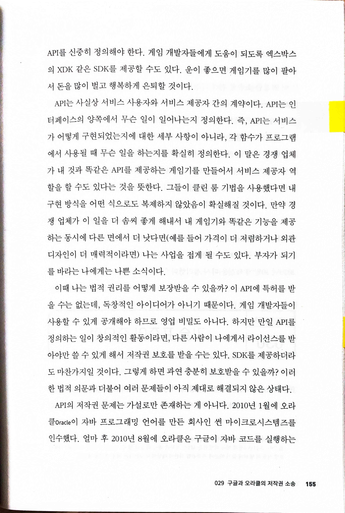

* `API는 사실상 서비스 사용자와 서비스 제공자 간의 계약이다. API는 인터페이스의 양쪽에서 무슨 일이 일어나는지 정의한다. 즉, API는 서비스가 어떻게 구현되었는지에 대한 세부 사항이 아니라, 각 함수가 프로그램에서 사용될 때 무슨 일을 하는지를 확실히 정의한다.`

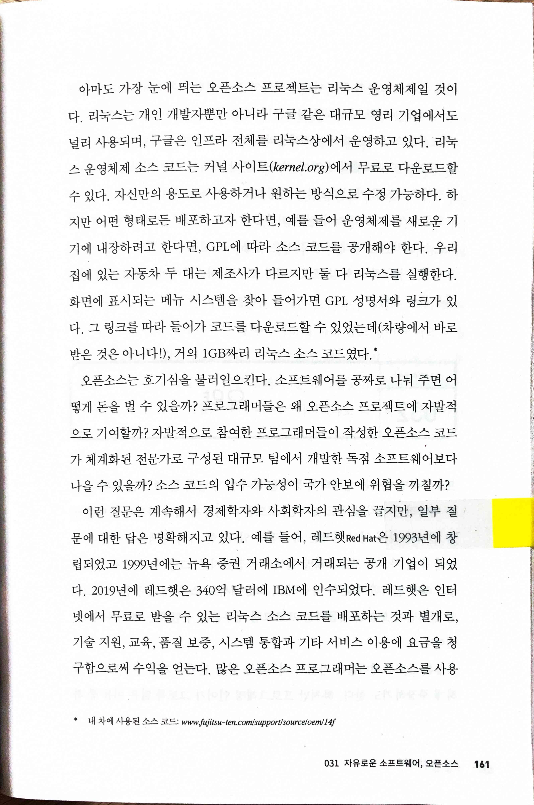

* `오픈소스는 호기심을 불러일으킨다. 소프트웨어를 공짜로 나눠 주면 어떻게 돈을 벌 수 있을까? 프로그래머들은 왜 오픈소스 프로젝트에 자발적으로 기여할까? 자발적으로 참여한 프로그래머들이 작성한 오픈소스 코드가 체계화된 전문가로 구성된 대규모 팀에서 개발한 독점 소프트웨어보다 나을 수 있을까? 소스 코드의 입수 가능성이 국가안보에 위협을 끼칠까?`
* `이런 질문은 계속해서 경제학자와 사회학자의 관심을 끌지만, 일부 질문에 대한 답은 명확해지고 있다.`

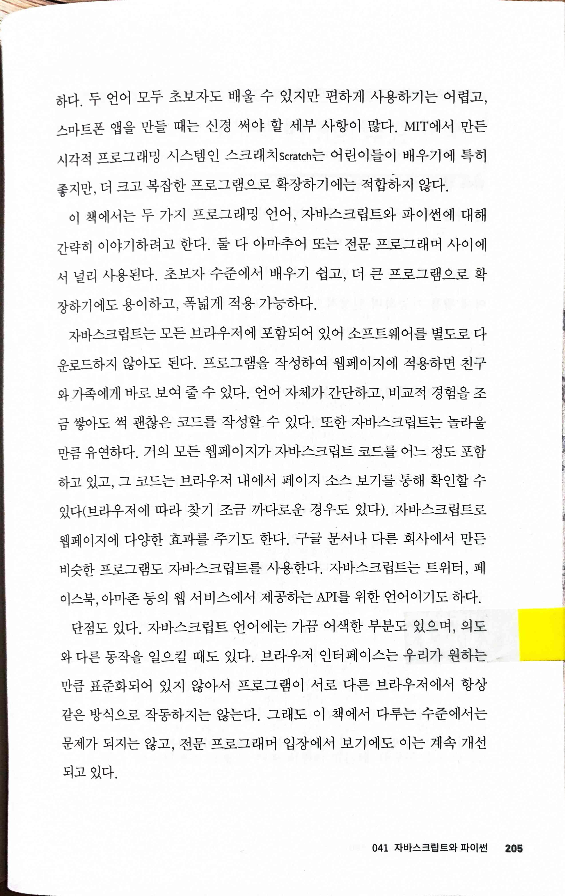

* `자바스크립트 언어에는 가끔 어색한 부분도 있으며, 의도와 다른 동작을 일으킬 때도 있다. 브라우저 인터페이스는 우리가 원하는만큼 표준화되어 있지 않아서 프로그램이 서로 다른 브라우저에서 항상같은 방식으로 작동하지는 않는다.`

* `프로그래밍은 때로는 좌절스러울 정도로 어렵기도 하지만 매우 재미있는 일이 되기도 하고, 심지어 이걸로 괜찮은 수입을 거두기도 한다. 누구나 프로그래머가 될 수 있지만, 세부 사항을 놓치지 않는 안목이 중요하며, 미세한 부분에 집중하면서도 큰 그림을 볼 수 있는 능력이 있으면 금상첨화다. 또한 신중하지 않으면 프로그램이 제대로 작동하지 않거나 전혀 작동하지 않을 수 있으므로, 세부 사항을 바로잡지 않고는 못배기는 습관을 기르는 것도 도움이 된다. 대부분의 분야가 그렇겠지만 아마추어 프로그래머와 진짜 전문가의 차이는 크다.`

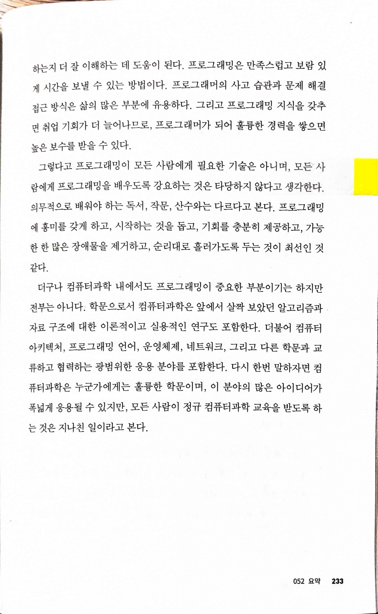

* `그렇다고 프로그래밍이 모든 사람에게 필요한 기술은 아니며, 모든 사람에게 프로그래밍을 배우도록 강요하는 것은 타당하지 않다고 생각한다. 의무적으로 배워야 하는 독서, 작문, 산수와는 다르다고 본다. 프로그래밍에 흥미를 갖게 하고, 시작하는 것을 돕고, 기회를 충분히 제공하고, 가능한 한 많은 장애물을 제거하고, 순리대로 흘러가도록 두는 것이 최선인 것 같다.`

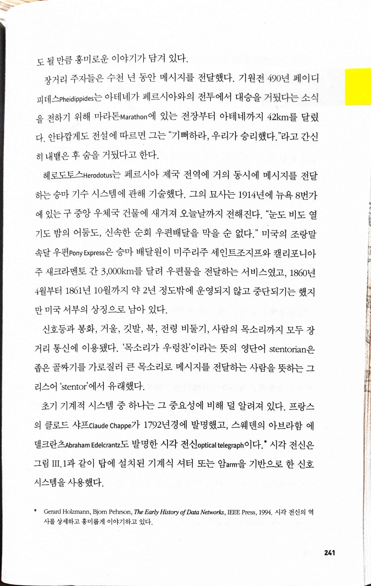 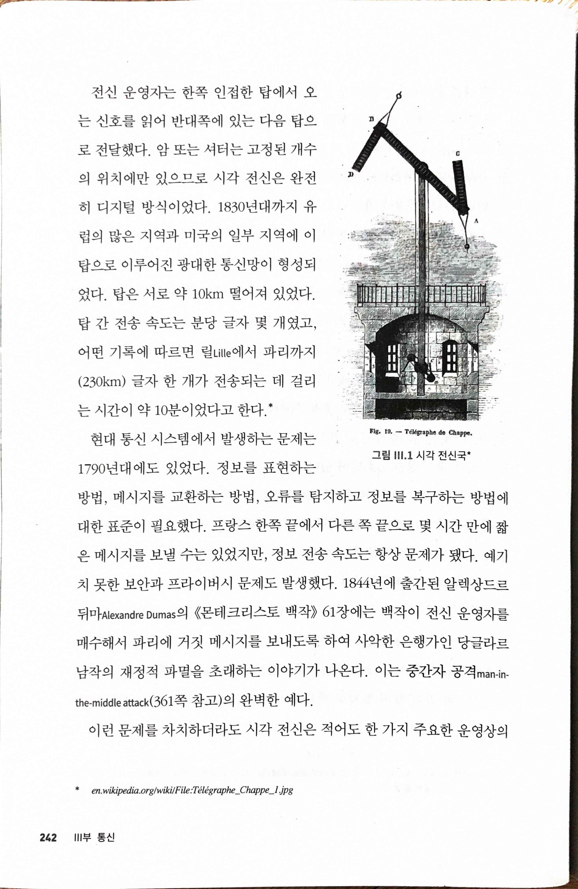 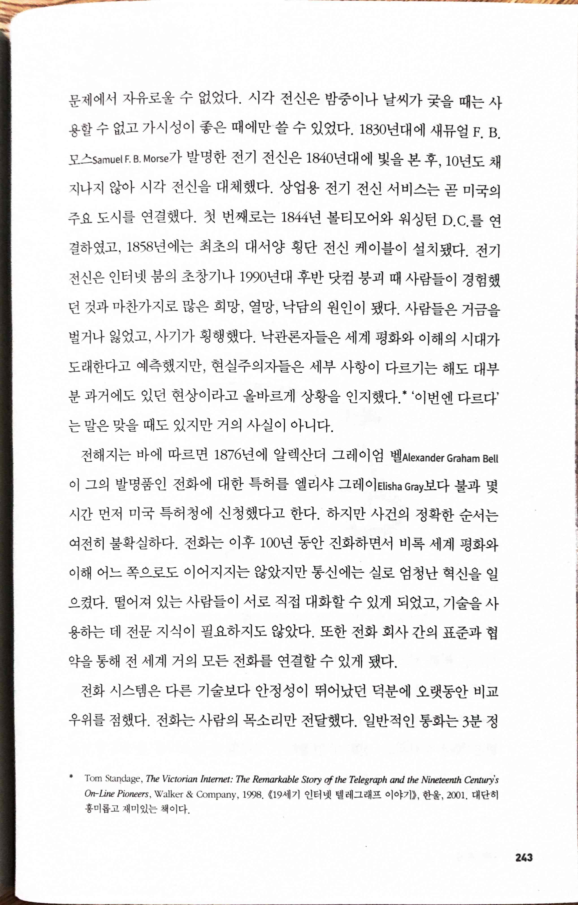 

* 메시지 전달
  * `기원전 490년 페이디피데스Pheidippides는 아테네가 페르시아와의 전투에서 대승을 거뒀다는 소식을 전하기 위해 마라톤Marathon에 있는 전장부터 아테네까지 42km를 달렸다.`
  * `헤로도토스Herodotus는 페르시아 제국 전역에 거의 동시에 메시지를 전달하는 승마 기수 시스템에 관해 기술했다.`
  * `미국의 조랑말 속달 우편Pony Express은 승마 배달원이 미주리주 세인트조지프와 캘리포니아주 새크라멘토 간 3,000km를 달려 우편물을 전달하는 서비스였고, 1860년 4월부터 1861년 10월까지 약 2년 정도밖에 운영되지 않고 중단되기는 했지만 미국 서부의 상징으로 남아 있다.`
  * `신호등과 봉화, 거울, 깃발, 북, 전령 비둘기, 사람의 목소리까지 모두 장거리 통신에 이용됐다. '목소리가 우렁찬'이라는 뜻의 영단어 stentorian은 좁은 골짜기를 가로질러 큰 목소리로 메시지를 전달하는 사람을 뜻하는 그리스어 'stentor'에서 유래했다.`
* 초기 기계적 시스템 
  * `프랑스의 클로드 샤프Claude Chappe가 1792년경에 발명했고, 스웨덴의 아브라함 에델크란츠Abraham Edelcrantz 발명한 시각 전신optical telegraph`
  * `1830년대에 새뮤얼 F. B. 모스Samuel F. B. Morse가 발명한 전기 전신은 1840년대에 빛을 본 후, 10년도 채 지나지 않아 시각 전신을 대체`
  * `1876년에 알렉산더 그레이엄 벨Alexander Graham Bell이 그의 발명품인 전화에 대한 특허를 엘리샤 그레이Elisha Gray보다 불과 몇 시간 먼저 미국 특허청에 신청`
  * `전화 시스템이 두 가지 핵심 가치, 즉 높은 신뢰성과 보장된 서비스 품질에 집중할 수 있었음을 의미한다. 50년 동안 누군가 수화기를 들면 다이얼 톤(발신음. 또 다른 언어적 반향으로 남아 있다)이 울리고, 통화 호출은 항상 성사되고, 전화가 연결되면 상대방의 목소리를 분명하게 들을 수 있고, 양측 모두 전화를 끊을 때까지 유지되었다.`

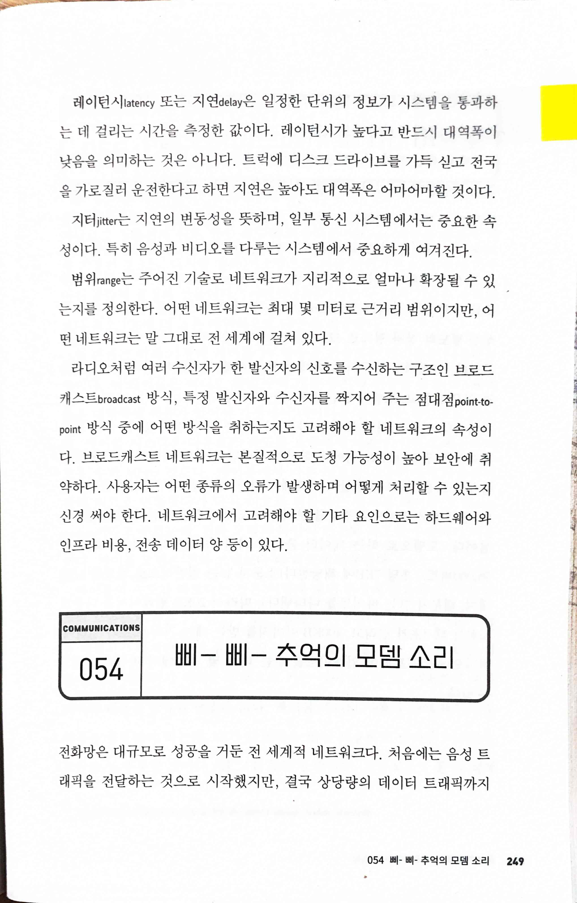

* `레이턴시 latency 또는 지연 delay은 일정한 단위의 정보가 시스템을 통과하는 데 걸리는 시간을 측정한 값이다. 레이턴시가 높다고 반드시 대역폭이낮음을 의미하는 것은 아니다. 트럭에 디스크 드라이브를 가득 싣고 전국을 가로질러 운전한다고 하면 지연은 높아도 대역폭은 어마어마할 것이다.`
* `지터 jitter는 지연의 변동성을 뜻하며, 일부 통신 시스템에서는 중요한 속성이다. 특히 음성과 비디오를 다루는 시스템에서 중요하게 여겨진다.`
* `범위 range는 주어진 기술로 네트워크가 지리적으로 얼마나 확장될 수 있는지를 정의한다. 어떤 네트워크는 최대 몇 미터로 근거리 범위이지만, 어떤 네트워크는 말 그대로 전 세계에 걸쳐 있다.`
* `라디오처럼 여러 수신자가 한 발신자의 신호를 수신하는 구조인 브로드캐스트broadcast 방식, 특정 발신자와 수신자를 짝지어 주는 점대점point-topoint 방식 중에 어떤 방식을 취하는지도 고려해야 할 네트워크의 속성이다. 브로드캐스트 네트워크는 본질적으로 도청 가능성이 높아 보안에 취약하다. 사용자는 어떤 종류의 오류가 발생하며 어떻게 처리할 수 있는지신경 써야 한다. 네트워크에서 고려해야 할 기타 요인으로는 하드웨어와 인프라 비용, 전송 데이터 양 등이 있다.`

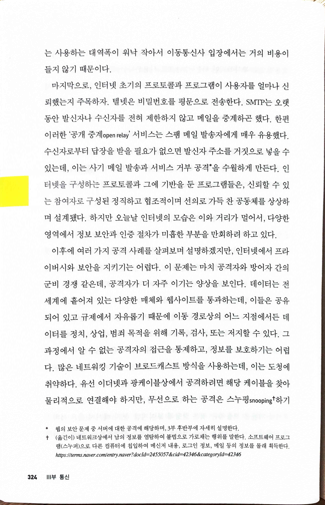

* `인터넷을 구성하는 프로토콜과 그에 기반을 둔 프로그램들은, 신뢰할 수 있는 참여자로 구성된 정직하고 협조적이며 선의로 가득 찬 공동체를 상상하며 설계됐다. 하지만 오늘날 인터넷의 모습은 이와 거리가 멀어서, 다양한 영역에서 정보 보안과 인증 절차가 미흡한 부분을 만회하려 하고 있다.`

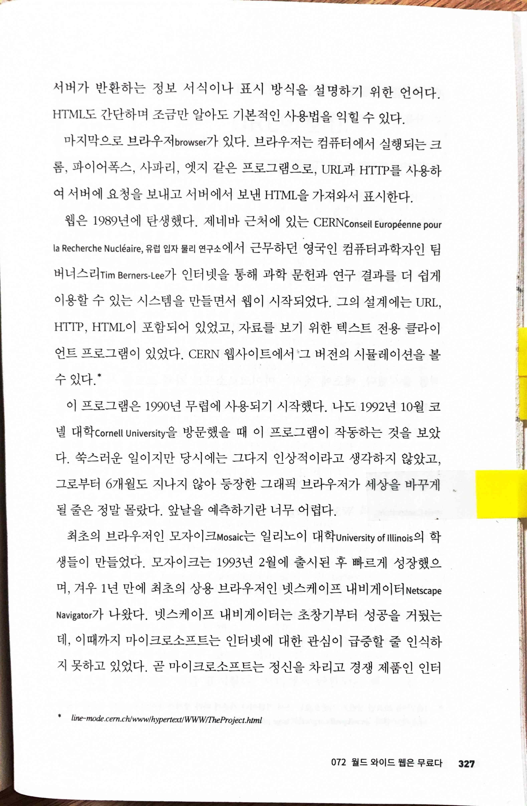

* `이 프로그램은 1990년 무렵에 사용되기 시작했다. 나도 1992년 10월 코넬 대학 Cornell University을 방문했을 때 이 프로그램이 작동하는 것을 보았다. 쑥스러운 일이지만 당시에는 그다지 인상적이라고 생각하지 않았고,그로부터 6개월도 지나지 않아 등장한 그래픽 브라우저가 세상을 바꾸게될 줄은 정말 몰랐다. 앞날을 예측하기란 너무 어렵다.`

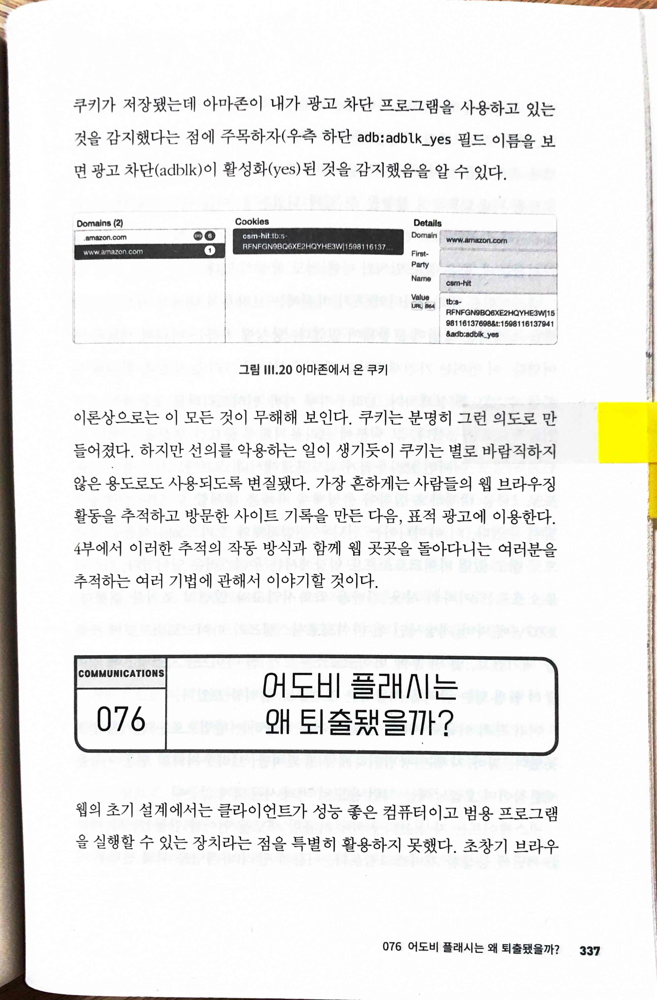

* `이론상으로는 이 모든 것이 무해해 보인다. 쿠키는 분명히 그런 의도로 만들어졌다. 하지만 선의를 악용하는 일이 생기듯이 쿠키는 별로 바람직하지않은 용도로도 사용되도록 변질됐다. 가장 흔하게는 사람들의 웹 브라우징 활동을 추적하고 방문한 사이트 기록을 만든 다음, 표적 광고에 이용한다.`

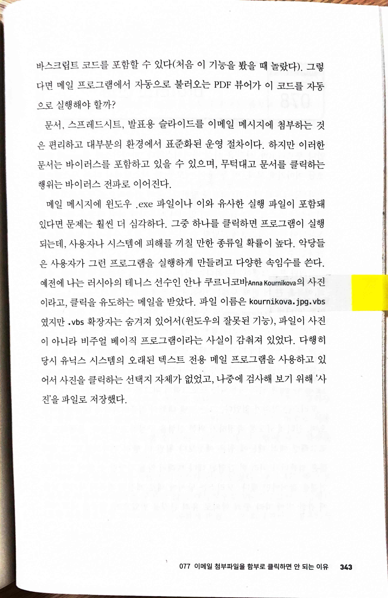

* 그냥 재미있어서(안나 쿠르니코바라니..)

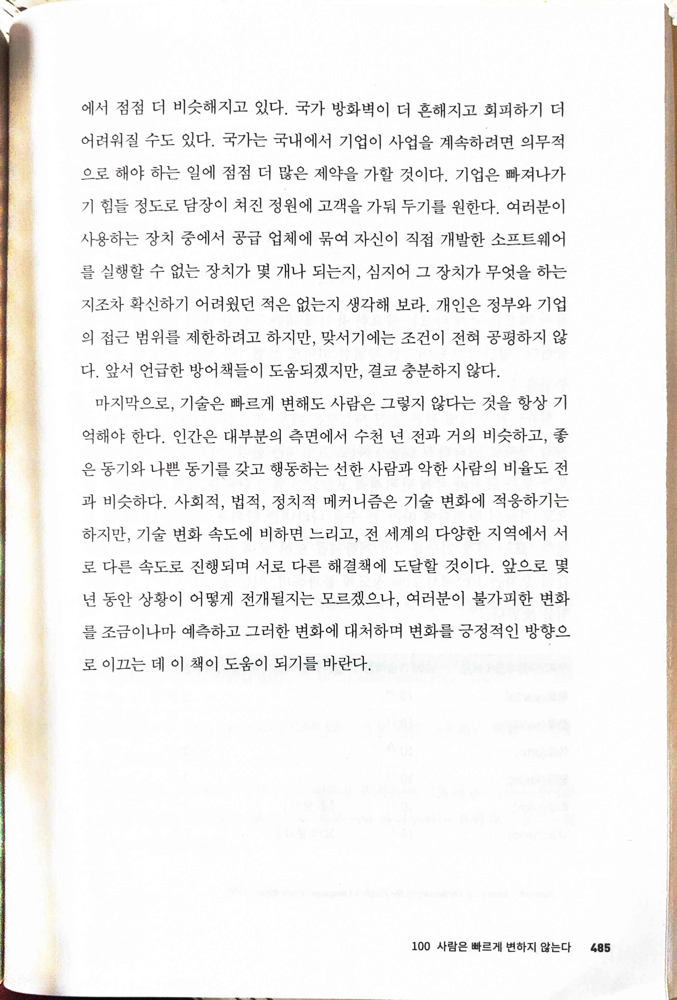

* `기술은 빠르게 변해도 사람은 그렇지 않다는 것을 항상 기억해야 한다. 인간은 대부분의 측면에서 수천 년 전과 거의 비슷하고, 좋은 동기와 나쁜 동기를 갖고 행동하는 선한 사람과 악한 사람의 비율도 전과 비슷하다. 사회적, 법적, 정치적 메커니즘은 기술 변화에 적응하기는 하지만, 기술 변화 속도에 비하면 느리고, 전 세계의 다양한 지역에서 서로 다른 속도로 진행되며 서로 다른 해결책에 도달할 것이다. 앞으로 몇년 동안 상황이 어떻게 전개될지는 모르겠으나, 여러분이 불가피한 변화를 조금이나마 예측하고 그러한 변화에 대처하며 변화를 긍정적인 방향으로 이끄는 데 이 책이 도움이 되기를 바란다.`