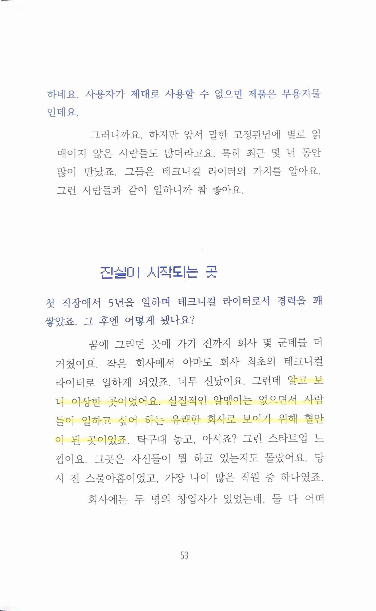
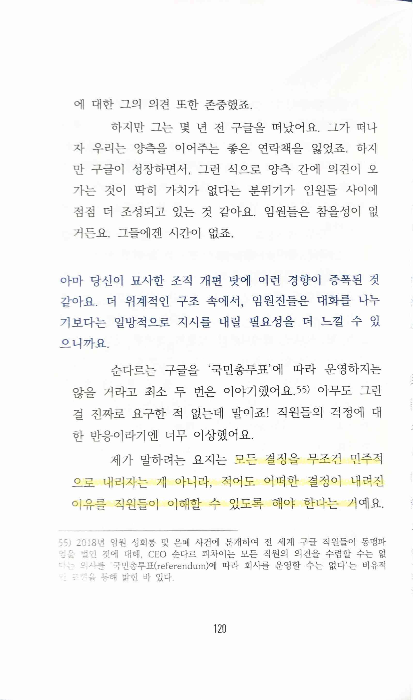
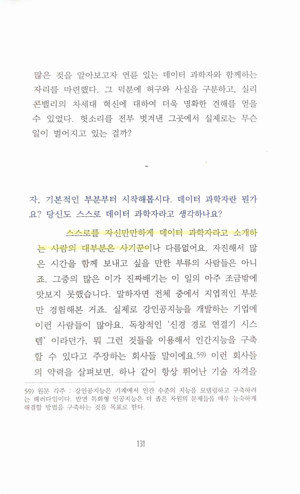
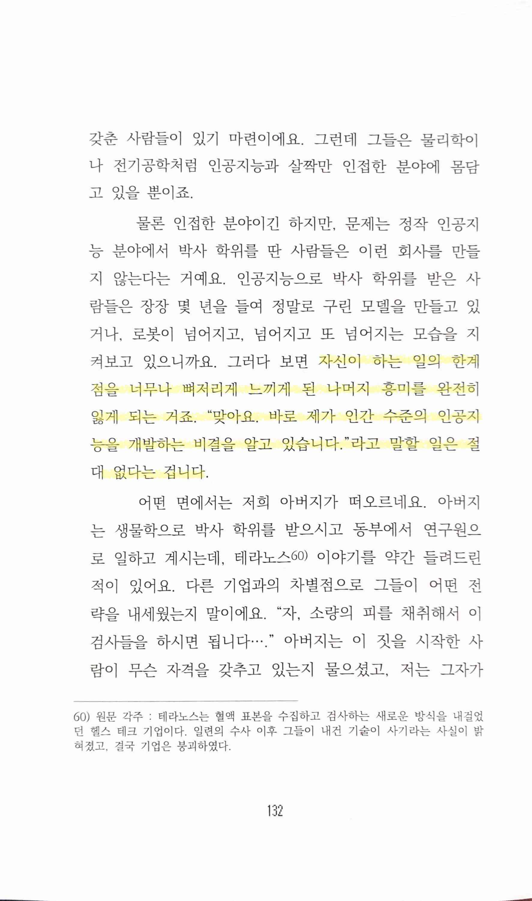
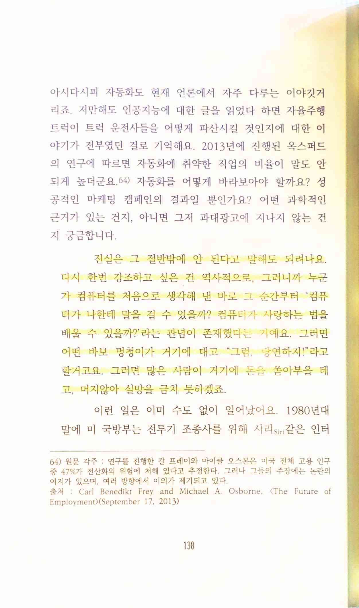
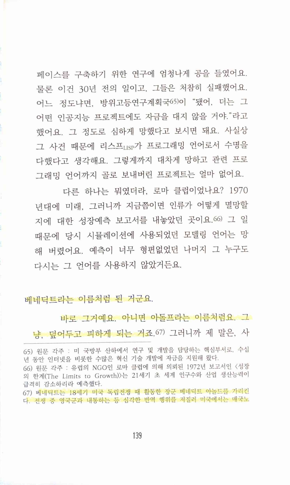
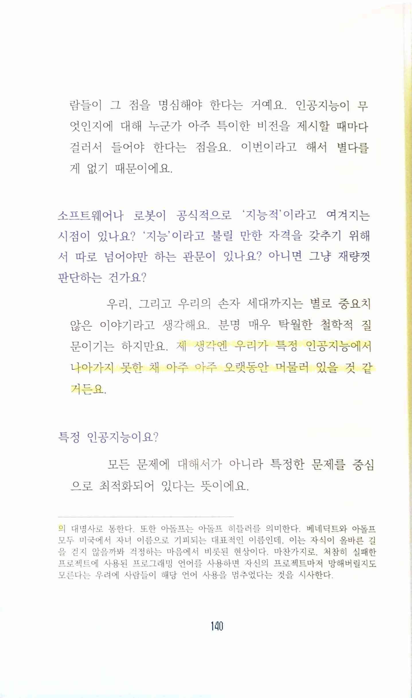

실리콘 밸리의 목소리
====================

* ★★★☆☆ 2023.04.02~03
* [테크니컬 라이터의 어두운 면. 우리나라에서 테크니컬 라이터는 소수다. 지난 10여 간 수요가 늘고… | by Ragina Jeon | Dec, 2022 | Medium](https://lyingdragon.medium.com/%ED%85%8C%ED%81%AC%EB%8B%88%EC%BB%AC-%EB%9D%BC%EC%9D%B4%ED%84%B0%EC%9D%98-%EC%96%B4%EB%91%90%EC%9A%B4-%EB%A9%B4-b5f456359a3b)

> 알고 보니 이상한 곳이었어요. 실질적인 알맹이는 없으면서 사람들이 일하고 싶어 하는 유쾌한 회사로 보이기 위해 혈안이 된 곳이었죠.
* 나도 이런 데서 일한 경험이 있어서 어떤 느낌인지 정말 와닿는다

> 모든 결정을 무조건 민주적으로 내리자는 게 아니라, 적어도 어떠한 결정이 내려진 이유를 직원들이 이해할 수 있도록 해야 한다는 거예요.
* (물론 우리나라같은 문화에서와 실리콘밸리에서의 문화 차이가 있긴 하겠지만) 이런 게 구글에서조차 잘 안 되고 있는 걸까? 1 on 1, 부서 전체 미팅을 통해 이런 걸 항상 수렴하려고 했지만 쉽지 않고, 또 우리나라는 특히 잘 발언하는 사람들이 없어서 어려운데, 실리콘밸리의 빅테크에서도 암묵적으로나마 (특히 요즘같이 대규모 구조조정이 일상화된 시기에는) 이런 분위기일지 궁금하다

> 스스로를 자신만만하게 데이터 과학자라고 소개하는 사람의 대부분은 사기꾼이나 다름없어요.
* 많은 업무들이 분화된 큰 회사일수록 더 그렇다. 아직도 AI, ML, DL이 통계의 다른 말이라고 이야기하는 경우도 많기 때문에 이 넓은 분야를 통칭하는 의미로 그 말을 사용한다면 사기꾼일 확률은 거의 100%라는 데 동의

> 자신이 하는 일의 한계점을 너무나 뼈저리게 느끼게 된 나머지 흥미를 완전히 잃게 되는 거죠. “맞아요. 바로 제가 인간 수준의 인공지능을 개발하는 비결을 알고 있습니다."라고 말할 일은 절대 없다는 겁니다.
* 하지만 그럼에도 불구하고 작년 말부터의 분위기는 이제 정말 특이점이 다가오는가 하는 기대감을 갖게 만들고 있긴 하다.

> 진실은 그 절반밖에 안 된다고 말해도 되려나요. 다시 한번 강조하고 싶은 건 역사적으로, 그러니까 누군가 컴퓨터를 처음으로 생각해 낸 바로 그 순간부터 '컴퓨터가 나한테 말을 걸 수 있을까? 컴퓨터가 사랑하는 법을 배울 수 있을까?' 라는 관념이 존재했다는 거예요. 그러면 어떤 바보 멍청이가 거기에 대고 “그럼, 당연하지!"라고 할거고요. 그러면 많은 사람이 거기에 돈을 쏟아부을 테고, 머지 않아 실망을 금치 못하겠죠.
* 제3의 AI 겨울이 오지 않는다고 확언할 수 없겠지만, 앞에서도 썼듯 작년 말부터는 정말 기대감을 갖게 되었고, 그런 분위기가 형성이 되었다.

> 베네딕트라는 이름처럼 된 거군요.
>
> 바로 그거예요. 아니면 아돌프라는 이름처럼요. 그냥 덮어두고 피하게 되는 거죠.
>
> 베네딕트는 18세기 미국 독립전쟁 때 활동한 장군 베네딕트 아놀드를 가리킨다. 전쟁 중 영국군과 내통하는 등 심각한 반역 행위를 저질러 미국에서는 매국노의 대명사로 통한다.

> 제 생각엔 우리가 특정 인공지능에서 나아가지 못한 채 아주 아주 오랫동안 머물러 있을 것 같거든요.
* ChatGPT를 통해 촉발된 이번 붐이 정말 AGI의 시작이 될지 궁금하다.