프로덕트 매니저는 무슨 일을 하고 있을까
=======================================
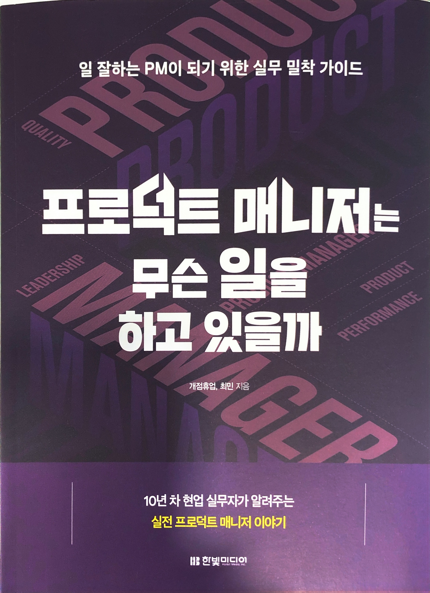

* 장점
  * 확실히 실무를 했던 사람이 쓴 책이라는 느낌이 든다. 전반적으로 다뤄야 할 부분들을 빠짐없이 다루고 있어서, PM을 지향하는 사람에게, 특히 초보/주니어에게 큰 도움이 될만하다
  * 확실히 이제는 이쪽 분야가 전문화가 되어간다는 걸 느끼는게 얼마 전 읽었던 제품의 탄생도 그렇지만, product를 잘 만들기 위해 어떻게 구조적으로 전문적으로 일할지 다루는 서적이 계속 출간된다는 건 발전의 좋은 신호로 생각이 든다.
* 단점
  * Agile 전문 서적이 아니니 한계가 있긴 하지만, agile에 대한 언급이 매우 적고, 이에 대해 좀 전문적인 부분은 부족하다. 우리나라가 PO/PM 등의 명칭을 갖는 직책이 늘어나는 건 결국 agile, 특히 scrum의 확산과 직접적으로 연결되어 있는데, 이 분야는 매우 약하다.

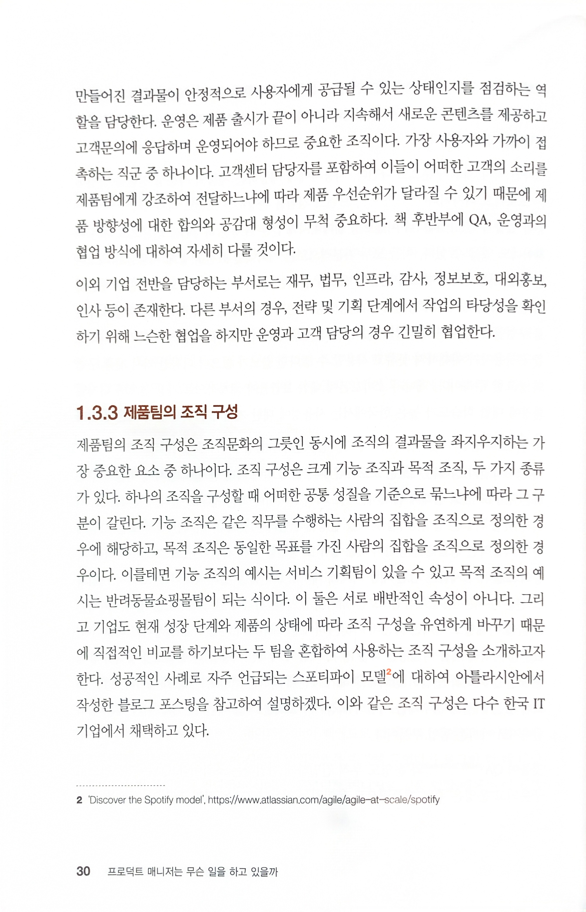 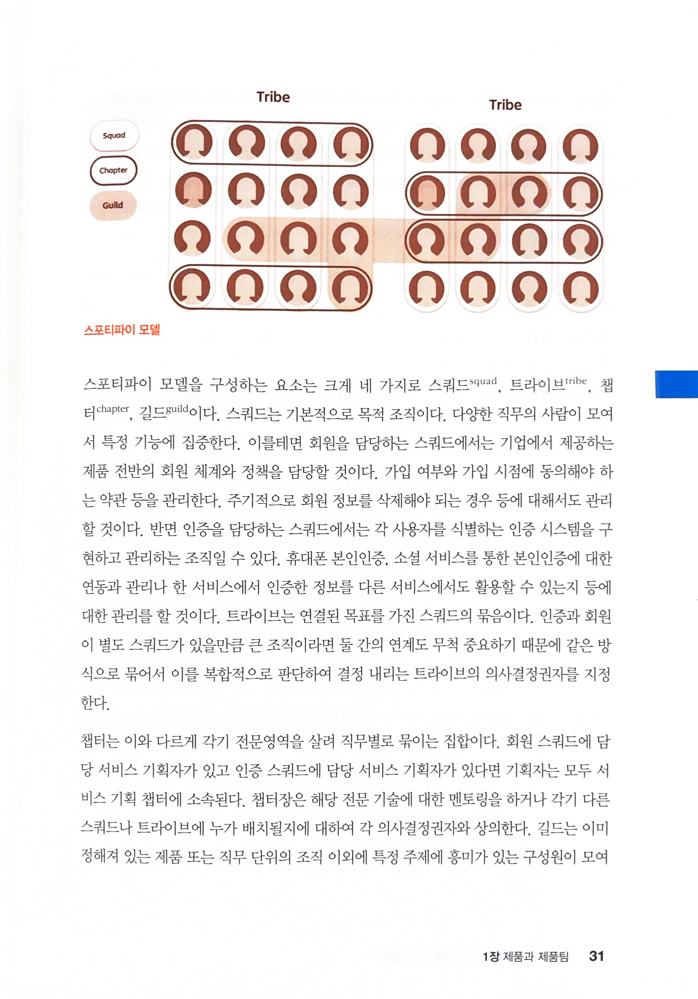 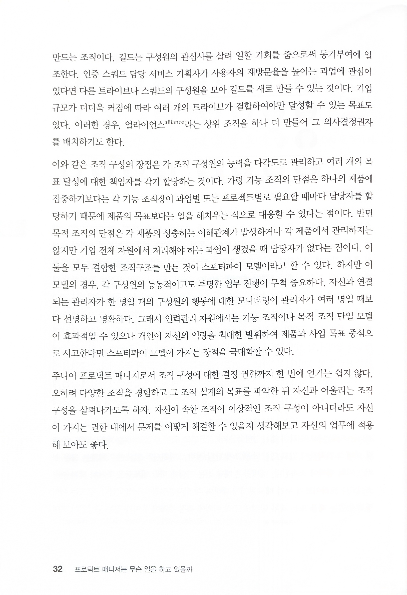

* [The Spotify Model for Scaling Agile | Atlassian](https://www.atlassian.com/agile/agile-at-scale/spotify)
  * 어디서나 나오는 스포티파이 모델. 이제 그만 좀 보고 싶다. 성공적인 사례로만 언급하고 왜 스포티파이 모델을 스포티파이가 버렸는지는 모르는지 알지만 숨기는 건지 모르겠지만, matrix 조직의 운영의 어려움에 대해서는 언급한 책이 없다는 현실이 안타깝다.

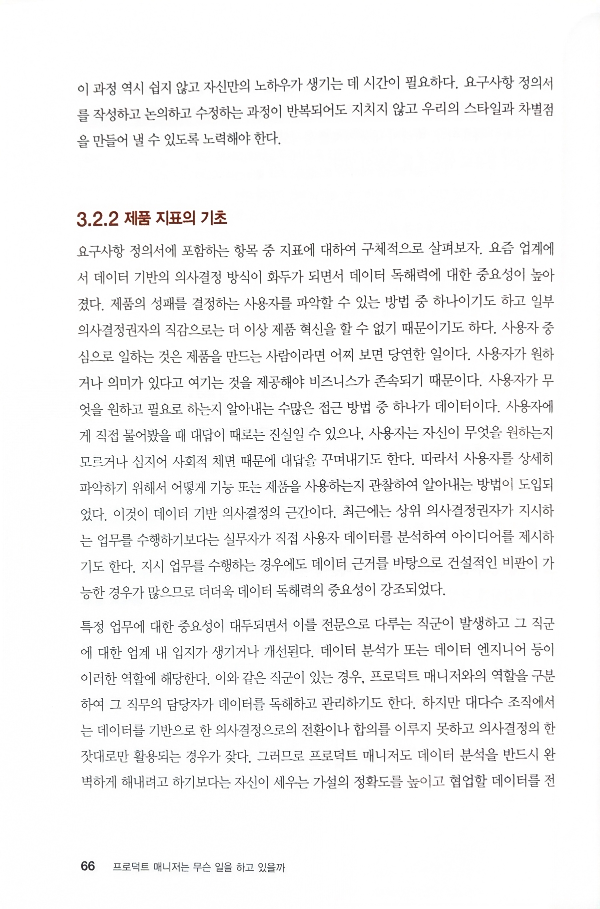 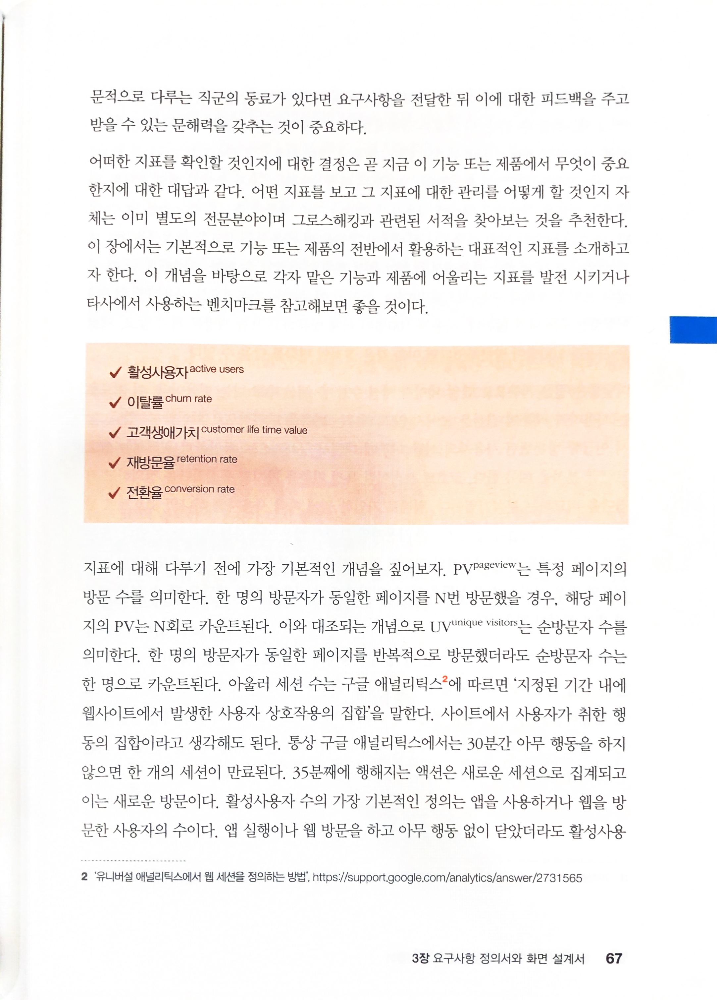 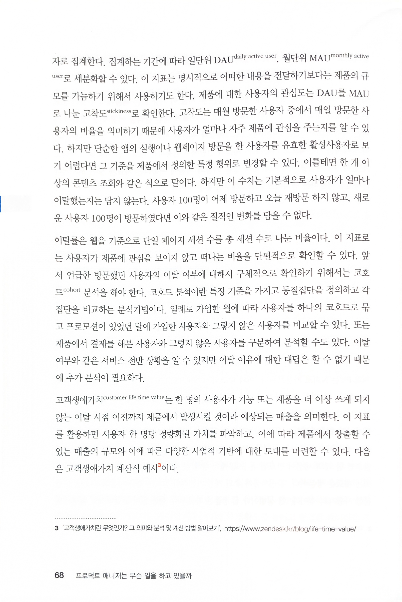 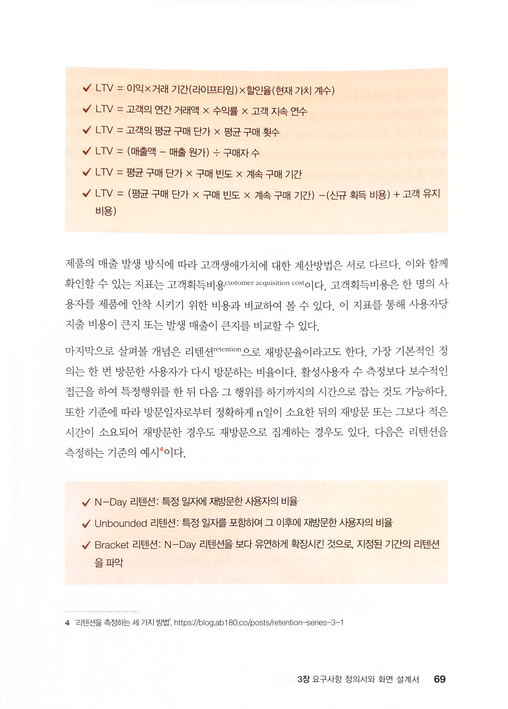

> 3.2.2 제품 지표의 기초
>
> `활성사용자 active users` `이탈률 churn rate` `고객생애가치 customer life time value` `재방문율 retention rate` `전환율 conversion rate`
>
> `PV Pageview` 특정 페이지의 방문 수
>
> `UV unique visitors` 순방문자 수
>
> `DAU daily active user`
>
> `MAU monthly active user`
>
> 제품에 대한 사용자의 관심도 DAU MAU로 나눈 `고착도 stickiness` 매월 방문한 사용자 중에서 매일 방문한 사용자의 비율, 사용자가 얼마나 자주 제품에 관심을 주는지
>
> `코호트 cohort 분석` 특정 기준을 가지고 동질집단을 정의하고 각 집단을 비교하는 분석기법
>
> `고객생애가치 customer life time value` 한 명의 사용자가 기능 또는 제품을 더 이상 쓰게 되지 않는 이탈 시점 이전까지 제품에서 발생시킬 것이라 예상되는 매출
* [고객 평생 가치(Life Time Value)란 무엇인가? 그 의미와 분석 및 계산 방법 알아보기 - Zendesk KR](https://www.zendesk.kr/blog/life-time-value/)
> LTV = 이익 X 거래 기간 (라이프타임) 할인율 (현재 가치 계수)
>
> LTV = 고객의 연간 거래액 X 수익률 X 고객 지속 연수
>
> LTV = 고객의 평균 구매 단가 x 평균 구매 횟수
>
> LTV = (매출액 - 매출 원가) / 구매자 수
>
> LTV = 평균 구매 단가 x 구매 빈도 X 계속 구매 기간
>
> LTV = (평균 구매 단가 x 구매 빈도 × 계속 구매 기간) - (신규 획득 비용) + 고객 유지비용)
>
> `고객획득비용 customer acquisition cost` 한 명의 사용자를 제품에 안착 시키기 위한 비용
>
> `리텐션 retention` 재방문율 한 번 방문한 사용자가 다시 방문하는 비율
* [리텐션을 측정하는 세 가지 방법](https://blog.ab180.co/posts/retention-series-3-1)
> N-Day 리텐션: 특정 일자에 재방문한 사용자의 비율
>
> Unbounded 리텐션: 특정 일자를 포함하여 그 이후에 재방문한 사용자의 비율
>
> Bracket 리텐션: N-Day 리텐션을 보다 유연하게 확장시킨 것으로 지정된 기간의 리텐션을 파악

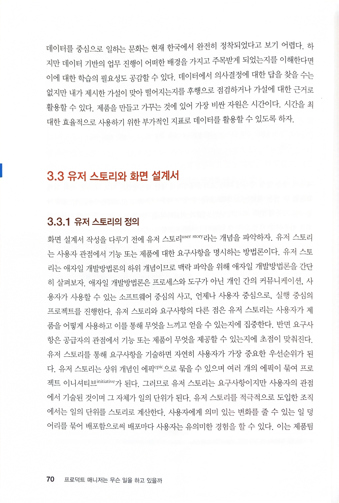 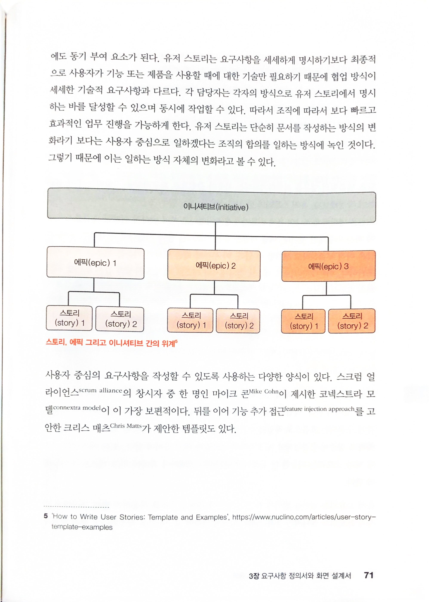 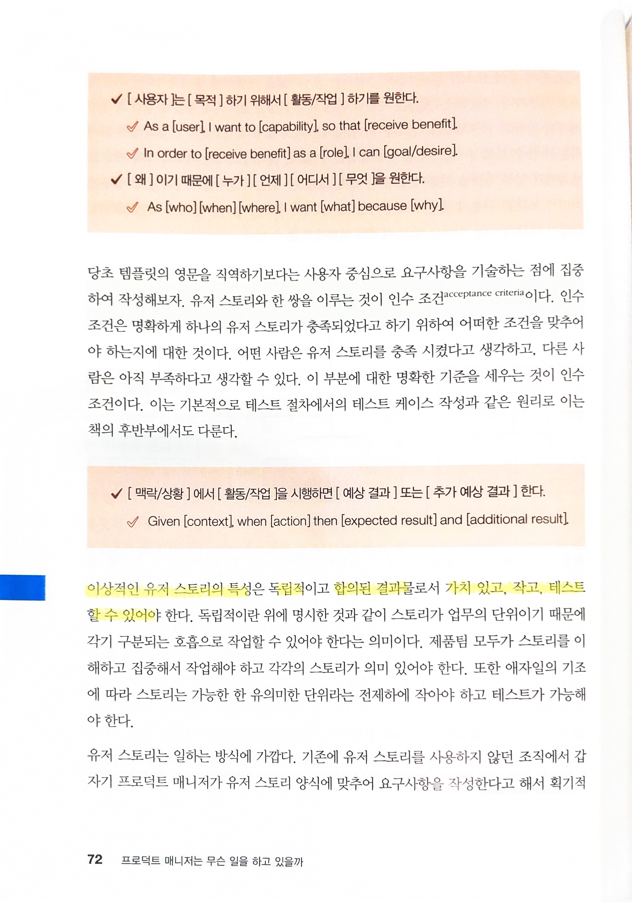 

> 3.3 유저 스토리와 화면 설계서
* [How to Write User Stories: Template and Examples](https://www.nuclino.com/articles/user-story-template-examples)
> 이상적인 유저 스토리의 특성은 독립적이고 합의된 결과물로서 가치 있고, 작고, 테스트할 수 있어야

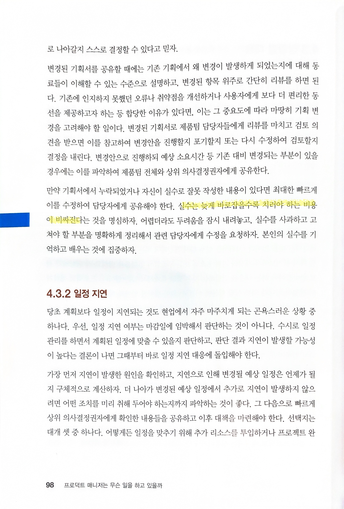

> 실수는 늦게 바로잡을수록 치러야 하는 비용이 비싸진다
* 제조업뿐만 아니라 product 개발도 마찬가지. 극단적으로 기획에 결함이 있어서 production에 배포 후 문제를 발견하게 되면 (마치 자동차 부품 결함을 출고 후 발견해 리콜할 때 비용이 엄청나게 드는 것처럼) 큰 비용을 치를수 밖에 없다. 그래서 PO/PM의 업무가 중요한데, 이런 기획의 중요함을 망각하는 경우가 많다. 특히 agile manifesto를 오용하는 경우는 더 심각한데, agile이 문서를 경시하는 게 아니라 문서보다 동작하는 sw를 더 중시할 뿐인데, 마치 문서가 중요하지 않다는 식으로 멋대로 해석하는 경우는 기본 자격이 의심되는 심각한 상황이다.

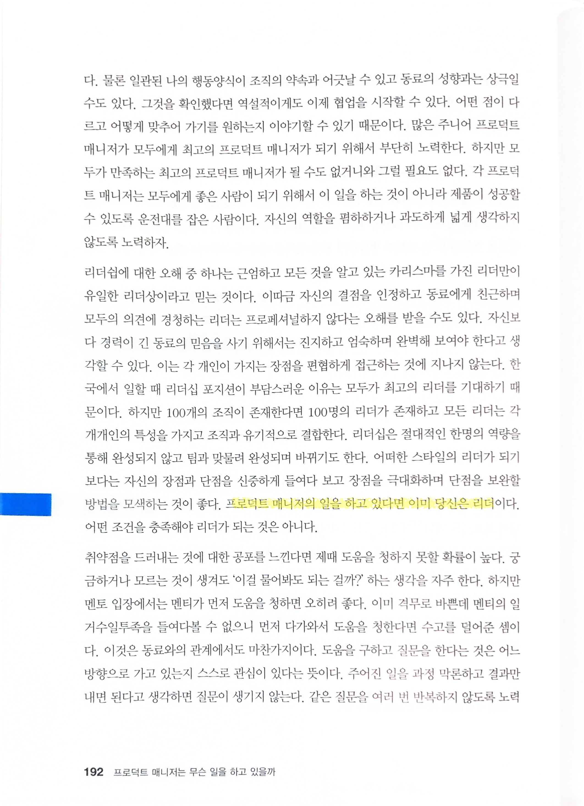

> 프로덕트 매니저의 일을 하고 있다면 이미 당신은 리더
* 좋은 쪽으로 해석하려고 해도 이건 문제가 있다. 특히 이 부분을 오용해 PO/PM이 관리자, people management를 하는 것으로 해석하는 조직이 종종 있는데 이로 인해 폐해가 크다.

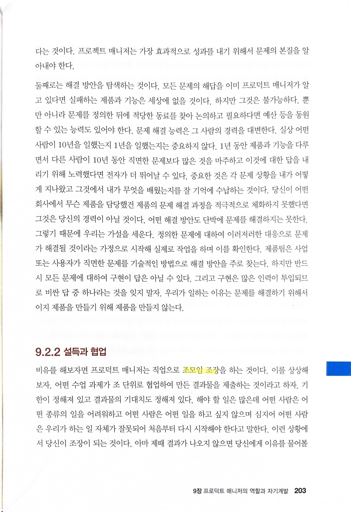 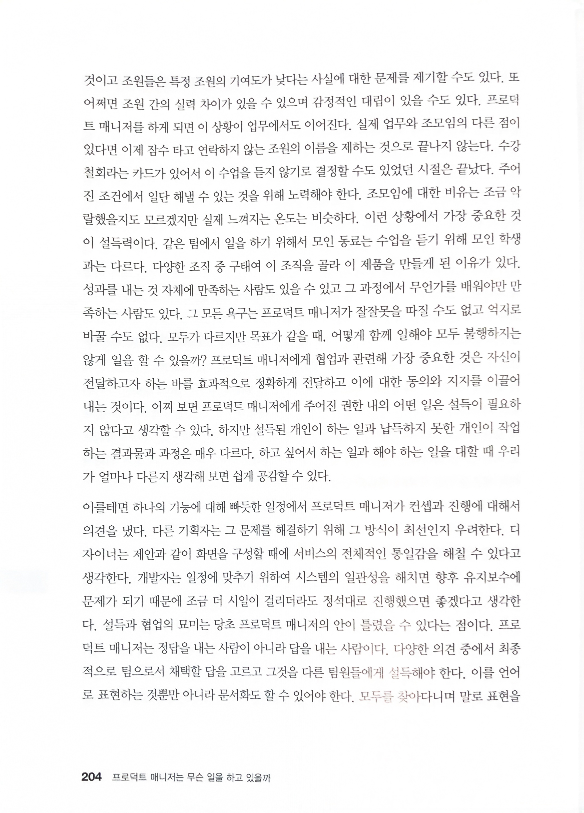 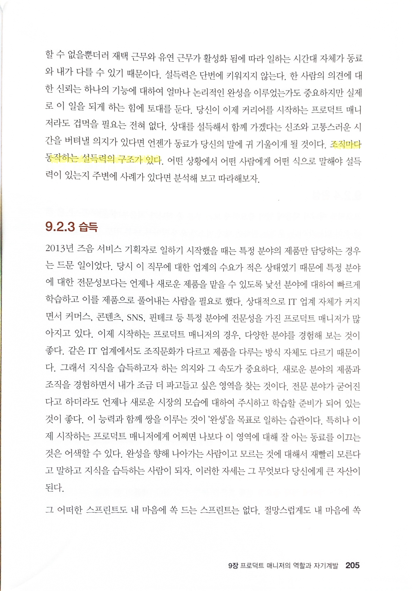

* 조모임 조장의 비유는 이런 협업 상황에서는 어디서나 사용할 수 있는 부정적인 의미로 널리 받아들여진다는 게 안타깝지만, 또 현실적이긴 하다