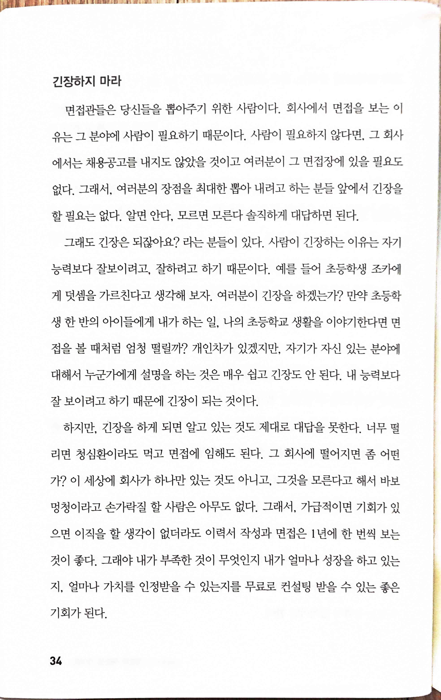
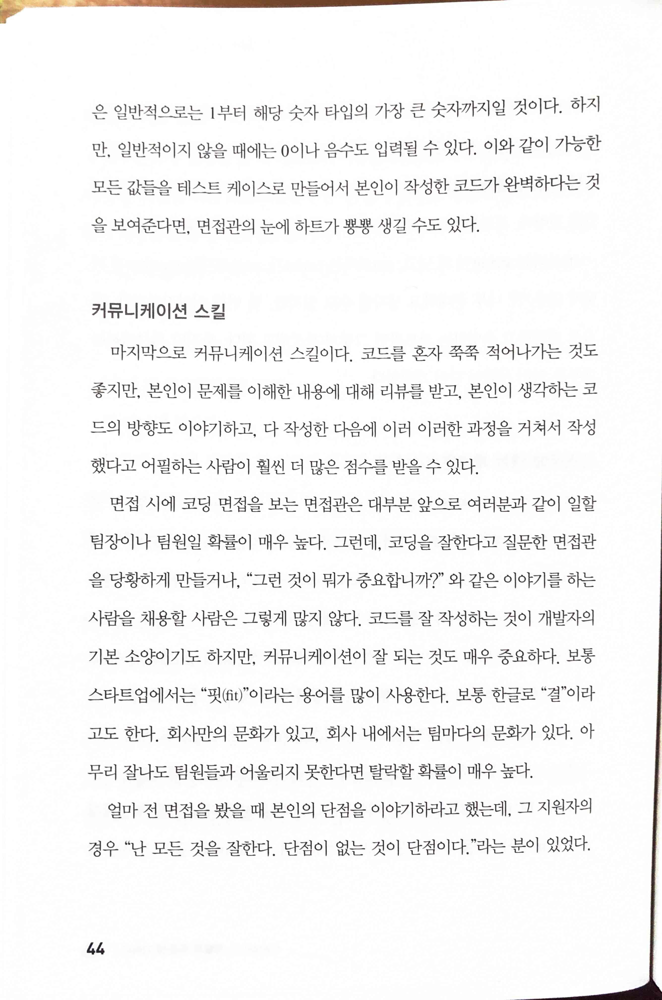
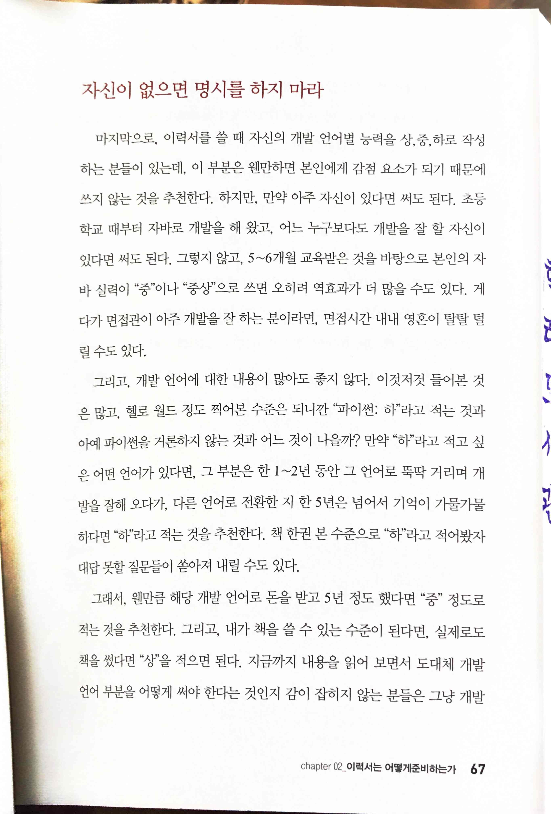
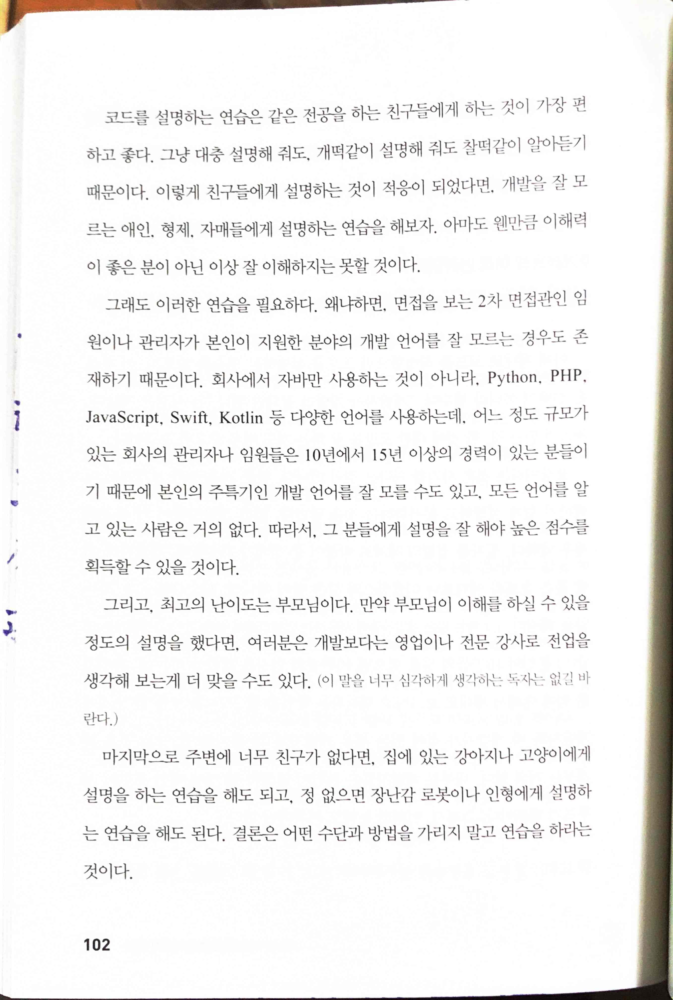
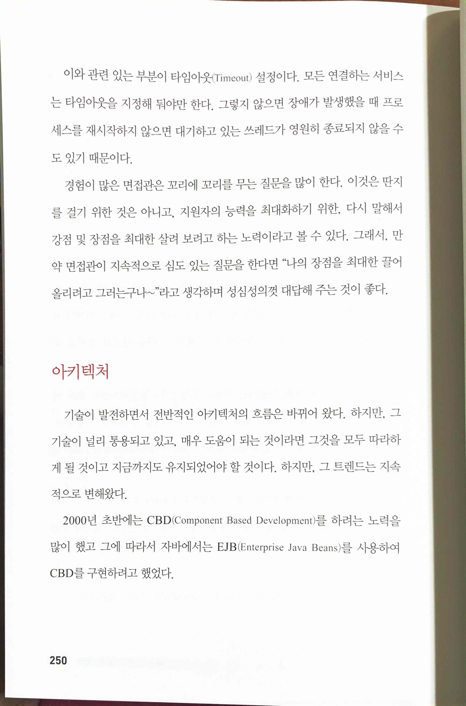

# 누가 IT시장 취업에 성공하는가

* 저자가 java 전문가라 약간 치우친 경향도 있고, 또 기술적인 내용은 java에 관계된 게 대부분이나, 전반적인 부분은 기술이나 특정 언어와 무관하게 적용할 수 있는 이야기이고, 읽기 쉽게 쓰려고 노력한 점이 엿보인다. 표지에도 썼지만 신입으로 지원하거나 경력이라도 junior인 개발자들에게 적합한 책이다.

> 면접관들은 당신들을 뽑아주기 위한 사람이다. 회사에서 면접을 보는 이유는 그 분야에 사람이 필요하기 때문이다... 사람이 긴장하는 이유는 자기능력보다 잘보이려고, 잘하려고 하기 때문이다.
하지만, 긴장을 하게 되면 알고 있는 것도 제대로 대답을 못한다... 그 회사에 떨어지면 좀 어떤가? ... 그래야 내가 부족한 것이 무엇인지 내가 얼마나 성장을 하고 있는지, 얼마나 가치를 인정받을 수 있는지를 무료로 컨설팅 받을 수 있는 좋은 기회가 된다.

> 회사만의 문화가 있고, 회사 내에서는 팀마다의 문화가 있다. 아무리 잘나도 팀원들과 어울리지 못한다면 탈락할 확률이 매우 높다.

> 마지막으로, 이력서를 쓸 때 자신의 개발 언어별 능력을 상,중,하로 작성하는 분들이 있는데, 이 부분은 웬만하면 본인에게 감점 요소가 되기 때문에 쓰지 않는 것을 추천한다.

> 설명하는 연습을 해보자.
설명을 잘 해야 높은 점수를 획득할 수 있을 것이다.

> 경험이 많은 면접관은 꼬리에 꼬리를 무는 질문을 많이 한다. 이것은 딴지를 걸기 위한 것은 아니고, 지원자의 능력을 최대화하기 위한, 다시 말해서 강점 및 장점을 최대한 살려 보려고 하는 노력이라고 볼 수 있다.