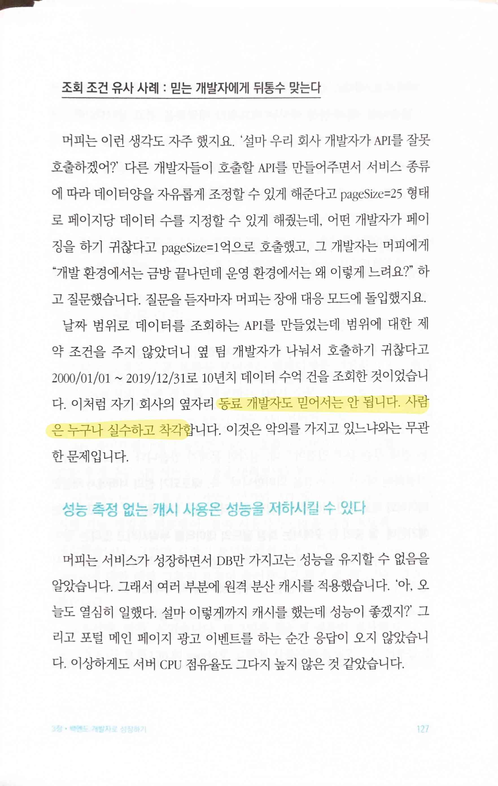
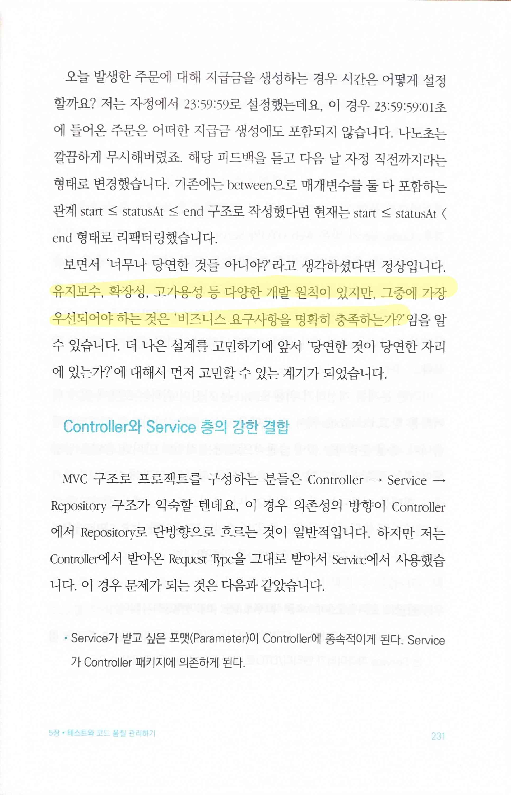
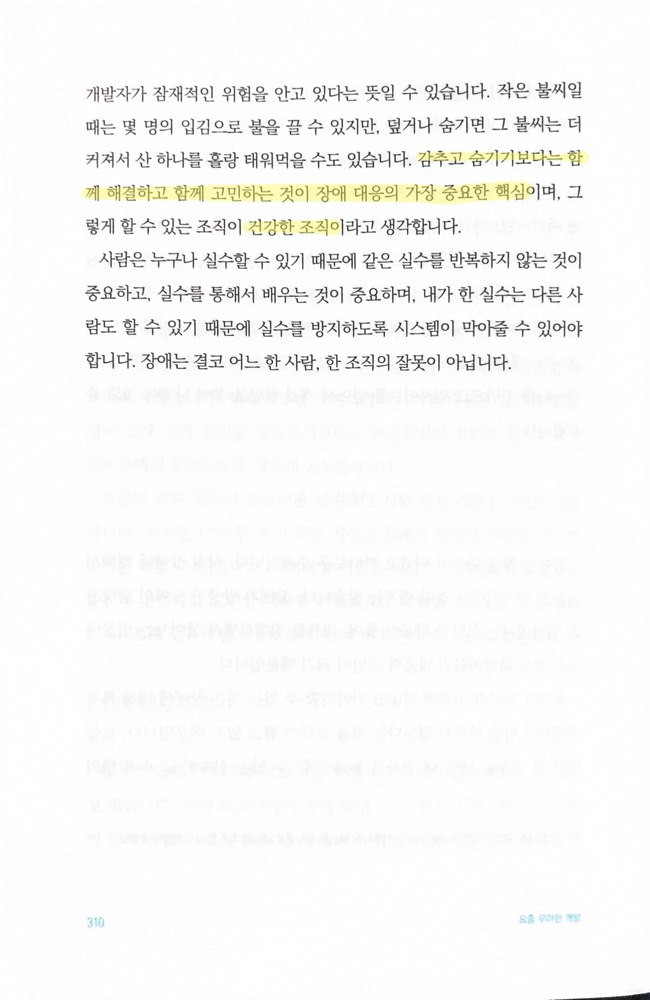

# 요즘 우아한 개발

Tags: devrel, software-engineering
Date: November 4, 2023
Score: ★★★★☆

- 좋은 software 회사들은 여럿 있다. 기술 블로그를 통해 자사의 기술을 공개하고 개발자들에게 선한 영향력을 미치며 브랜딩에도 좋은 효과를 보기는 하지만 우아한 형제들같이 책까지 내면서 이런 활동 - 일종의 devrel - 을 하는 경우는 드물다. software 업계와 밀접하면서 동시에 최근에 책을 낸 회사들을 생각해보면 대표적으로 토스나 쿠팡이 있지만, 이 경우는 기술적인 내용과는 무관했다.
- 책의 내용은 이미 [https://techblog.woowahan.com](https://techblog.woowahan.com/) 를 통해 공개한 내용이고, 마지막에 각 소챕터를 읽을 수 있는 번호도 공개하고 있다. 몇몇 글들은 이미 읽어봤던 글이었지만, 기술 블로그에 있다고 해도 두고 두고 돌아볼 가치도 있어서 이렇게 책으로 나오는 게 의미가 있단 생각이 든다.
- 특히 아래 저장한 내용들은 어느 회사에서나 주의하고 지켜지는지 봐야 할 부분들이다. 이게 뭐가 어려워? 혹은 이건 당연하지? 라고 생각한다면 본인이 다니는 회사는 이미 꽤 좋은 회사일 거라고 장담할 수 있다.
    
    
    
    - 내가 항상 강조하는 건 스스로부터 믿지 말라는 것. 자신이 몇 달 전에 작업한 코드에 대해 작성하던 당시만큼 자신있게 설명하고 모든 부분을 파악할 수 있는 개발자는 정말 흔치 않다
    
    
    
    - 이 역시 management를 하기 시작한 후부터 항상 강조하던 부분. BM의 중요성과 함께 어떤 '회사'가 제대로 굴러가기 위해서 가장 필요한 생각
    
    
