# 순서 파괴 Working Backwards
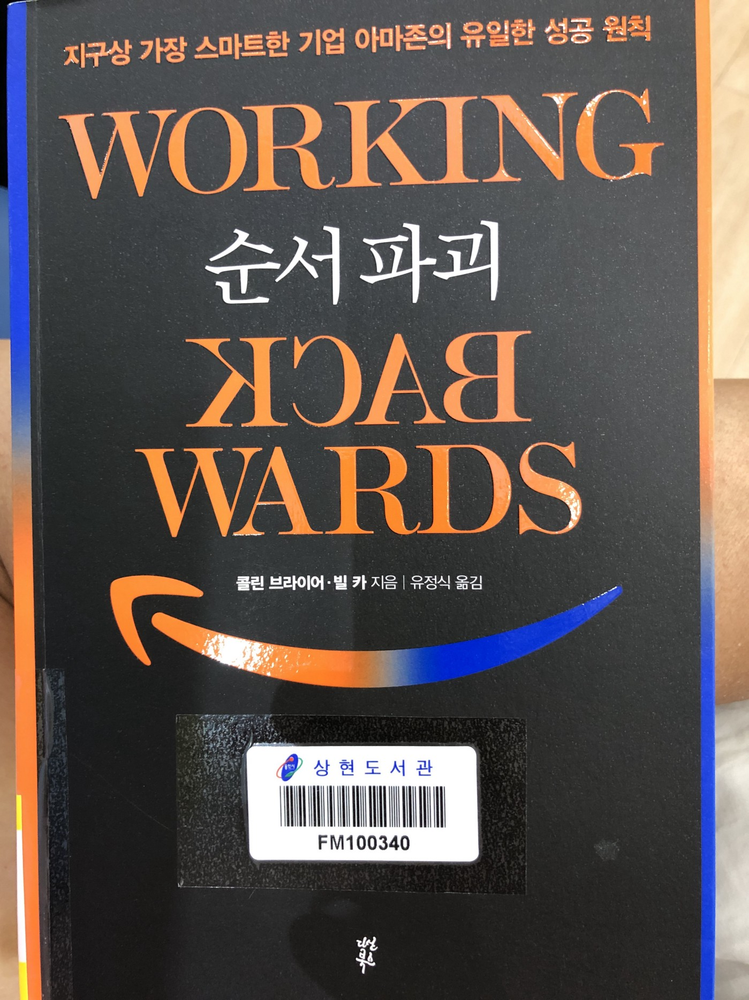

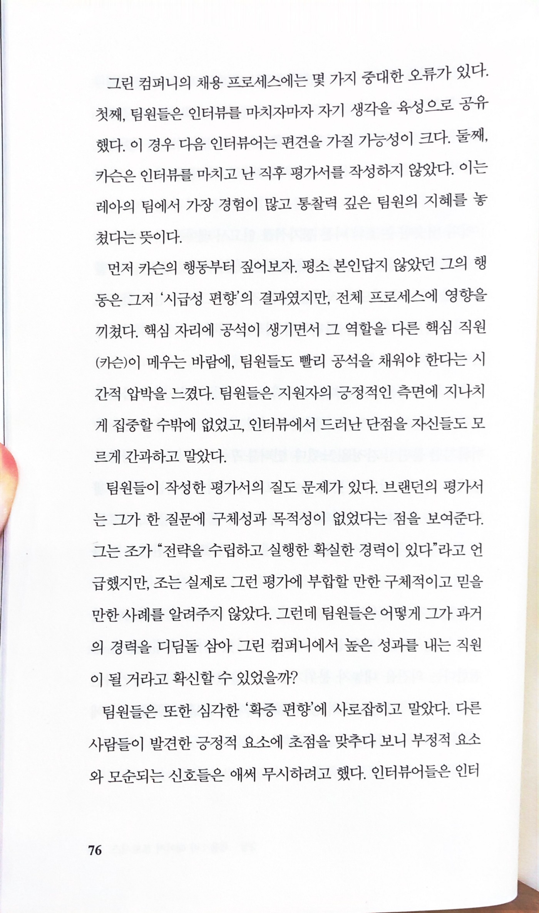

> 그린 컴퍼니의 채용 프로세스에는 몇 가지 중대한 오류가 있다. 첫째, 팀원들은 인터뷰를 마치자마자 자기 생각을 육성으로 공유했다. 이 경우 다음 인터뷰어는 편견을 가질 가능성이 크다. 둘째, 카슨은 인터뷰를 마치고 난 직후 평가서를 작성하지 않았다. 이는 레아의 팀에서 가장 경험이 많고 통찰력 깊은 팀원의 지혜를 놓쳤다는 뜻이다.

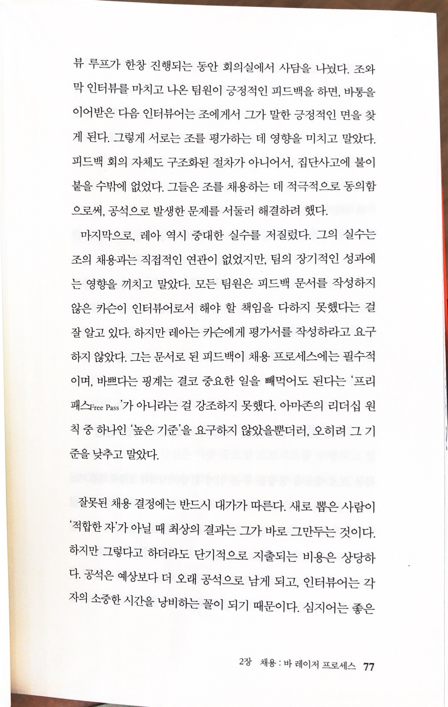

> 잘못된 채용 결정에는 반드시 대가가 따른다. 새로 뽑은 사람이 ‘적합한 자’가 아닐 때 최상의 결과는 그가 바로 그만두는 것이다. 하지만 그렇다고 하더라도 단기적으로 지출되는 비용은 상당하다. 공석은 예상보다 더 오래 공석으로 남게 되고, 인터뷰어는 각자의 소중한 시간을 낭비하는 꼴이 되기 때문이다.

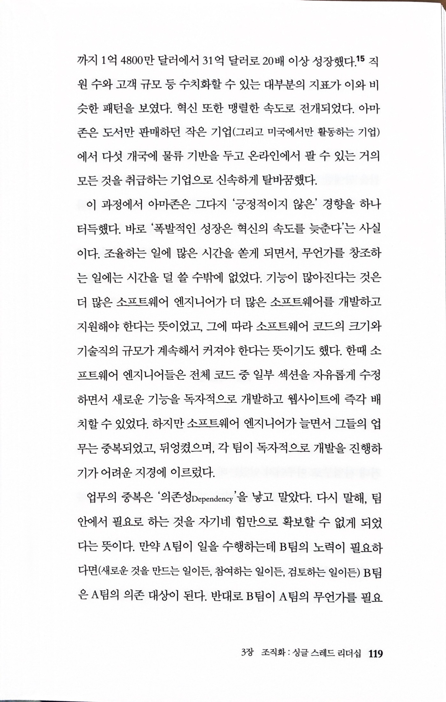

> 업무의 중복은 ‘의존성Dependency’을 낳고 말았다. 다시 말해, 팀안에서 필요로 하는 것을 자기네 힘만으로 확보할 수 없게 되었다는 뜻이다.

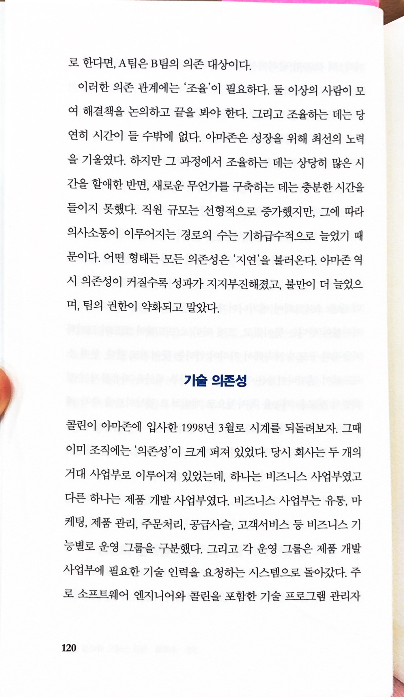

> 이러한 의존 관계에는 ‘조율’이 필요하다… 직원 규모는 선형적으로 증가했지만, 그에 따라 의사소통이 이루어지는 경로의 수는 기하급수적으로 늘었기 때문이다. 어떤 형태든 모든 의존성은 ‘지연’을 불러온다.

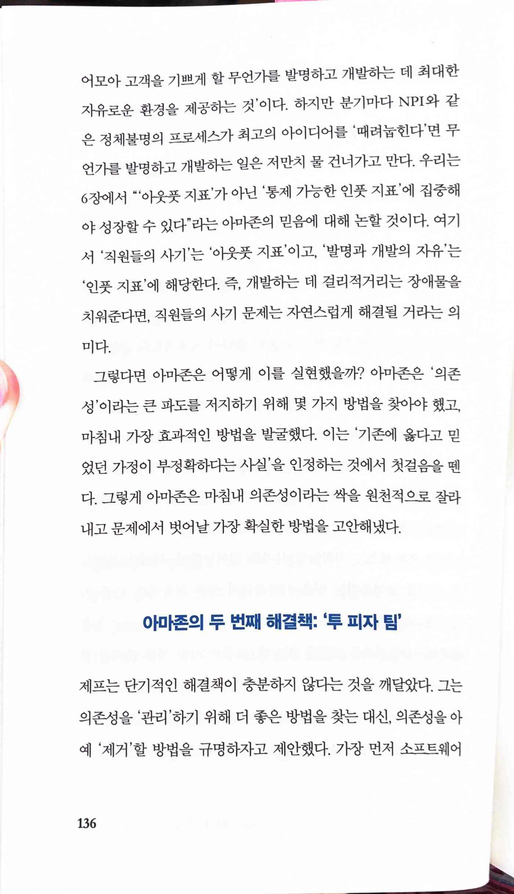

> “아웃풋 지표가 아닌 ‘통제 가능한 인풋 지표’에 집중해야 성장할 수 있다” 라는 아마존의 믿음에 대해 논할 것이다. 여기서 ‘직원들의 사기’는 ‘아웃풋 지표’이고, ‘발명과 개발의 자유’’인풋 지표’에 해당한다. 즉, 개발하는 데 걸리적거리는 장애물을 치워준다면, 직원들의 사기 문제는 자연스럽게 해결될 거라는 의미다.

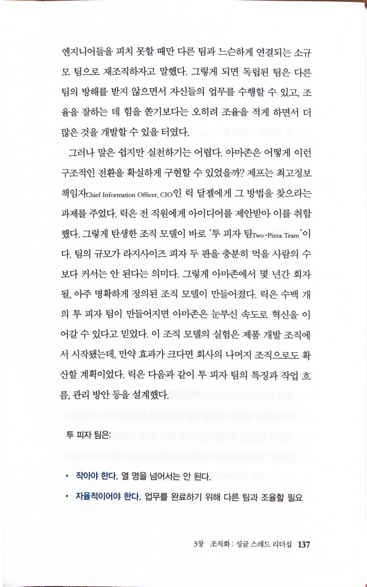

> 투 피자 팀은
>
> 작아야 한다. 열 명을 넘어서는 안 된다.
> 자율적이어야 한다. 업무를 완료하기 위해 다른 팀과 조율할 필요가 없어야 한다.

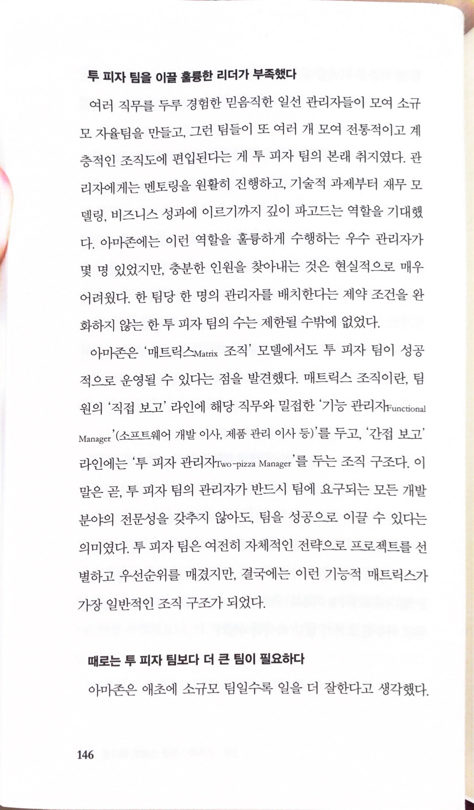

> 여러 직무를 두루 경험한 믿음직한 일선 관리자들이 모여 소규모 자율팀을 만들고, 그런 팀들이 또 여러 개 모여 전통적이고 계층적인 조직도에 편입된다는 게 투 피자 팀의 본래 취지였다. 관리자에게는 멘토링을 원활히 진행하고, 기술적 과제부터 재무 모델링, 비즈니스 성과에 이르기까지 깊이 파고드는 역할을 기대했다.

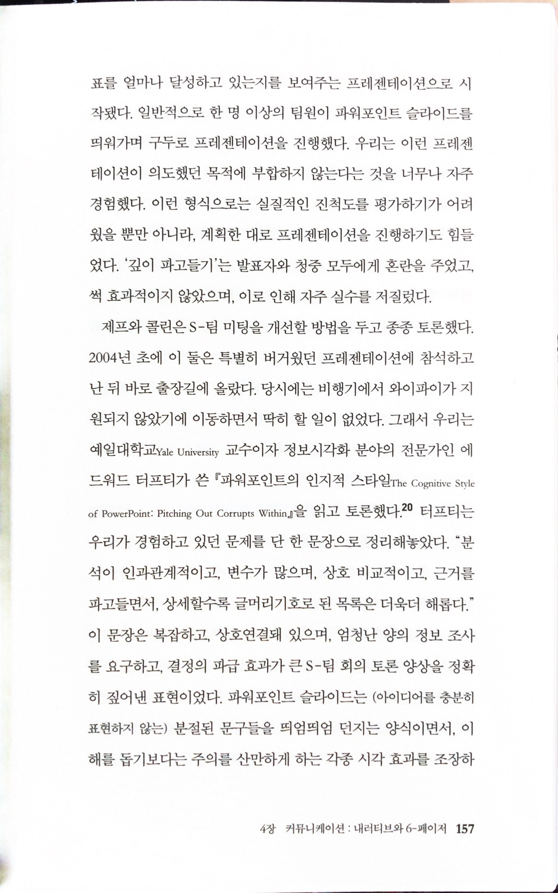

> “분석이 인과관계적이고, 변수가 많으며, 상호 비교적이고, 근거를 파고들면서, 상세할수록 글머리기호로 된 목록은 더욱더 해롭다.”

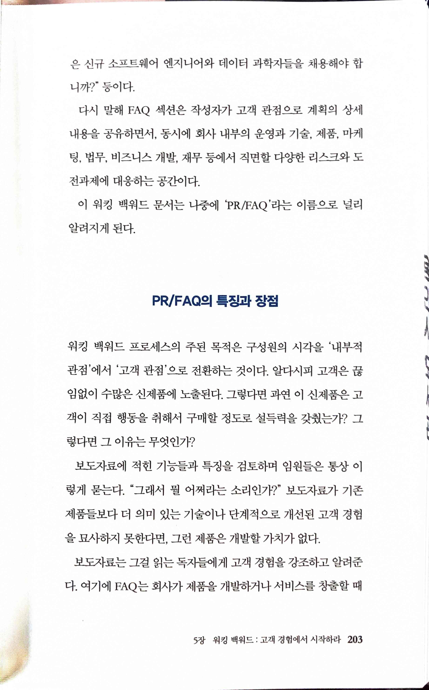

> 워킹 백워드 프로세스의 주된 목적은 구성원의 시각을 ‘내부적 관점’에서 ‘고객 관점’으로 전환하는 것이다. 알다시피 고객은 끊임없이 수많은 신제품에 노출된다. 그렇다면 과연 이 신제품은 고객이 직접 행동을 취해서 구매할 정도로 설득력을 갖췄는가? 그렇다면 그 이유는 무엇인가?

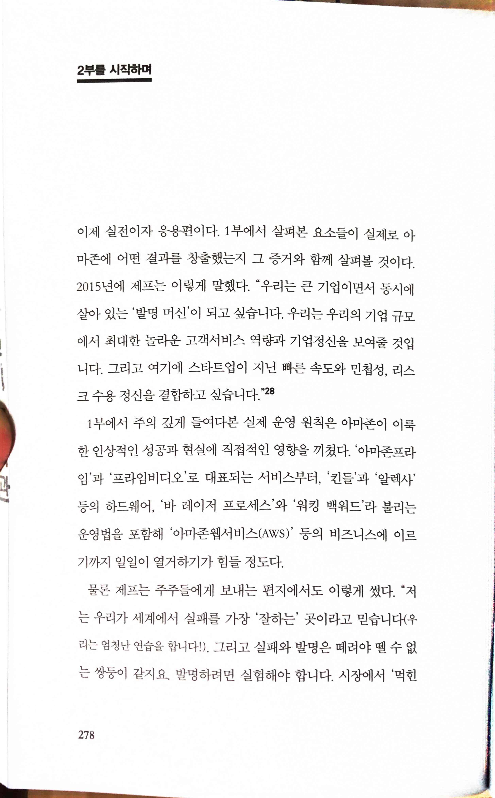 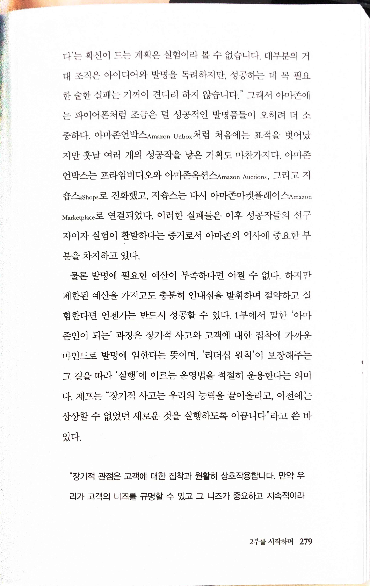

> “저는 우리가 세계에서 실패를 가장 ‘잘하는 곳이라고 믿습니다(우리는 엄청난 연습을 합니다!). 그리고 실패와 발명은 떼려야 뗄 수 없는 쌍둥이 같지요. 발명하려면 실험해야 합니다. 시장에서 ‘먹힌다’는 확신이 드는 계획은 실험이라 볼 수 없습니다. 대부분의 거대 조직은 아이디어와 발명을 독려하지만, 성공하는 데 꼭 필요한 숱한 실패는 기꺼이 견디려 하지 않습니다.”

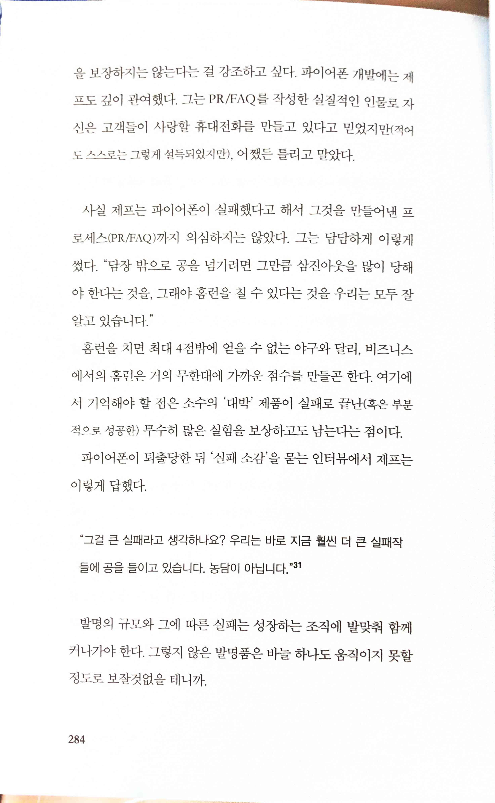

> “담장 밖으로 공을 넘기려면 그만큼 삼진아웃을 많이 당해야 한다는 것을, 그래야 홈런을 칠 수 있다는 것을 우리는 모두 잘알고 있습니다.”
>
> 발명의 규모와 그에 따른 실패는 성장하는 조직에 발맞춰 함께커나가야 한다. 그렇지 않은 발명품은 바늘 하나도 움직이지 못할정도로 보잘것없을 테니까.

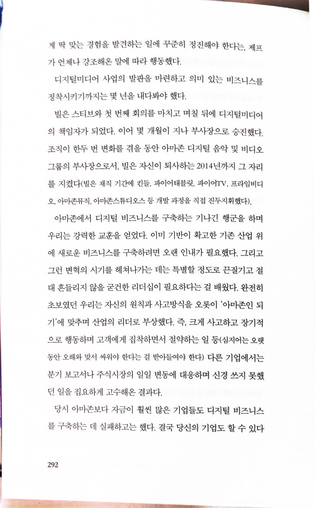

> 아마존에서 디지털 비즈니스를 구축하는 기나긴 행군을 하며우리는 강력한 교훈을 얻었다. 이미 기반이 확고한 기존 산업 위에 새로운 비즈니스를 구축하려면 오랜 인내가 필요했다. 그리고그런 변혁의 시기를 헤쳐나가는 데는 특별할 정도로 끈질기고 절대 흔들리지 않을 굳건한 리더십이 필요하다는 걸 배웠다. 완전히 초보였던 우리는 자신의 원칙과 사고방식을 오롯이 ‘아마존인 되기’에 맞추며 산업의 리더로 부상했다. 즉, 크게 사고하고 장기적으로 행동하며 고객에게 집착하면서 절약하는 일 등(심지어는 오랫동안 오해와 맞서 싸워야 한다는 걸 받아들여야 한다) 다른 기업에서는 분기 보고서나 주식시장의 일일 변동에 대응하며 신경 쓰지 못했던 일을 집요하게 고수해온 결과다.

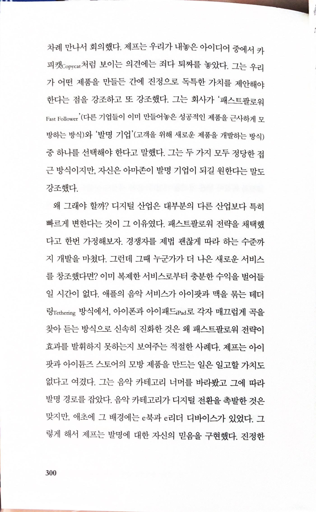

> 그는 우리가 어떤 제품을 만들든 간에 진정으로 독특한 가치를 제안해야 한다는 점을 강조하고 또 강조했다. 그는 회사가 ‘패스트팔로워 Fast Follower’(다른 기업들이 이미 만들어놓은 성공적인 제품을 근사하게 모방하는 방식)와 ‘발명 기업’(고객을 위해 새로운 제품을 개발하는 방식)중 하나를 선택해야 한다고 말했다. 그는 두 가지 모두 정당한 접근 방식이지만, 자신은 아마존이 발명 기업이 되길 원한다는 말도 강조했다.

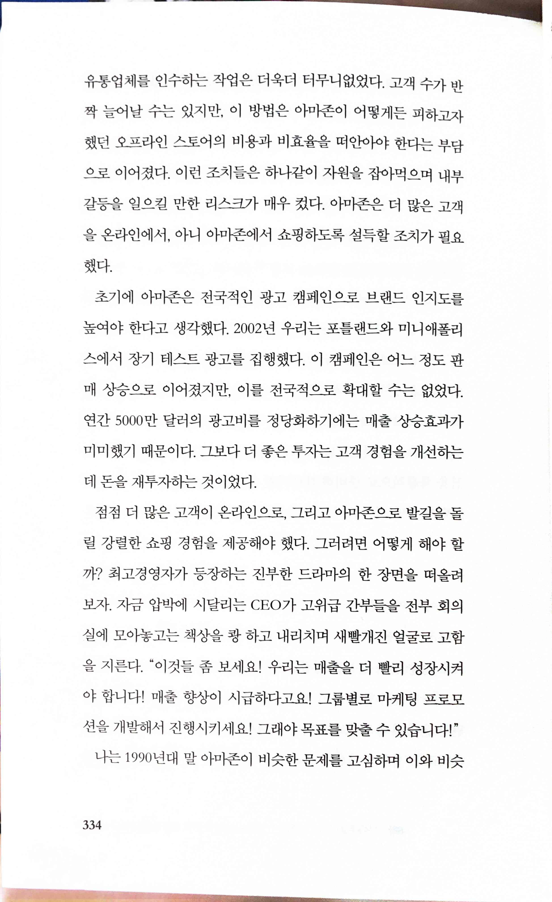

> 고객 수가 반짝 늘어날 수는 있지만, 이 방법은 아마존이 어떻게든 피하고자 했던 오프라인 스토어의 비용과 비효율을 떠안아야 한다는 부담으로 이어졌다. 이런 조치들은 하나같이 자원을 잡아먹으며 내부 갈등을 일으킬 만한 리스크가 매우 컸다. 아마존은 더 많은 고객을 온라인에서, 아니 아마존에서 쇼핑하도록 설득할 조치가 필요했다.

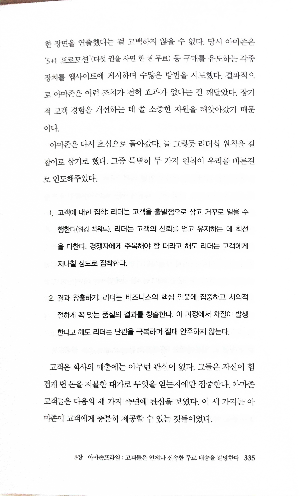

> 1. 고객에 대한 집착: 리더는 고객을 출발점으로 삼고 거꾸로 일을 수행한다(워킹 백워드), 리더는 고객의 신뢰를 얻고 유지하는 데 최선을 다한다. 경쟁자에게 주목해야 할 때라고 해도 리더는 고객에게 지나칠 정도로 집착한다.
>
> 2. 결과 창출하기: 리더는 비즈니스의 핵심 인풋에 집중하고 시의적절하게 꼭 맞는 품질의 결과를 창출한다. 이 과정에서 차질이 발생한다고 해도 리더는 난관을 극복하며 절대 안주하지 않는다.
>
> 고객은 회사의 매출에는 아무런 관심이 없다. 그들은 자신이 힘겹게 번 돈을 지불한 대가로 무엇을 얻는지에만 집중한다.

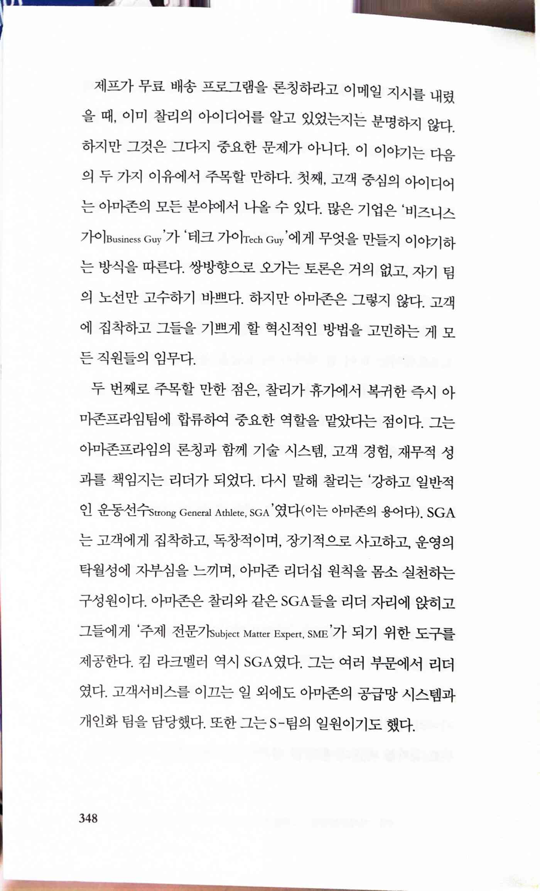

> 고객 중심의 아이디어는 아마존의 모든 분야에서 나올 수 있다. 많은 기업은 ‘비즈니스 가이Business Guy’가 ‘테크 가이Tech Guy’에게 무엇을 만들지 이야기하는 방식을 따른다. 쌍방향으로 오가는 토론은 거의 없고, 자기 팀의 노선만 고수하기 바쁘다. 하지만 아마존은 그렇지 않다. 고객에 집착하고 그들을 기쁘게 할 혁신적인 방법을 고민하는 게 모든 직원들의 임무다.

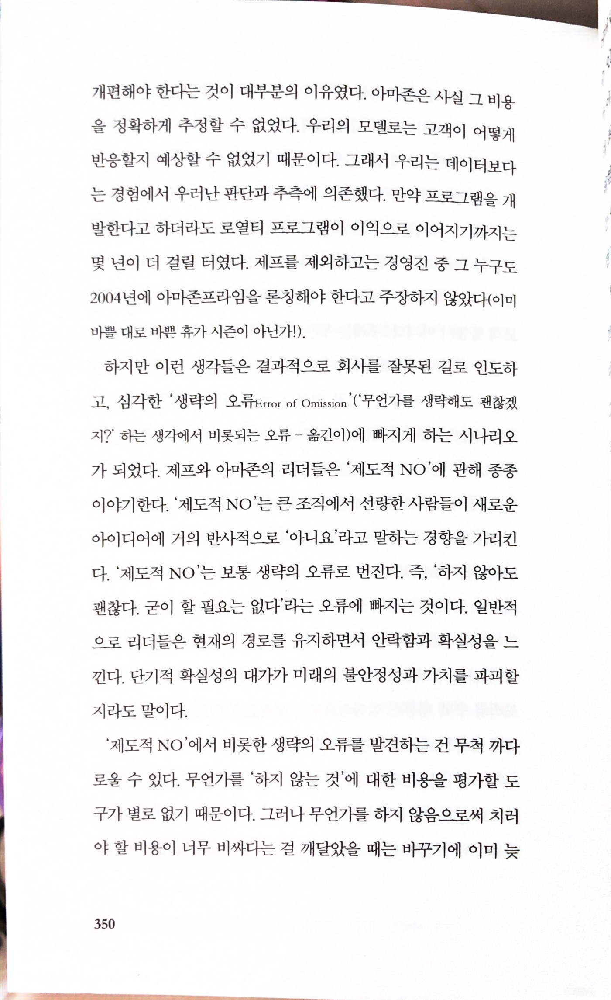

> ‘제도적 NO’는 보통 생략의 오류로 번진다. 즉, ‘하지 않아도 괜찮다. 굳이 할 필요는 없다’ 라는 오류에 빠지는 것이다. 일반적으로 리더들은 현재의 경로를 유지하면서 안락함과 확실성을 느낀다. 단기적 확실성의 대가가 미래의 불안정성과 가치를 파괴할지라도 말이다.
>
> ‘제도적 NO’에서 비롯한 생략의 오류를 발견하는 건 무척 까다로울 수 있다. 무언가를 하지 않는 것’에 대한 비용을 평가할 도구가 별로 없기 때문이다. 그러나 무언가를 하지 않음으로써 치러야 할 비용이 너무 비싸다는 걸 깨달았을 때는 바꾸기에 이미 늦어버린 경우가 많다.

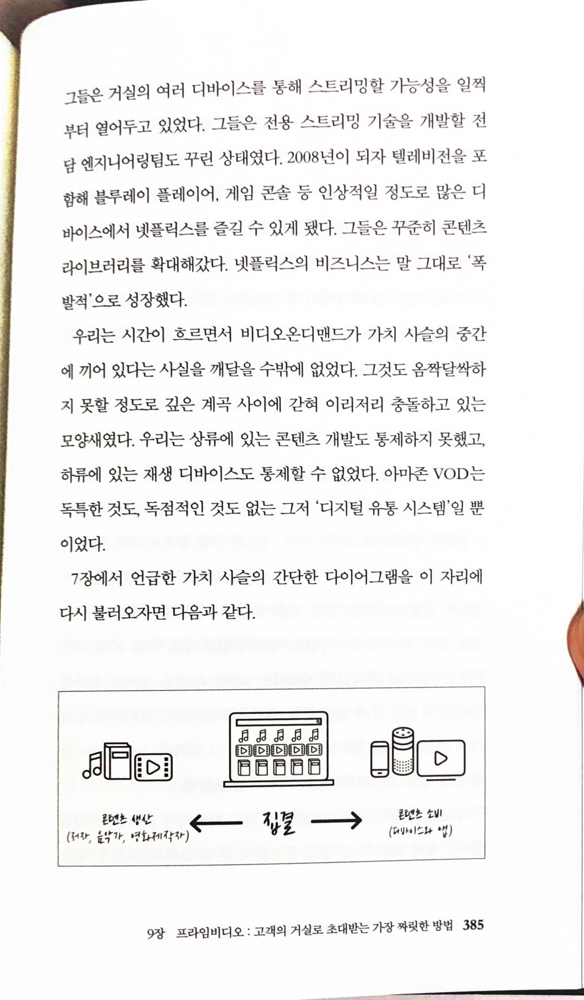

> 우리는 시간이 흐르면서 비디오온디맨드가 가치 사슬의 중간에 끼어 있다는 사실을 깨달을 수밖에 없었다. 그것도 옴짝달싹하지 못할 정도로 깊은 계곡 사이에 갇혀 이리저리 충돌하고 있는 모양새였다. 우리는 상류에 있는 콘텐츠 개발도 통제하지 못했고, 하류에 있는 재생 디바이스도 통제할 수 없었다. 아마존 VOD는 독특한 것도, 독점적인 것도 없는 그저 ‘디지털 유통 시스템’일 뿐이었다.

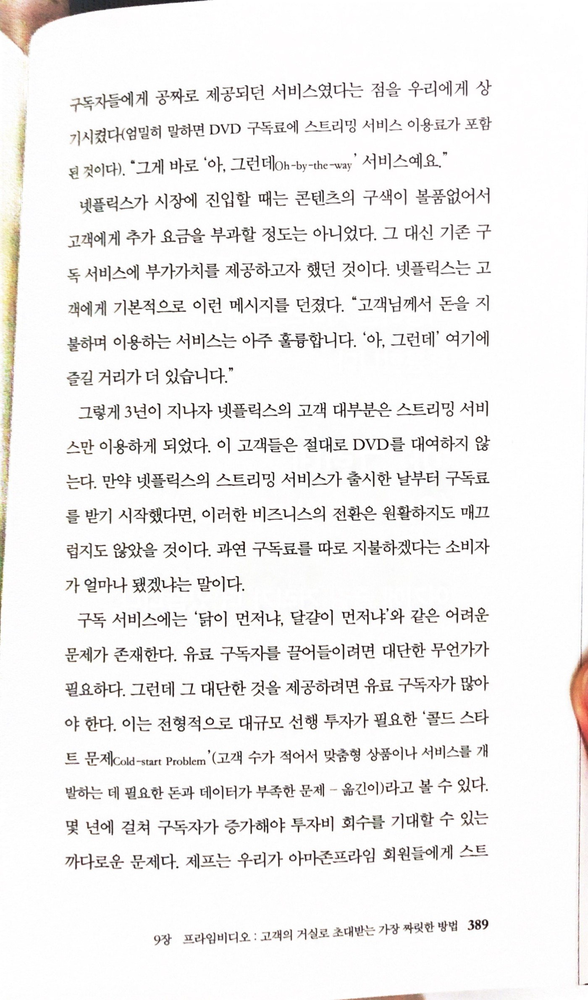

> “그게 바로 ‘아, 그런데on-by-the way’ 서비스예요.”
>
> 넷플릭스가 시장에 진입할 때는 콘텐츠의 구색이 볼품없어서 고객에게 추가 요금을 부과할 정도는 아니었다. 그 대신 기존 구독 서비스에 부가가치를 제공하고자 했던 것이다. 넷플릭스는 고객에게 기본적으로 이런 메시지를 던졌다. “고객님께서 돈을 지불하며 이용하는 서비스는 아주 훌륭합니다. ‘아, 그런데’ 여기에 즐길 거리가 더 있습니다.”
>
> 구독 서비스에는 ‘닭이 먼저냐, 달걀이 먼저냐’와 같은 어려운 문제가 존재한다. 유료 구독자를 끌어들이려면 대단한 무언가가 필요하다. 그런데 그 대단한 것을 제공하려면 유료 구독자가 많아야 한다. 이는 전형적으로 대규모 선행 투자가 필요한 ‘콜드 스타트 문제 Cold-start Problem (고객 수가 적어서 맞춤형 상품이나 서비스를 개발하는 데 필요한 돈과 데이터가 부족한 문제 — 옮긴이)라고 볼 수 있다.몇 년에 걸쳐 구독자가 증가해야 투자비 회수를 기대할 수 있는 까다로운 문제다.

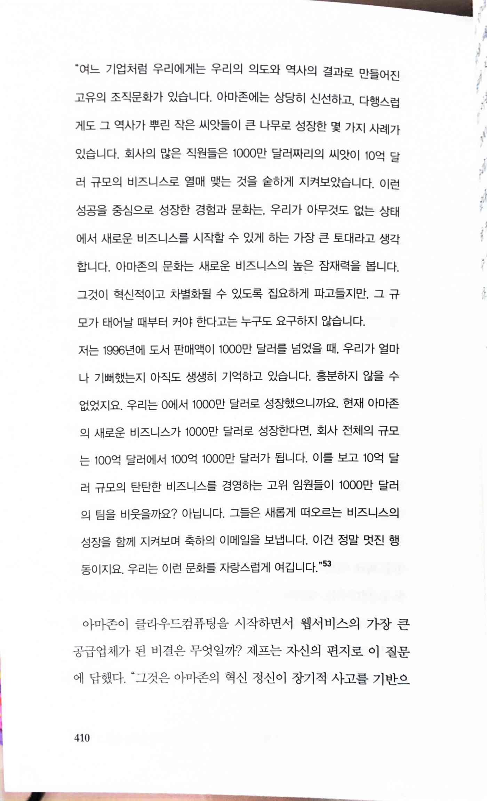

> 아마존의 문화는 새로운 비즈니스의 높은 잠재력을 봅니다. 그것이 혁신적이고 차별화될 수 있도록 집요하게 파고들지만, 그 규모가 태어날 때부터 커야 한다고는 누구도 요구하지 않습니다…현재 아마존의 새로운 비즈니스가 1000만 달러로 성장한다면, 회사 전체의 규모는 100억 달러에서 100억 1000만 달러가 됩니다. 이를 보고 10억 달러 규모의 탄탄한 비즈니스를 경영하는 고위 임원들이 1000만 달러의 팀을 비웃을까요? 아닙니다. 그들은 새롭게 떠오르는 비즈니스의 성장을 함께 지켜보며 축하의 이메일을 보냅니다. 이건 정말 멋진 행동이지요. 우리는 이런 문화를 자랑스럽게 여깁니다.

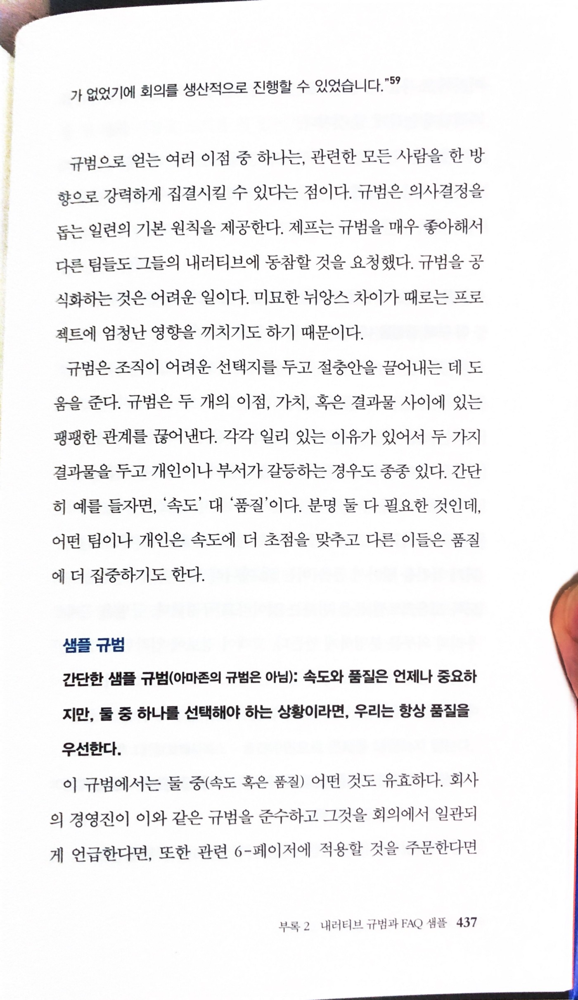

> 속도와 품질은 언제나 중요하지만, 둘 중 하나를 선택해야 하는 상황이라면, 우리는 항상 품질을 우선한다.