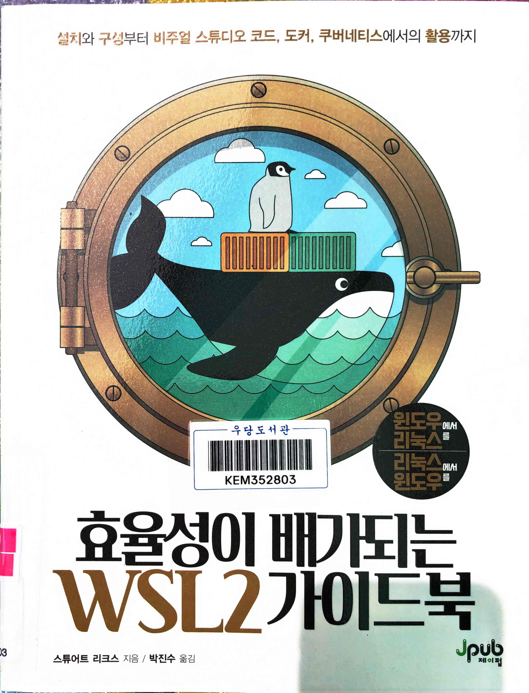
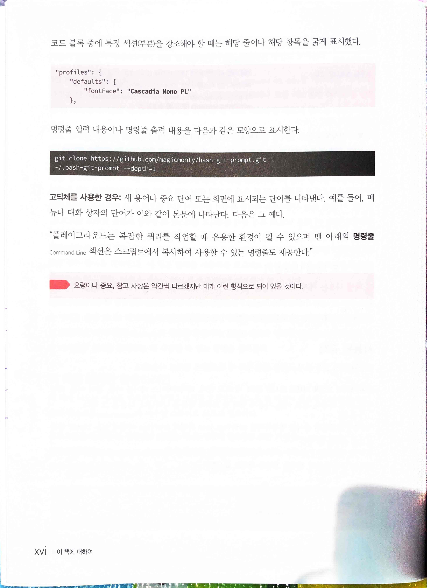
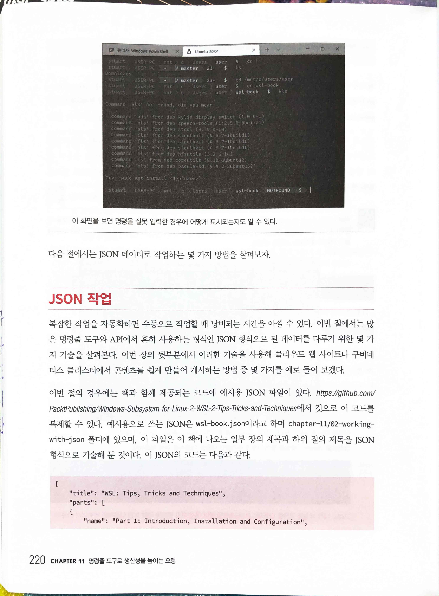
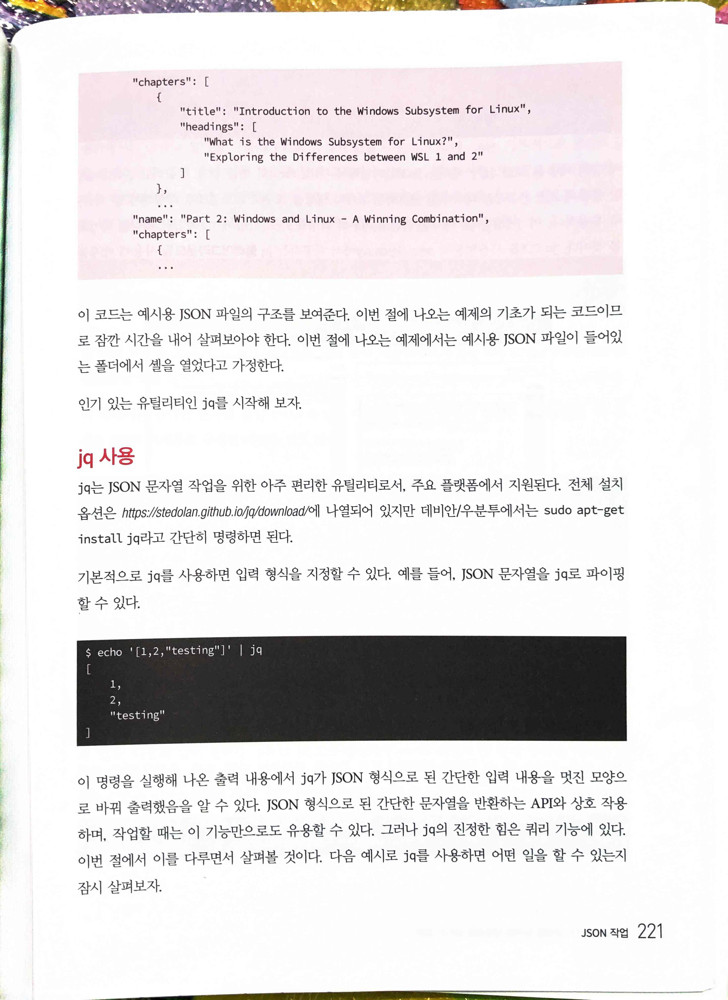
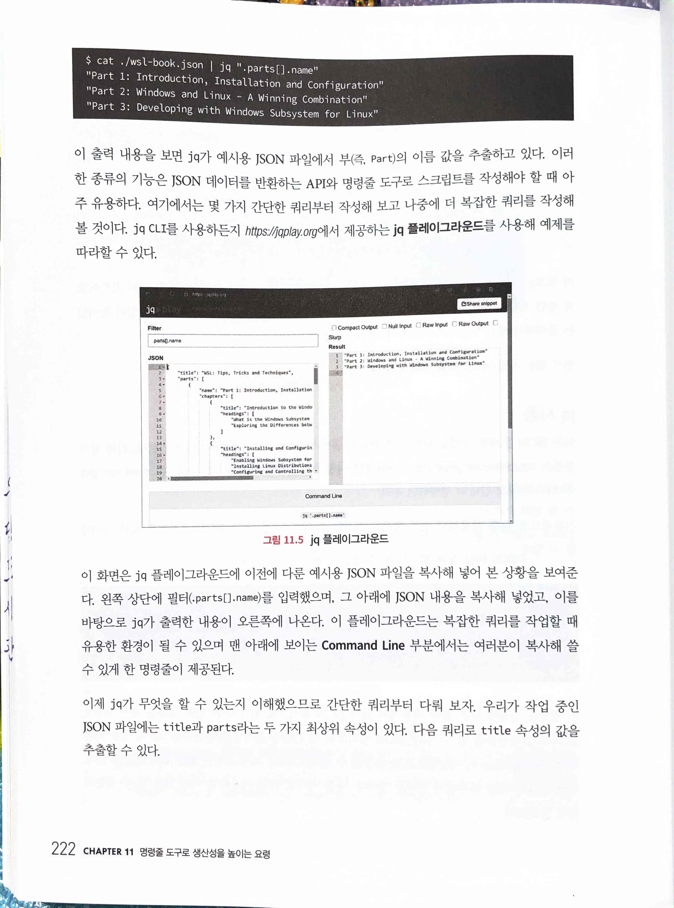
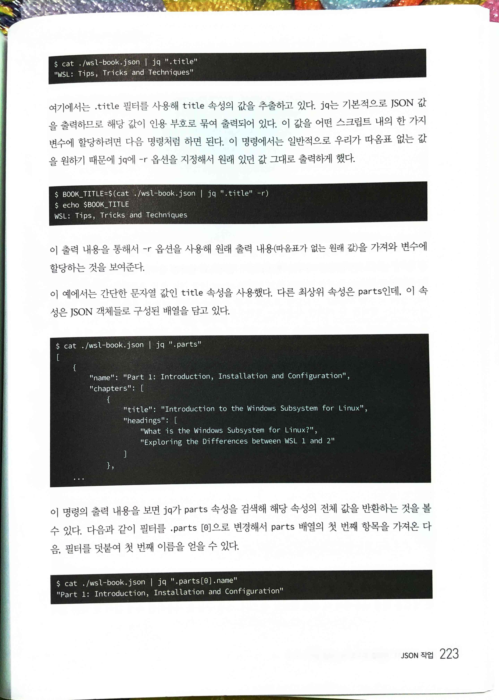
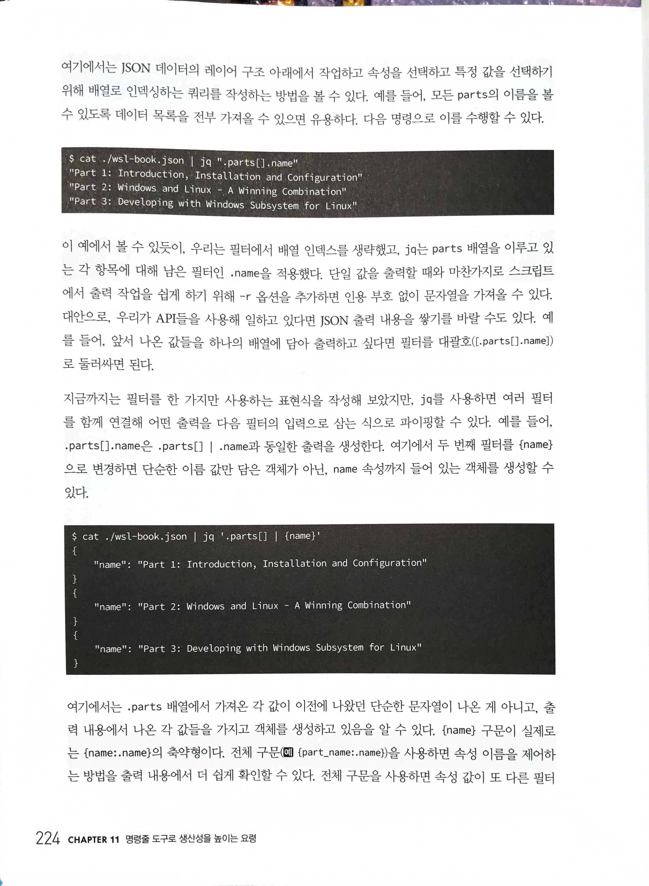
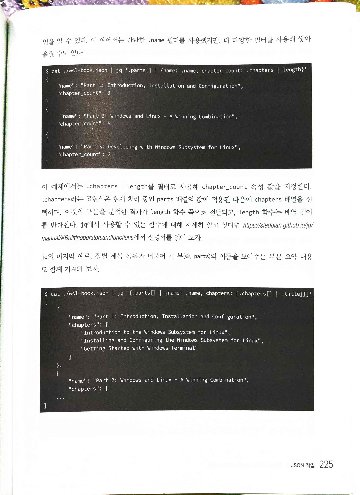
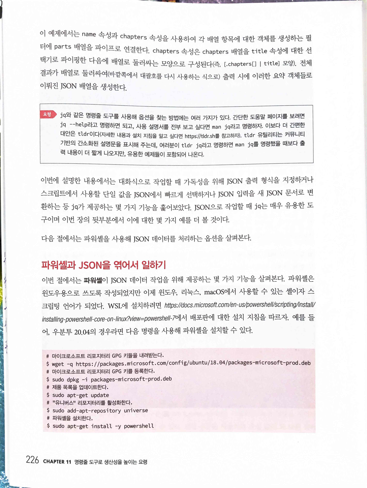

효율성이 배가되는 WSL2 가이드북
===============================


* [Windows-Subsystem-for-Linux-2-WSL-2-Tips-Tricks-and-Techniques: Windows Subsystem for Linux 2 (WSL 2) Tips, Tricks, and Techniques, published by Packt](https://github.com/PacktPublishing/Windows-Subsystem-for-Linux-2-WSL-2-Tips-Tricks-and-Techniques)



[bash-git-prompt: An informative and fancy bash prompt for Git users](https://github.com/magicmonty/bash-git-prompt)



# jq 사용


> `❯ echo '[1,2,"testing"]' | jq`



> `❯ cat ./wsl-book.json | jq ".parts[].name"`



```
❯ cat/wsl-book.json | jq ".title"

❯ BOOK_TITLE=$(cat /wsl-book.json | jq ".title" -r)

❯ cat ./wsl-book.json | jq ".parts"

❯ cat ./wsl-book.json | jq ".parts[0].name"
```



```
❯ cat ./wsl-book.json | jq ".parts[].name"

❯ cat ./wsl-book.json | jq '.parts[] | {name}'
```



```
❯ cat ./wsl-book.json | jq '.parts[] | {name: .name, chapter_count: .chapters | length}'

❯ cat ./wsl-book.json | jq '[.parts[] | {name: .name, chapters: [.chapters[] | .title]}]'
```

# 파워셸과 JSON을 엮어서 일하기


> [Install PowerShell on Linux - PowerShell | Microsoft Learn](https://learn.microsoft.com/en-us/powershell/scripting/install/installing-powershell-on-linux?view=powershell-7.3&viewFallbackFrom=powershell-7)