당신은 AI를 개발하게 된다, 개발자가 아니더라도
==============================================

* 일관되게 나타나지만, 책의 주제는 AI이고 구체적인 내용은 AI의 사례들을 들지만, AI가 아니라 일반적인 프로젝트를 위한 안내라고 생각해도 좋을 정도로 기본적이고 일반적인 이야기들이 많이 나온다.

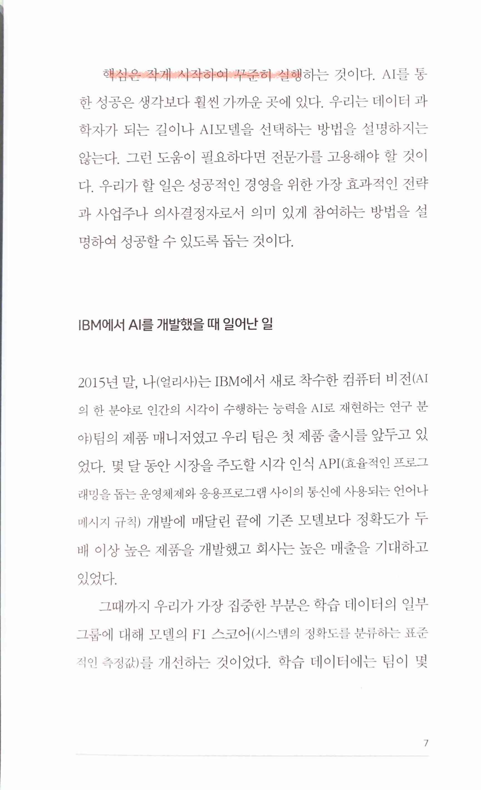

> 핵심은 작게 시작하여 꾸준히 실행

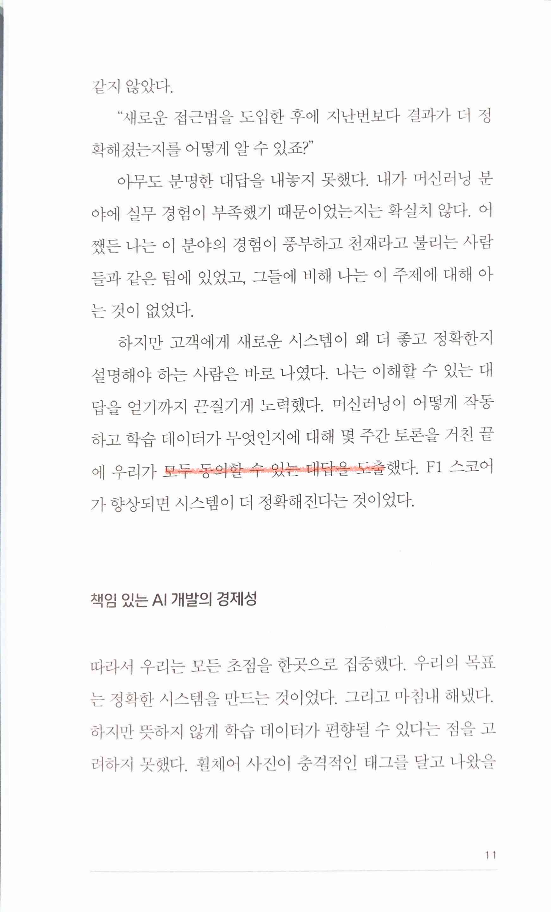

> 모두 동의할 수 있는 대답을 도출
* 사실 이게 핵심

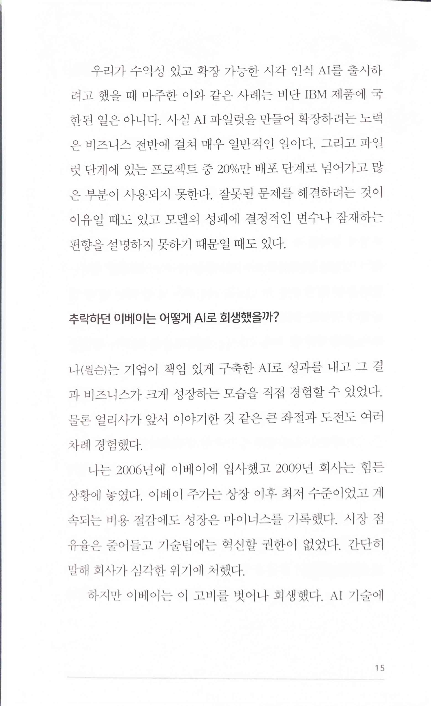

* 다른 프로젝트와 마찬가지로 성공하기 어려운 AI 프로젝트

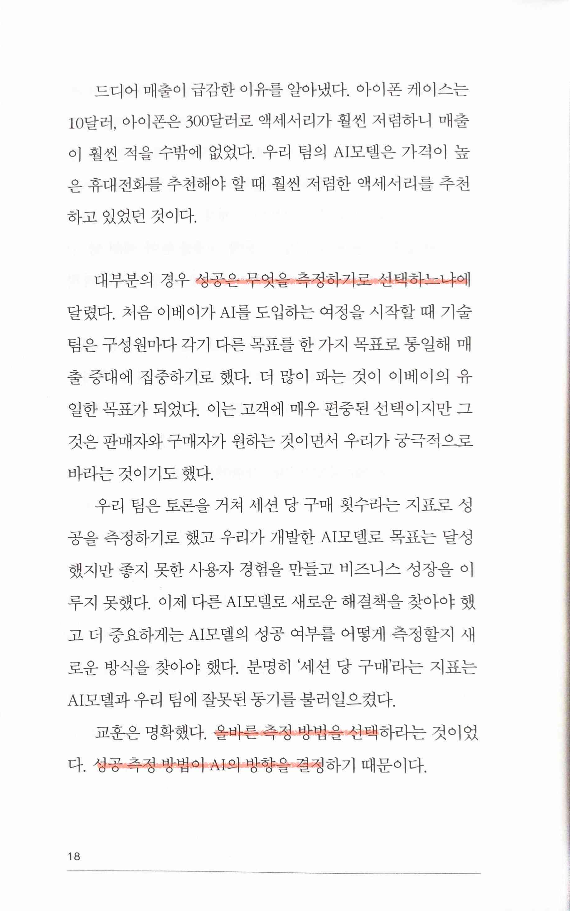

> 성공은 무엇을 측정하기로 선택하느냐에 달렸다.
>
> 올바른 측정 방법을 선택하라... 성공 측정 방법이 AI의 방향을 결정
* AI가 아니라 일반적인 프로젝트에서도 마찬가지

# 제1장 AI 개발과 편향의 덫
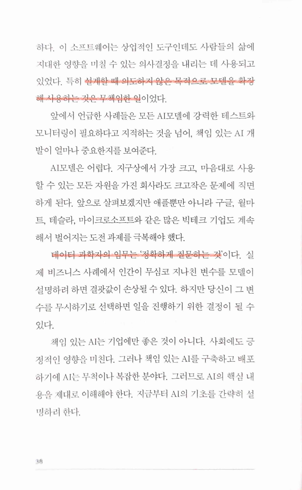

> 설계할 때 의도하지 않은 목적으로 모델을 확장해 사용하는 것은 무책임한 일
>
> 데이터 과학자의 임무는 '정확하게 질문하는 것'
* 역시 마찬가지. AI업무에서만이 아니라, 어떤 일을 시작하기 위해서는 정확한 질문이 필요

* AI, ML, DL

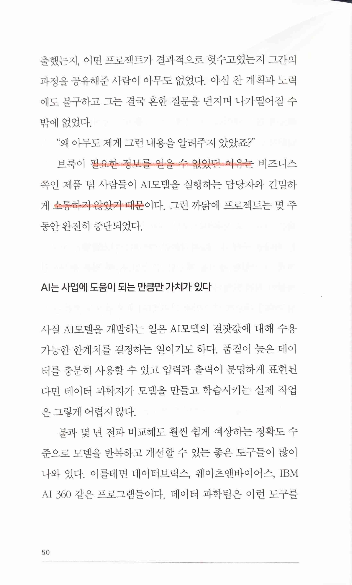

> 필요한 정보를 얻을 수 없었던 이유
>
> 소통하지 않았기 때문
* 이 역시 마찬가지. 어느 일에서나 적용되는 기본적인 일. 다시 한 번 '송곳'의 명대사가 생각난다. `“사람들은 옳은 사람 말 안 들어. 좋은 사람 말을 듣지.”`

> AI가 의미 있고 원하는 결과를 제공하려면 꾸준한 유지 관리와 수정 작업이 필요하다. 프로젝트를 시작할 때 목표와 성공 측정 방법, 신중하게 정의된 기대치, 이정표, 가이드라인이 명확하지 않으면 ... 성공할 가능성이 희박해진다.

# 2장 기존 사업에 AI를 적용할 때 벌어지는 일들
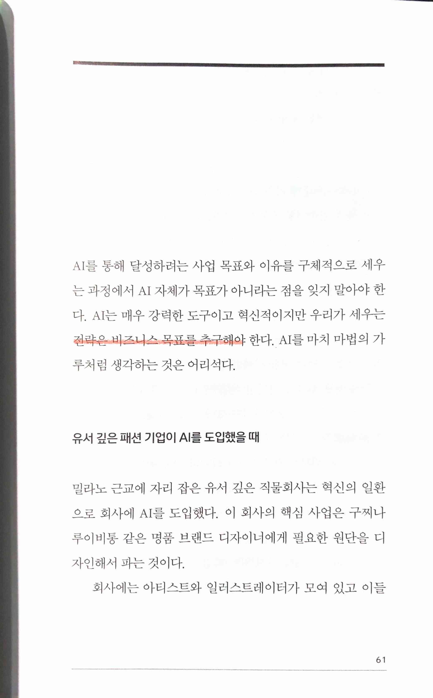

> 전략은 비즈니스 목표를 추구해야

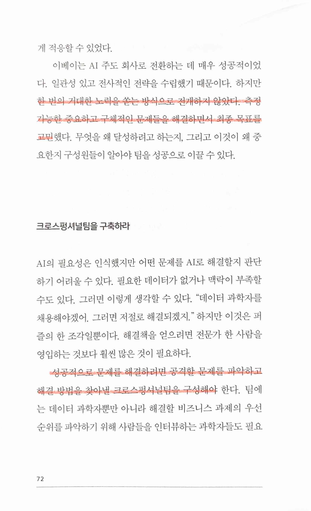

> 한 번의 거대한 노력을 쏟는 방식으로 전개하지 않았다. 측정가능한 중요하고 구체적인 문제들을 해결하면서 최종 목표를 고민
>
> 성공적으로 문제를 해결하려면 공격할 문제를 파악하고 해결 방법을 찾아낼 크로스펑셔널팀을 구성해야
* 작게 시작하고 여러 직군의 이해관계자들이 모여서 업무. 전형적인 agile 아닌가?

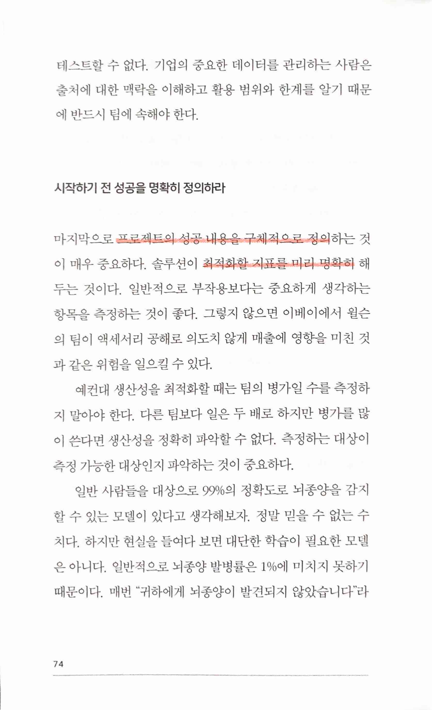

> 프로젝트의 성공 내용을 구체적으로 정의하는 것이 매우 중요. 최적화할 지표를 미리 명확히

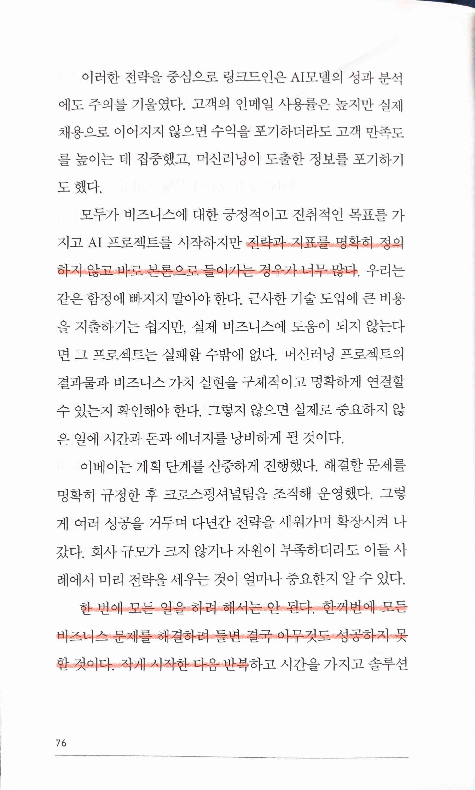

> 전략과 지표를 명확히 정의하지 않고 바로 본론으로 들어가는 경우가 너무 많다.
>
> 한 번에 모든 일을 하려 해서는 안 된다. 한꺼번에 모든 비즈니스 문제를 해결하려 들면 결국 아무것도 성공하지 못할 것이다. 작게 시작한 다음 반복

# 3장 골디락스 문제 선택하기
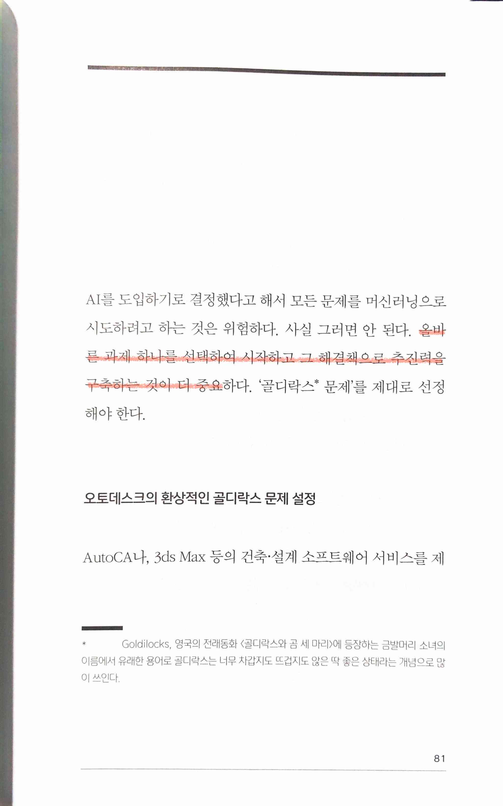

> 올바른 과제 하나를 선택하여 시작하고 그 해결책으로 추진력을 구축하는 것이 더 중요

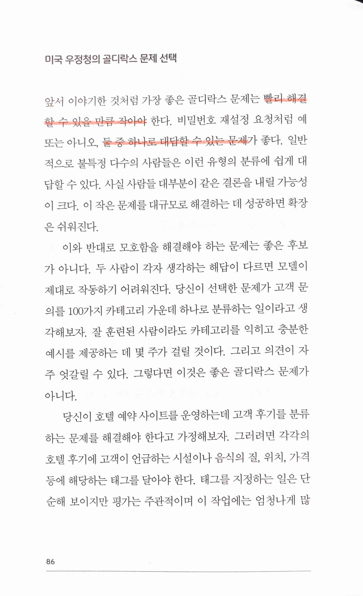

> 빨리 해결할 수 있을 만큼 작아야
>
> 둘 중 하나로 대답할 수 있는 문제

> 같은 문제를 해결한 과거 사례 데이터가 많이 축적
>
> 의도하지 않은 편향이나 불공정성을 포함하지는 않는지 확인

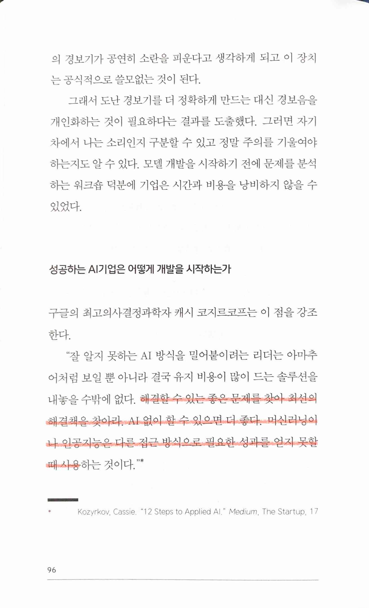

> 구글의 최고의사결정과학자 캐시 코지르코프, 해결할 수 있는 좋은 문제를 찾아 최선의 해결책을 찾아라. AI 없이 할 수 있으면 더 좋다. 머신러닝이나 인공지능은 다른 접근 방식으로 필요한 성과를 얻지 못할 때 사용하는 것
* [12 Steps to Applied AI. A roadmap for every machine learning… | by Cassie Kozyrkov | The Startup | Medium](https://medium.com/swlh/12-steps-to-applied-ai-2fdad7fdcdf3)

> 모든 모델은 엄격한 A/B 테스트
>
> 재무 결정은 전적으로 데이터 기반

# 4장 AI는 데이터로 완성된다

> 안드레아 카르파티, AI모델보다 AI모델 학습에 사용되는 데이터가 훨씬 중요

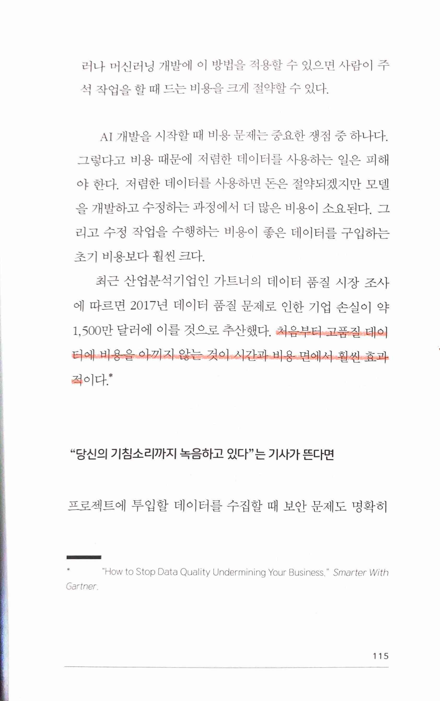

> 처음부터 고품질 데이터에 비용을 아끼지 않는 것이 시간과 비용 면에서 훨씬 효과적

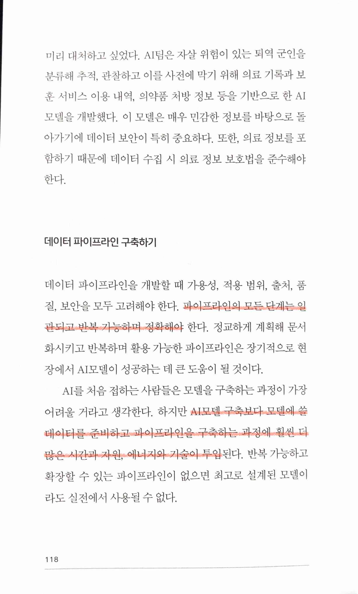

> 파이프라인의 모든 단계는 일관되고 반복 가능하며 정확해야
>
> AI모델 구축보다 모델에 쓸 데이터를 준비하고 파이프라인을 구축하는 과정에 훨씬 더많은 시간과 자원, 에너지와 기술 투입

# 5장 강력한 AI조직 구축하는 법
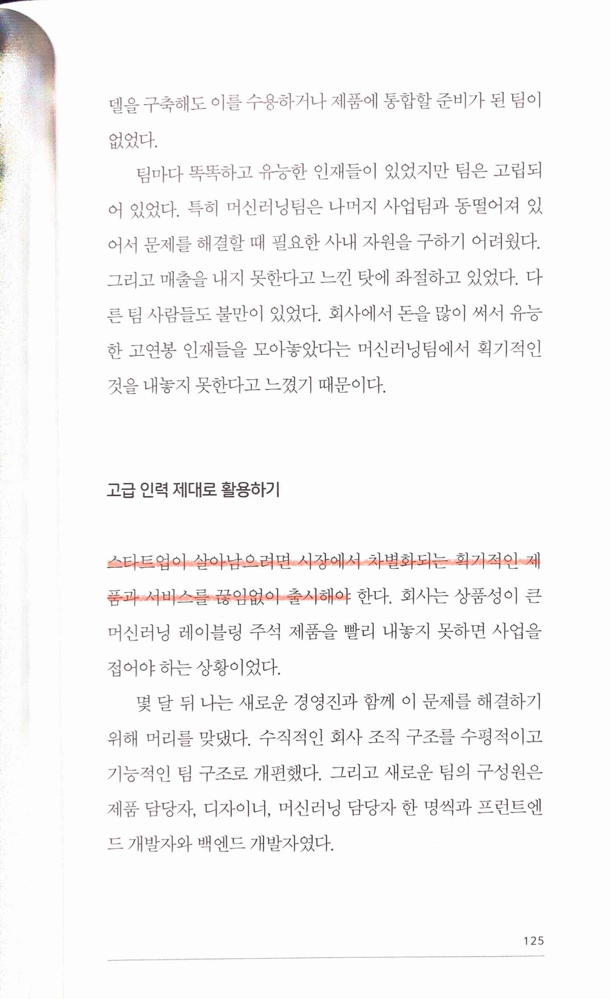

> 스타트업이 살아남으려면 시장에서 차별화되는 획기적인 제품과 서비스를 끊임없이 출시해야

> 수평적 협력과 애자일에 중점을 두면서도 여전히 기존 팀의 일원이라는 점을 강조하며 균형

> 수평적 협력을 훨씬 강조하는 환경 조성
>
> 수평적인 팀을 한 번 구성하면 최소 2주 이상 유지. 2주마다 효과가 있는 것과 없는 것이 무엇인지 묻고 피드백에 따라 변화
* 이렇게 빠르게 조직을 변경해도 일관성이 유지되고, 조직 적응에 문제가 없나?

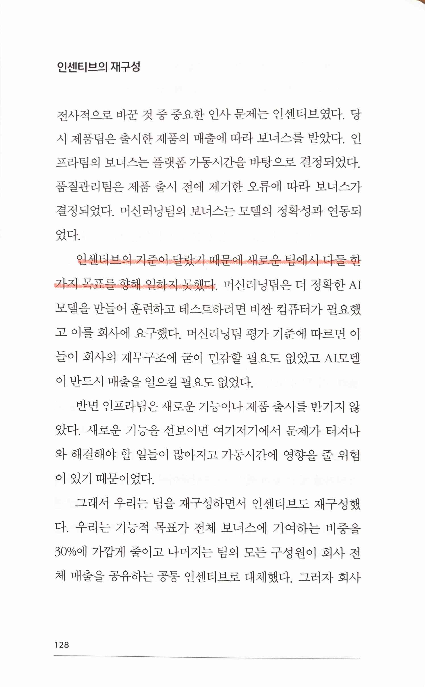

> 인센티브의 기준이 달랐기 때문에 새로운 팀에서 다들 한가지 목표를 향해 일하지 못했다.

> 팀에 완전히 몰입할 수 있는 사람이어야 한다. 그렇게 해야 회사 안에서 프로젝트를 지키고 옹호할 수 있다.

 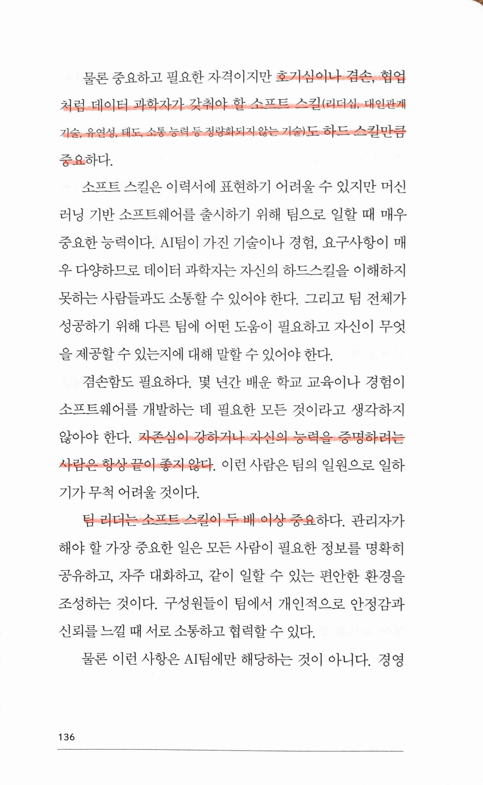

> 호기심이나 겸손, 협업처럼 데이터 과학자가 갖춰야 할 소프트 스킬(리더십, 대인관계기술, 유연성, 태도, 소통 능력 등 정량화되지 않는 기술)도 하드 스킬만큼 중요
>
> 자존심이 강하거나 자신의 능력을 증명하려는사람은 항상 끝이 좋지 않다.
>
> 팀 리더는 소프트 스킬이 두 배 이상 중요

# 6장 성공으로 향하는 파일럿 설정하기
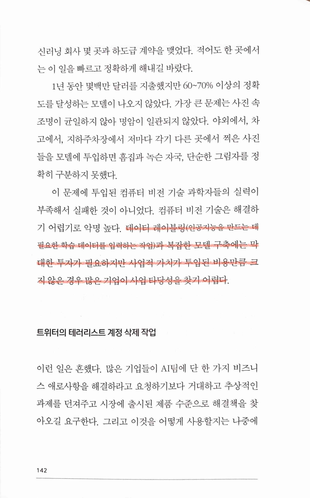

> 데이터 레이블링 (인공지능을 만드는 데 필요한 학습 데이터를 입력하는 작업)과 복잡한 모델 구축에는 막대한 투자가 필요하지만 사업적 가치가 투입된 비용만큼 크지 않은 경우 많은 기업이 사업 타당성을 찾기 어렵다.

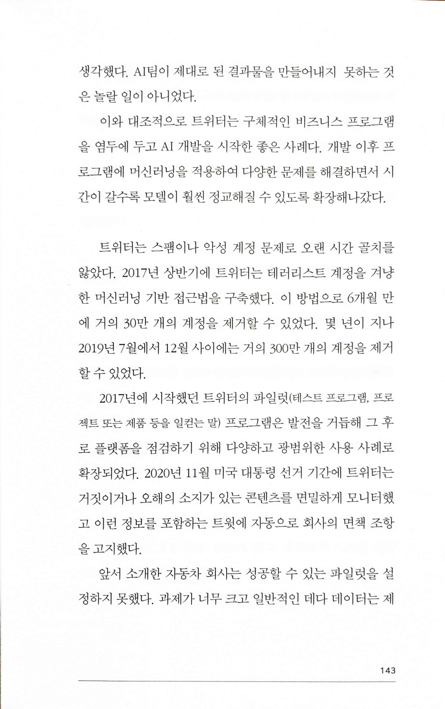

* 트위터의 성공 사례를 이야기하는데 이게 이렇게 성공했다고 평가받을 만한 일이었나?

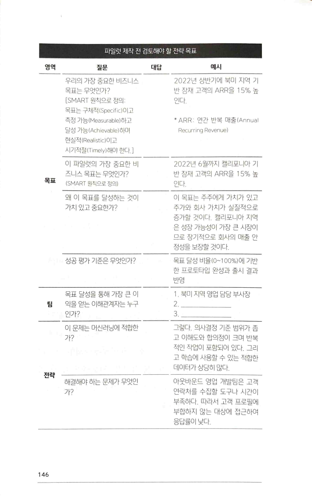 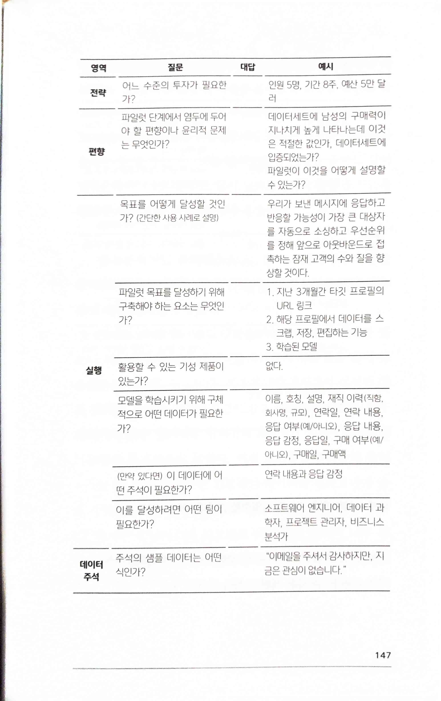 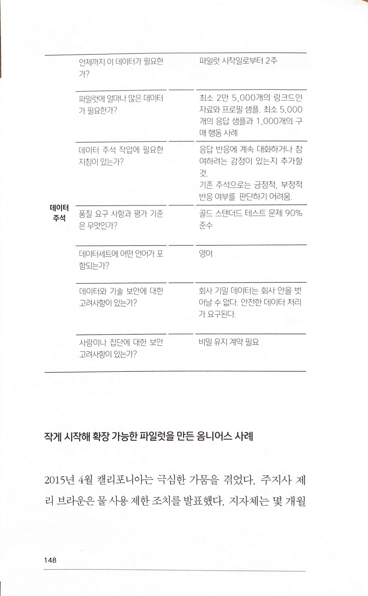

> 파일럿 제작 전 검토해야 할 전략 목표 질문 대답

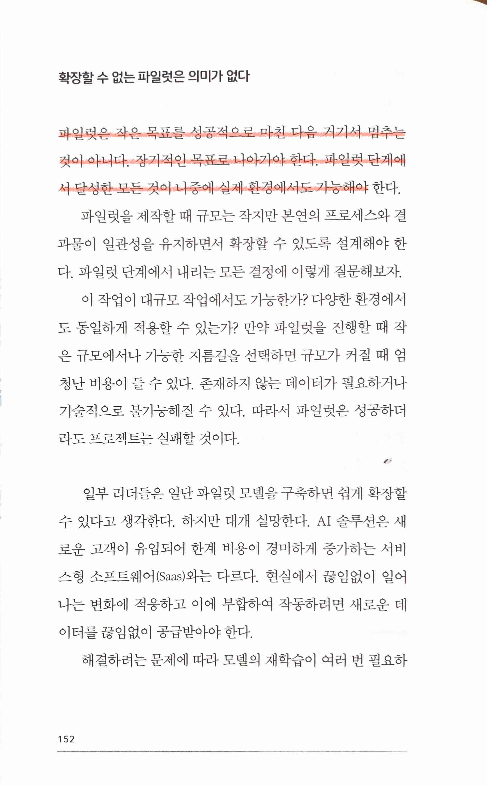

> 파일럿은 작은 목표를 성공적으로 마친 다음 거기서 멈추는 것이 아니다. 장기적인 목표로 나아가야 한다. 파일럿 단계에서 달성한 모든 것이 나중에 실제 환경에서도 가능해야

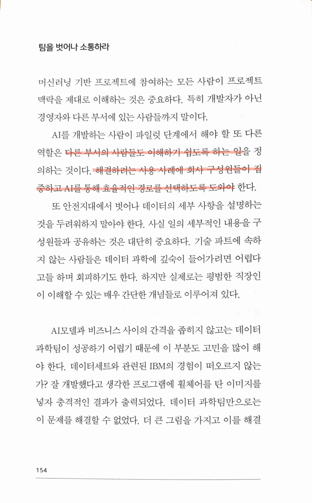

> 다른 부서의 사람들도 이해하기 쉽도록 하는 일을 정의하는 것이다. 해결하려는 사용 사례에 회사 구성원들이 집중하고 AI를 통해 효율적인 경로를 선택하도록 도와야

# 7장 시제품에서 완제품으로

# 8장 AI기업으로 변신한 뉴욕타임스의 AI 리더십
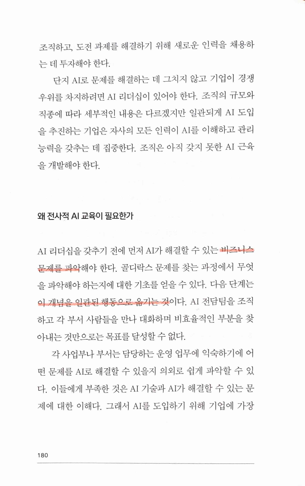

> 비즈니스 문제를 파악
>
> 이 개념을 일관된 행동으로 옮기는

# 9장 AI 성숙도를 높이는 과정
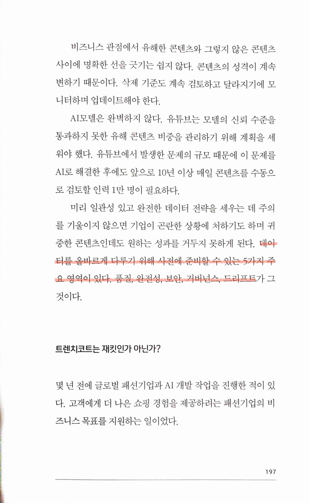

> 데이터를 올바르게 다루기 위해 사전에 준비할 수 있는 5가지 주요 영역. 품질, 완전성, 보안, 거버넌스, 드리프트

> 프로젝트는 애플리케이션의 목표와 사용 사례를 깊이 파악하는 것부터 시작해야
>
> 광범위한 이해관계자들이 참여해야

# 10장 AI, 개발할까 구매할까?